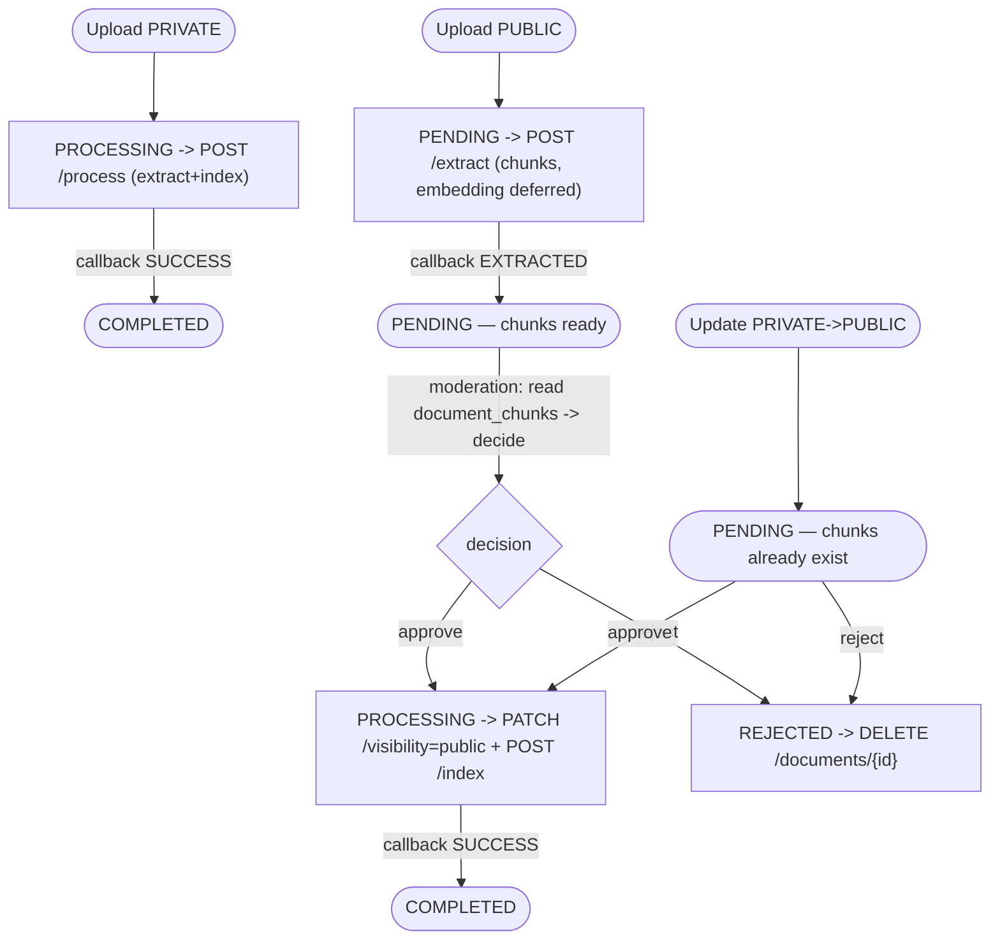

# Repository Guidelines

Guide for AI assistants working in `ai-study-hub-api`. Everything below is grounded in the current source tree.

## Project Overview

**AI Study Hub API** — a Spring Boot 4.0.6 / Java 17 backend for a smart study-document platform: upload/store documents, chat with an AI study assistant over document content (RAG), manage storage plans + VNPay billing, and moderate via reviews/reports. It is a stateless JSON REST API (port `8080`) backed by PostgreSQL 16 + pgvector, Redis 7, AWS S3, and an **external FastAPI RAG microservice**.

## Architecture & Data Flow

Layered servlet (WebMVC) app, base package `vn.ai_study_hub_api` (`src/main/java/.../`).

```
HTTP request
  → JwtAuthenticationFilter   (validate Bearer → Redis blacklist check → load user by email → set SecurityContext)
  → SecurityFilterChain        (path-based authz: /api/v1/admin/** = ADMIN; public allow-list; else authenticated)
  → Controller                 (thin: pull userId from CustomUserDetails principal, delegate to service)
  → Service interface → *Impl   (@Transactional, manual builder DTO↔entity mapping, throws AppException)
  → Repository (JPA)  /  external (WebClient→FastAPI, AWS S3, Redis)  /  @Async taskExecutor
  → common/ApiResponse<T> envelope {success, message, data, timestamp}
  → GlobalExceptionHandler      (AppException→its status; validation→400 field map; auth→401; generic→500)
```

Key cross-process integrations are abstracted behind interfaces:
- **`ChatbotClient` → `ChatbotClientImpl`**: synchronous blocking `WebClient` POST to `${fastapi.rag-chat-url}` (`.timeout(chat-timeout-seconds).block()`). The `/chat` body includes the session's prior turns as `history` (`{role, content}`, oldest first, ≤10) for multi-turn RAG memory — built by `ChatServiceImpl` from `chat_messages` and passed via the 4-arg `ChatbotClient.chat(query, userId, documentId, history)`. `DocumentServiceImpl` POSTs to `${fastapi.rag-process-url}`. One shared `WebClient` bean (`config/WebClientConfig`).
- **`UploadProvider` → `S3UploadProvider`** (sole impl): AWS SDK v2, presigned URLs (10-min GET).
- **`AiQuotaService`**: Redis-backed daily per-user AI request counter (`user:ai_limit:{userId}:{date}`); throws HTTP 429 on overflow.
- **`RedisTokenService`**: refresh-token storage/rotation + access-token blacklist + OTP (`refresh_token:`, `blacklist_token:`, `otp:` keys).
- **`UserSanctionService`**: tracks live tokens in `active_tokens:{userId}` so `banUser` can mass-blacklist every session.

Async is centralized on the `taskExecutor` pool (`config/AsyncConfig`, `app.async.*`: core 5 / max 20 / queue 100 / prefix `doc-async-`) and applied **only** to `DocumentServiceImpl` (`@Async("taskExecutor")` on `processDocumentAsync`/`triggerFastApiAsync`/`updateFastApiVisibilityAsync`/`deleteFastApiVectorsAsync`). `EmailService` (JavaMailSender) and `PaymentService` are **synchronous**, not `@Async`.

Data model: `User 1—N Documents`; `Document N—M Tags` (join `document_tags`); `User 1—N ChatSessions`, `ChatSession N—M Documents` (`session_documents`), `ChatSession 1—N ChatMessages`; `User N—1 StoragePlan`, `User 1—N Invoices`; `Review`/`Report` link `User`+`Document`; `User 1—N ViolationHistory`/`Notifications`. `document_chunks` (with `embedding vector(1536)` + HNSW cosine index) is **managed by the FastAPI service**, not mapped by JPA.

## Key Directories

```
src/main/java/vn/ai_study_hub_api/
├── controller/         REST endpoints + request/ (input DTOs) + response/ (output DTOs)
├── service/            service interfaces; service/impl/ the @Service implementations
├── repository/         Spring Data JPA repos; projection/ interface projections
├── model/              JPA entities (*Entity) + enums (UserRole, UserStatus, DocumentStatus, ...)
├── security/           SecurityConfig, JwtTokenProvider, JwtAuthenticationFilter, OAuth2, session tracking
├── config/             AsyncConfig, AwsS3Config, WebClientConfig, WebConfig (CORS), OpenApiConfig, logging filter
├── common/             ApiResponse<T> envelope, VNPayUtil (HMAC-SHA512 signing)
├── exception/          AppException + GlobalExceptionHandler (centralized)
└── AiStudyHubApiApplication.java   @SpringBootApplication entry (normalizes TZ → Asia/Ho_Chi_Minh)
src/main/resources/     application.yaml (+ -dev, -prod); static/ & templates/ empty
src/test/java/.../      JUnit 5 + Mockito unit tests mirroring main packages
documents/              BRD, functional requirements, acceptance criteria (BDD Gherkin), user stories, pgvector ref, RAG tutorial
initdb.sql              full DDL: 8 native PG enums, 13 tables, pgvector ext + vector(1536) HNSW index
```

## Development Commands

Java 17 + Maven (wrapper included). **There is no Node/Bun — this is a pure JVM project.**

```bash
# Run infra only (PostgreSQL + Redis) for local dev
docker compose up -d postgres redis

# Run the app locally (dev profile is the default-active Maven profile)
./mvnw spring-boot:run -Dspring-boot.run.profiles=dev

# Run the whole stack via Docker (builds JAR in-image, serves :8080)
docker compose up --build -d

# Tests (pure unit — no DB/Redis/S3 needed)
./mvnw clean test

# Build (also produces target/*.jar)
./mvnw clean package
```

- **Swagger UI**: `http://localhost:8080/swagger-ui/index.html` (Actuator endpoints exposed at `/actuator/*`).
- **Profile wiring**: Maven `dev` profile (default) / `prod` set `spring.profiles.active`, injected into `application.yaml` via the `@spring.profiles.active@` resource-filtering placeholder. Both profiles use `ddl-auto: update`.
- **CI** (`.github/workflows/workflow.yml`): deploy-only. On push to `main` it SSH-deploys to the VPS and runs `docker compose up --build -d`. There is **no CI build/test gate**; the Dockerfile builds with `-DskipTests`. Run `./mvnw test` locally before pushing.

## Code Conventions & Common Patterns

**Layering & wiring.** Controller → `Service` interface → `*Impl` (`@Service`). Exceptions propagate as `throw new AppException(HttpStatus.X, "message")` — there is **no error-code enum**; the message string is the sole payload. Controllers are thin and never contain business logic.

**Response envelope.** ~every controller returns `ApiResponse<T>` (`common/ApiResponse`: static `success(data,msg)` / `success(msg)` / `error(msg)`). Errors all reuse `ApiResponse.error(...)`. Note `PaymentController` is an **anomaly** — it returns bare `ResponseEntity<PaymentResponse>`; follow the `ApiResponse` convention for new code.

**Authorization.** **No method-level security** (`@PreAuthorize`/`@Secured` are absent). Authz is purely path-based in `SecurityConfig`:
- `/api/v1/admin/**` → `hasRole(ADMIN)`
- `permitAll`: `/api/v1/auth/**`, public document search/preview/shared, GET reviews, **`/api/v1/internal/**` and `/api/internal/**`**, `/login/oauth2/**`, swagger
- everything else → authenticated

`admin` vs `user` vs `internal` is separated **only by URL prefix**. The internal FastAPI callback (`/api/v1/internal/documents/callback`) is `permitAll` and instead guarded manually by comparing the `X-Internal-Secret` header to `${app.internal.secret}` (403 on mismatch).

**Current-user access.** Get the acting user from the principal: extract `CustomUserDetails` from the `SecurityContext` and read its `userId`/`role`. `CustomUserDetails.build(UserEntity)` maps `role → ROLE_<NAME>`; `ACTIVE` + `OVERLIMITSTORAGE` are treated as enabled, `INACTIVE`/`BANNED` as disabled.

**Transactions & mapping.** Public service methods are `@Transactional` (use `readOnly=true` for queries). DTO↔entity mapping is **manual via Lombok builders — no MapStruct**.

**Entity conventions.** All entities: `@Getter @Setter @NoArgsConstructor @AllArgsConstructor @Builder` (note: `@Data` is **not** used on entities, only on DTOs). `@Table` names are plural snake_case.
- **ID strategies split**: `@GeneratedValue(strategy = GenerationType.UUID)` (DB-assigned) for `UserEntity`, `InvoiceEntity`, `ReviewEntity`, `ReportEntity`, `ViolationHistoryEntity`, `NotificationEntity`; **app-assigned UUID** with `Persistable<UUID>` + a `@Transient isNew` flag reset in `@PostPersist/@PostLoad` for `DocumentEntity`, `ChatSessionEntity`, `ChatMessageEntity`; `GenerationType.IDENTITY` (Integer PK) for `StoragePlanEntity` + `TagEntity`.
- **Enums** use `@Enumerated(EnumType.STRING)` + Hibernate `@ColumnTransformer` to bridge Java UPPER-case names to lowercase native PG enum literals (`read="UPPER(status::text)"`, `write="cast(LOWER(?) as <pg_enum>)"`).
- **JSONB**: `ChatMessageEntity.citations` is `@JdbcTypeCode(SqlTypes.JSON) @Column(columnDefinition = "jsonb")` typed as `String`.
- **Audit cols** `createdAt`/`updatedAt` are `insertable=false, updatable=false` and rely on DB `DEFAULT now()`; there is no `@UpdateTimestamp`/trigger, so `updated_at` is effectively insert-time only.
- Relationships are `@ManyToOne(LAZY)`; M:N via join tables; no JPA `cascade` (only SQL-level `ON DELETE CASCADE`).

**Repositories.** Extend `JpaRepository`. Custom queries mix JPQL (`@Query`) and native SQL. Projections: DTO constructor-expression (`new ...ReportedDocumentResponse(...)`) and Spring Data interface projection (`TrendingStatsProjection`). Pagination via `Page<>` + `PageRequest.of(page, size)` (defaults 0/10).

**Async.** Use `@Async("taskExecutor")` (the configured `ThreadPoolTaskExecutor`) for background work — currently only document processing. Do not spawn raw threads.

**External HTTP.** Use the shared `WebClient` bean for the FastAPI RAG service. (Google OAuth token exchange in `AuthServiceImpl` uses `RestClient` instead — a pre-existing inconsistency.)

**DTOs.** Input DTOs in `controller/request/`, output DTOs in `controller/response/`, both Lombok `@Data + @Builder`. Some controllers also declare static-inner request DTOs. Validate inputs with `@Valid`; validation failures become a 400 field→message map via `GlobalExceptionHandler`.

## Important Files

| File | Purpose |
|------|---------|
| `src/main/java/vn/ai_study_hub_api/AiStudyHubApiApplication.java` | Entry point; normalizes JVM TZ to `Asia/Ho_Chi_Minh` |
| `security/SecurityConfig.java` | Filter chain: stateless, CSRF off, path-based authz, OAuth2 wiring |
| `security/JwtTokenProvider.java` | jjwt HMAC tokens: access 1h (`app.jwt.access-expiration-ms`=3600000), refresh 7d |
| `security/JwtAuthenticationFilter.java` | Bearer validation + Redis blacklist check + user load |
| `service/impl/AuthServiceImpl.java` | Login (issue + store refresh), rotate-on-refresh, logout blacklist |
| `service/impl/DocumentServiceImpl.java` | Core upload/processing state machine + all `@Async` FastAPI orchestration |
| `service/impl/ChatServiceImpl.java` | Chat sessions, AI-quota enforcement, multi-turn `history` construction (last 10 `chat_messages` → RAG), citation extraction from RAG JSON |
| `service/impl/RedisTokenServiceImpl.java` | Redis keys: `refresh_token:`, `blacklist_token:`, `otp:` |
| `service/impl/S3UploadProvider.java` | Sole `UploadProvider` impl (AWS SDK v2, presigned URLs) |
| `repository/DocumentChunkRepository.java` | Read-only `document_chunks` query (`ChunkContentProjection`) — moderation input. Never writes (RAG owns the table). |
| `common/ApiResponse.java` | Universal response envelope |
| `exception/GlobalExceptionHandler.java` | Centralized error mapping → `ApiResponse.error` |
| `exception/AppException.java` | The one custom exception (`HttpStatus` + message) |
| `src/main/resources/application.yaml` | Base config + all `${ENV:default}` placeholders |
| `initdb.sql` | Full DDL (8 enums, 13 tables, pgvector `vector(1536)` HNSW cosine index) |
| `pom.xml` | Maven build, `dev`/`prod` profiles, dependency versions |

**Externalized config groups** (`application.yaml`): `aws.s3.*`, `fastapi.*` (`base-url`, `rag-process-url`, `rag-chat-url`, `chat-timeout-seconds:30`), `app.jwt.*`, `app.internal.secret`, `app.async.*`, `app.upload.max-file-size-bytes` (50MB), `app.share-url-prefix`, `vnpay.*`, `spring.security.oauth2.client` (Google), `spring.mail.*`.

## Sibling Service: RAG Pipeline (FastAPI)

The RAG/AI engine is a **separate Python service** in a sibling repo: `~/code/ai-study-hub-rag-service` (FastAPI + uvicorn on port `8000`, container `ai-study-hub-rag-service`, joined to the same external `ai-study-hub-network`). This Java API calls it over HTTP; it is **not** part of this repo's build. The two services share one PostgreSQL database (`aistudyhub`) and one `INTERNAL_API_SECRET`.

**Stack**: Python 3.11, FastAPI, **LangChain 0.3.x (pinned — code targets the 0.3 API; do not bump to 1.x)**, Google Gemini (`gemini-2.5-flash-lite` LLM + `gemini-embedding-001` @ **1536 dims**), Jina reranker (`jina-reranker-v3`, top-5), a **custom `PostgresVectorStore` over pgvector** (ChromaDB is intentionally unused), psycopg2 with a `ThreadedConnectionPool`.

### Wire contract between the two services

All RAG ingest endpoints live under `fastapi.base-url` (default `http://localhost:8000/api/v1/rag`); chat lives at `fastapi.rag-chat-url` (`/api/v1/chat`). Calls from this API use the shared `WebClient` bean (10s timeout, blocking inside `@Async("taskExecutor")` workers).

| Direction | Endpoint | Body | Purpose |
|---|---|---|---|
| API → RAG | `POST {base}/process` | `{document_id, file_url}` | PRIVATE docs: extract + index + summary in one background job (no moderation). |
| API → RAG | `POST {base}/extract` | `{document_id, file_url}` | PUBLIC docs: extract only — chunks stored with `embedding=NULL`. Returns 202. |
| API → RAG | `POST {base}/index` | `{document_id}` | After approval: embed pending chunks + rebuild BM25. Idempotent. |
| API → RAG | `PATCH {base}/documents/{id}/visibility` | `{visibility}` | Stamp visibility into chunk metadata (metadata only; this API gates retrieval). |
| API → RAG | `DELETE {base}/documents/{id}` | — | Delete all chunks + parent docs + rebuild BM25 (reject / delete flow). |
| API → RAG | `POST /api/v1/chat` | `{query, user_id, document_id, history}` | Chat. `history` = the session's prior turns (`{role, content}`, oldest first, ≤10) for multi-turn memory. Response envelope mirrors `ApiResponse` (`data.llm_response` + `data.debug.documents` for citations). RAG **deterministically** routes SMALLTALK / SUMMARY / QA (no LLM); smalltalk returns a canned reply with no `documents` (→ 0 citations), and the QA branch short-circuits when retrieval is empty. |
| RAG → API | `POST /api/v1/internal/documents/callback` | `{document_id, status, summary}` + header `X-Internal-Secret` | Guarded by `InternalDocumentController` (`app.internal.secret`); mismatch → 403. `status` ∈ `SUCCESS` (→ `COMPLETED` if `PROCESSING`), `EXTRACTED` (stores summary, status unchanged), `FAILED` (→ `FAILED`). Retried 3× with backoff. |

> **Moderation reads `document_chunks` directly** (shared DB) via a read-only Java repository — `DocumentChunkRepository` returns a `ChunkContentProjection`. There is intentionally **no `/chunks` endpoint on RAG**: the moderation service lives in this backend, so it queries the shared DB instead of an HTTP hop.

### Document lifecycle & moderation flow (two-phase extract/index)

Uses the existing `DocumentStatus` values — **no new statuses were added**. Moderation itself is owned by a separate service; this API only wires the seams (extract so chunks exist, expose them via a read-only `document_chunks` query, index on approve, purge on reject).



- **PRIVATE** (`processDocumentAsync`): `/process` → extract + index immediately → callback `SUCCESS` → `COMPLETED`. No moderation.
- **PUBLIC upload** (`processDocumentAsync`): → `PENDING`, notify admins, call `/extract` (chunks created, `embedding=NULL`). The moderation service (same backend) reads chunk content directly from `document_chunks` via `DocumentChunkRepository`, classifies each with the OpenAI Moderation API, then drives the existing **approve/reject** methods internally (no HTTP, no JWT — same Spring context).
- **Approve** (`approveDocument`): `PENDING → PROCESSING` → `PATCH /visibility=public` + `POST /index` (embeds pending chunks; no-op if already embedded, e.g. the update-visibility case) → callback `SUCCESS` → `COMPLETED`.
- **Reject** (`rejectDocument`): → `REJECTED` + `DELETE /documents/{id}` (purge extracted/indexed chunks).
- **Update PRIVATE→PUBLIC** (`updateDocument`): chunks already exist (indexed as private) → `PENDING` for moderation; RAG visibility is flipped to public **only at approve**, not at update time.

### RAG ingestion pipeline

Two-phase, in `app/services/ingestion.py`: `_extract` and `_index`. `process_document_task` (private) calls both; `extract_document_task` calls only `_extract`; `index_document_task` calls only `_index`.

- **`_extract`**: download presigned file → load by extension (`PyPDFLoader` / `TextLoader` for `.txt`+`.md` / `Docx2txtLoader` for `.docx`; else `FAILED`) → enrich metadata (page/chunk citations + `document_id`) → **Parent-Child chunking** (parent 1000/200, child 200/50) via `ParentDocumentRetriever._split_docs_for_adding` → store parent docs in `LocalFileStore` (`parent_docs_store/`) → insert child chunks into `document_chunks` with **`embedding=NULL`** (`PostgresVectorStore.add_texts_without_embedding`). Children carry `metadata.doc_id` = parent uuid so parent-fetch retrieval still works after embedding.
- **`_index`**: `embed_pending_chunks(document_id)` — embed all `embedding IS NULL` chunks for the doc in one `embed_documents` call (1536-dim Gemini) + per-row `UPDATE` → `update_bm25()`. Idempotent.
- Summary is generated at extract time and carried in both the `EXTRACTED` and `SUCCESS` callbacks.

### Retrieval (QA branch)

Hybrid search: **BM25** (over parent docs, filtered to the requested `document_id`s) **+ dense** pgvector cosine (HNSW, `k=25`), combined via `EnsembleRetriever`, then **Jina cross-encoder re-rank** → top context → Gemini generation. `similarity_search_by_vector` filters `embedding IS NOT NULL`, so extracted-but-not-indexed (public, pre-approval) chunks are never surfaced. The generator emits **numeric citation markers `[N]`** mapping 1:1 to the `documents` list in `debug`, and consumes the sent `history` to resolve follow-up references (still cites `[N]` only from retrieved context). Routing is **deterministic (regex, no LLM)** — SMALLTALK → SUMMARY (needs a selected doc) → QA (default); the QA branch short-circuits with a fixed message when retrieval is empty. **Multi-query OFF by default** (`ENABLE_MULTI_QUERY=1`; costs ~6s/extra LLM call).

### Shared state & gotchas

- **Shared DB**: RAG reads `documents` (`summary`, `title`, `uploader_id`) and **owns** `document_chunks` (writes embeddings + metadata). This API reads it **read-only** via `DocumentChunkRepository` (`@Immutable` `DocumentChunkEntity` + `ChunkContentProjection`) for moderation — never writes. Keep both `initdb.sql` in sync — `document_chunks.embedding vector(1536)` + the HNSW cosine index.
- **Leak prevention is two-layered**: (1) RAG `similarity_search` filters `embedding IS NOT NULL`; (2) this API only passes `COMPLETED` document_ids to RAG chat, so `PENDING`/`REJECTED` public docs are never queried even though their (NULL-embedding) chunks exist in the store.
- **Embedding dim fixed at 1536** (Gemini `output_dimensionality` forced in `CustomGoogleEmbeddings`); must match the `vector(1536)` column.
- **`INTERNAL_API_SECRET` must be identical** in both services (`app.internal.secret` ↔ RAG `INTERNAL_API_SECRET`), else every callback → 403.
- **`fastapi.base-url`** (`${FASTAPI_BASE_URL:http://localhost:8000/api/v1/rag}`) is the base for all RAG ingest endpoints (`/process`, `/extract`, `/index`, `/documents/{id}/...`); `fastapi.rag-process-url` (private `/process`) and `fastapi.rag-chat-url` are retained for those two specific calls.
- **RAG clients are process-wide singletons** (LLM, embeddings, reranker) warmed at startup to avoid a ~14s Gemini cold-start.
- **RAG config** (`app/core/config.py` + `.env`): `DATABASE_URL`, `BACKEND_CALLBACK_URL`, `INTERNAL_API_SECRET`, `JINA_API_KEY`, Google API key, `ENABLE_MULTI_QUERY`, `DB_POOL_MAX` (20), `TEMP_DIR`.
- **RAG endpoints for reference**: `POST /api/v1/rag/process`, `POST /api/v1/rag/extract`, `POST /api/v1/rag/index`, `PATCH /api/v1/rag/documents/{id}/visibility`, `DELETE /api/v1/rag/documents/{id}`, `POST /api/v1/chat`. (The old `/api/v1/chat/retrieve` debug endpoint was removed.)

## Runtime / Tooling Preferences

- **Runtime**: Java 17 (JDK 17). No JavaScript runtime is involved.
- **Build tool**: Maven via the `mvnw` wrapper (note: `mvnw` is gitignored; use a locally installed `mvn` if the wrapper is absent — `mvnw.cmd` exists for Windows).
- **Package manager**: Maven (there is no npm/yarn/pnpm/bun).
- **`dev` is the default-active profile** — running plain `./mvnw spring-boot:run` uses `dev`.
- **Containers**: Docker multi-stage build (`Dockerfile`): `maven:3.8.8-eclipse-temurin-17` → `eclipse-temurin:17-jre-alpine`. `docker-compose.yaml` runs `postgres` (pgvector/pgvector:0.8.2-pg16-trixie, mounts `initdb.sql`), `redis:7-alpine`, and the backend, on an **external** `ai-study-hub-network`. `docker-compose.local.yaml` is a dev-only postgres+redis stack (no backend, gitignored).
- **Upload size**: Spring multipart ceiling is **60MB**, intentionally above the **50MB** business cap (`app.upload.max-file-size-bytes`) so the service-layer check returns a clean 400 rather than a generic 500. Keep multipart ≥ business cap when changing limits.
- **Secrets**: `.env` is gitignored and holds `DATABASE_*`, `REDIS_*`, `JWT_SECRET`, `GOOGLE_*`, `AWS_*`, `MAIL_*`, `INTERNAL_API_SECRET`, `FASTAPI_*`. Never commit it; never print secret values.

## Testing & QA

- **Framework**: JUnit 5 (Jupiter) + Mockito only. Managed by the Spring Boot 4.0.6 parent; test deps are `spring-boot-starter-data-jpa-test`, `-security-test`, `-webmvc-test`.
- **Style**: pure unit tests, `@ExtendWith(MockitoExtension.class)` (or manual `MockitoAnnotations.openMocks(this)`), `@Mock`/`@InjectMocks`/`when`/`verify`/`ArgumentCaptor`. **No Spring slices** (`@SpringBootTest`/`@WebMvcTest`/`@DataJpaTest`), **no MockMvc**, **no `@WithMockUser`**, **no test DB/H2/Testcontainers**, and **no `src/test/resources`**. All external deps (Redis, S3, FastAPI `WebClient`, JPA repos, even `EntityManager`) are mocked. `@Value` fields are set with `ReflectionTestUtils.setField`.
- **Assertions**: JUnit5 `Assertions.*` only — AssertJ is on the classpath but unused.
- **Naming**: classes `*Test`; packages mirror `main`. Method naming is inconsistent across files (`method_scenario_expectation` in services, `_Success` in controllers, `testDeserialize*` in the DTO test) — match the file you're editing.
- **Run**: `./mvnw clean test`. No extra infra required.
- **Coverage**: 9 of 16 service impls are tested (`AiQuota`, `Chat`, `User`, `Report`, `Document`, `Tag`, `AdminStats`, `Auth`, `S3UploadProvider`). **Untested**: `PaymentServiceImpl`, `ReviewServiceImpl`, `TrendingDocumentServiceImpl`, `RedisTokenServiceImpl`, `ChatbotClientImpl`, `UserSanctionServiceImpl`, `GoogleOAuth2UserServiceImpl`. Only `AdminReportController` & `AdminStatsController` have controller tests; the security filter chain is untested. Prefer the existing Mockito-unit style when adding tests.
