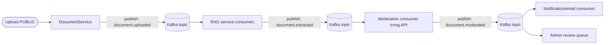
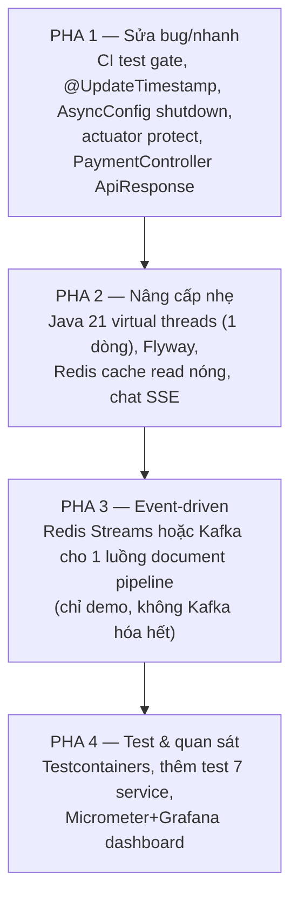

# AI Study Hub API — Đề xuất cải thiện

> Ghi chú phân tích project (đồ án môn học, mức sinh viên năm 3/intern).
> Ngày lập: 2026-07-07. Nội dung dựa trên code thật đã đọc (AGENTS.md, `pom.xml`, `application.yaml`, `AsyncConfig.java`, `DocumentServiceImpl.java`).
> Sắp xếp từ **dễ → khó**. Các mục có thể chọn lọc làm, không cần làm hết.

---

## Mục lục

- [0. Đánh giá tổng quan](#0-đánh-giá-tổng-quan)
- [1. Nâng cấp công nghệ](#1-nâng-cấp-công-nghệ-đáng-làm-vừa-sức)
- [2. Kafka dùng ở đâu](#2-kafka-dùng-ở-đâu-câu-hỏi-cụ-thể)
- [3. Cải thiện luồng hoạt động / kiến trúc](#3-cải-thiện-luồng-hoạt-động--kiến-trúc-dễ-làm-trước)
- [4. Tính năng nên thêm](#4-tính-năng-nên-thêm-chọn-1-2-cái-ghi-điểm-cao)
- [5. Testing / DevOps](#5-testing--devops—khoảng-trống-lớn-nhất)
- [6. Observability](#6-observability-bonus-nếu-còn-thời-gian)
- [7. Lộ trình ưu tiên](#7-lộ-trình-ưu-tiên-đề-xuất)

---

## 0. Đánh giá tổng quan

Project này khá ấn tượng cho đồ án sinh viên — đã có những thứ mà nhiều dev junior chưa từng làm: microservice (Java + FastAPI), RAG thật với pgvector, async orchestration, moderation tự động, presigned S3, JWT + Redis blacklist. Kiến trúc được trừu tượng hóa qua interface (`ChatbotClient`, `UploadProvider`) rất đúng cách.

Nhưng có vài điểm "mùi" thấy rõ trong code:

| Vấn đề | Bằng chứng | Mức độ |
|---|---|---|
| **God class** | `DocumentServiceImpl.java` = **1177 dòng** (1 class gánh cả upload + state machine + async + RAG orchestration) | Nặng |
| **Secret fallback trong YAML** | `application.yaml:86` có default JWT secret thật, `:90` có `default-secret-key-change-me` | Bảo mật |
| **Actuator mở `'*'` không protect** | `application.yaml:58` expose tất cả (kể cả `/env`, `/beans`) mà không qua auth | Bảo mật |
| **`ddl-auto: update` ở prod** | AGENTS.md xác nhận cả 2 profile đều `update` | Rủi ro DB |
| **Không có CI test gate** | Dockerfile build `-DskipTests`, CI chỉ deploy | DevOps |
| **WebClient block trong `@Async`** | `ChatbotClientImpl` `.block()` trên thread pool chỉ 5–20 thread | Hiệu năng |

> Các điểm bảo mật trong đồ án học thuật thường "chấp nhận được", nhưng nếu bày vào báo cáo/cv thì nên sửa để không bị bắt lỗi khi protect.

---

## 1. Nâng cấp công nghệ (đáng làm, vừa sức)

### ✅ Java 17 → Java 21 (LTS) — ưu tiên #1, ROI cao nhất

Java 21 mang lại 2 thứ cực hợp với project này:

- **Virtual threads (`Thread.ofVirtual`)**: project đang block WebClient trong `@Async("taskExecutor")` với pool 5/20/100. Virtual threads sinh ra cho đúng kiểu "I/O blocking nhiều" này — mỗi chat request / mỗi callback không ăn tài nguyên 1 OS thread nữa. Trong Spring Boot 4, chỉ cần `spring.threads.virtual.enabled: true` là task executor + Tomcat dùng virtual threads tự động. **Đổi 1 dòng config, không sửa code.** Rất đẹp để bày vào báo cáo ("tối ưu throughput chat RAG bằng virtual threads").
- **Records** cho DTO bất biến (thay một số `@Data @Builder`), **pattern matching** cho `switch` ở phần routing.

> Nâng cấp an toàn nhất (cùng họ LTS, Spring Boot 4 đã support full) và "bán" được nhất khi thuyết trình.

### ✅ Flyway (thay `ddl-auto: update`)

`initdb.sql` đã đẹp rồi — Flyway chỉ là quản lý version hóa nó. Tách thành `V1__init.sql`, `V2__add_xxx.sql`. Bài học về **database migration** là kỹ năng production thực tế mà ít sinh viên biết. Rất hợp đồ án.

### ✅ MapStruct (tùy chọn, nhẹ)

AGENTS.md nói cố tình map thủ công — OK cho học, nhưng 1177 dòng `DocumentServiceImpl` chứa nhiều map tay. MapStruct sinh code lúc compile, giảm ~30% boilerplate. **Chỉ nên dùng nếu thấy mapping tay đang đau**, không phải bắt buộc.

### ✅ Resilience4j (nếu RAG hay chết)

Hiện `WebClient` gọi FastAPI không có retry/circuit breaker. RAG down → request treo 30s (`chat-timeout-seconds`). Resilience4j thêm **retry + circuit breaker + bulkhead** dễ dàng. Level-appropriate và rất "production mindset".

### ⚠️ KHÔNG nên nâng cấp

- **Spring Boot 4.0.6 → cao hơn**: đang quá mới rồi, giữ nguyên.
- **WebMVC → WebFlux full reactive**: rewriting toàn bộ = quá sức cho đồ án, và WebMVC + virtual threads đã đủ tốt.
- **PostgreSQL 16 / Redis 7**: bản mới, không cần đụng.
- **LangChain 0.3 → 1.x** (RAG side): AGENTS.md đã cảnh báo, tuyệt đối không.

---

## 2. Kafka dùng ở đâu (câu hỏi cụ thể)

Luồng **đẹp nhất và kinh điển nhất** để nhét Kafka chính là **pipeline xử lý tài liệu** — vì nó vốn đã là state-machine bất đồng bộ, đang ghép bằng `@Async` + HTTP callback + shared secret. Đây là use-case giáo khoa chuẩn cho event-driven.

### Cách Kafka thay thế luồng hiện tại

| Bước | Hiện tại | Đổi sang Kafka | Lợi ích |
|---|---|---|---|
| API → RAG ingest | `@Async` WebClient POST `/extract` | Publish `document.uploaded` | RAG tự consume, không cần block |
| RAG → API (xong extract) | HTTP callback `/internal/documents/callback` + `X-Internal-Secret` | Publish `document.extracted` | **Bỏ hẳn endpoint internal + secret**, không lo 403 |
| Moderation kết quả | Gọi `approve/reject` trực tiếp trong cùng context | Publish `document.moderated` | Tách notification ra consumer riêng |
| Thông báo admin/email | Đồng bộ trong flow | Consumer riêng trên cùng topic | Không chậm flow chính |

**Lợi ích khi báo cáo:** "thay thế tight coupling bằng event-driven, loại bỏ HTTP callback + shared secret, có replay/retry tự nhiên, tách biệt concern (moderation ≠ notification)".

### ⚠️ Nhưng khuyên thật lòng — đường luồng tốt hơn cho đồ án

**Kafka hơi "quá sức" cho 1 SV năm 3**: phải chạy broker (KRaft/Zookeeper), quản lý consumer group, offset, partition, dead-letter… Nếu mục tiêu là **học + bày CV**, có 2 lựa chọn nhẹ hơn nhiều mà vẫn ghi điểm:

| Option | Đã có infra? | Học được gì | Độ khó |
|---|---|---|---|
| **Spring `ApplicationEventPublisher`** (in-process) | ✅ không cần thêm gì | event-driven, `@TransactionalEventListener`, decouple notification khỏi business | ⭐ Rất dễ |
| **Redis Streams / Pub-Sub** | ✅ đã có Redis | consumer group, persistence, ack — "message broker thật" mà không cài Kafka | ⭐⭐ Vừa |
| **Kafka** | ❌ phải thêm 1 service trong compose | full event-driven, partition, replay | ⭐⭐⭐ Nặng |

> **Đề xuất:** nếu GV/chấm quan tâm Kafka thì làm Kafka (chỉ cài 1 luồng document pipeline là đủ demo). Còn nếu tự chọn → **Redis Streams** cho 90% giá trị học với 10% công sức, vì Redis đã có sẵn trong compose rồi. Đừng cố Kafka- hóa mọi luồng — 1 luồng demo tốt còn hơn 3 luồng nửa vời.

**Chỉ Kafka- hóa đúng 1 luồng**: `document.uploaded → document.extracted → document.moderated`. Đừng đụng đến luồng chat (chat cần low-latency, Kafka thêm lag phản mà có hại).

---

## 3. Cải thiện luồng hoạt động / kiến trúc (dễ làm trước)

1. **Tách `DocumentServiceImpl` (1177 dòng)** thành: `DocumentUploadService`, `DocumentProcessingOrchestrator`, `DocumentModerationService`. Đây là refactor có giá trị học cao nhất về SRP.
2. **Sửa `PaymentController`** trả `ApiResponse` thay vì bare `ResponseEntity` (AGENTS.md đã đánh dấu là anomaly).
3. **Thêm method-level security**: hiện authz chỉ theo URL prefix. Thêm `@PreAuthorize("hasRole('ADMIN')")` hoặc `@PreAuthorize("#ownerId == authentication.principal.userId")` cho các endpoint sửa/xóa — bài học hay về defense-in-depth.
4. **WebClient đồng nhất**: OAuth đang dùng `RestClient` còn FastAPI dùng `WebClient` (bất nhất). Chọn 1.
5. **`updated_at` không hoạt động** (AGENTS.md: không có `@UpdateTimestamp`). Thêm `@UpdateTimestamp` để audit đúng — bug nhỏ nhưng thật.
6. **`AsyncConfig` thiếu**: `setWaitForTasksToCompleteOnShutdown(true)` + `setRejectedExecutionHandler` — hiện shutdown có thể làm mất task đang chạy, queue đầy thì throw exception mặc định.

---

## 4. Tính năng nên thêm (chọn 1–2 cái ghi điểm cao)

| Tính năng | Vì sao nên làm | Độ khó | Ghi điểm CV |
|---|---|---|---|
| **Chat streaming (SSE)** — trả token LLM từng phần | UX rõ rệt + học Server-Sent Events. Đang chat block 30s rất tệ | ⭐⭐ | ⭐⭐⭐ |
| **Cache Redis cho read nóng** (document metadata, trending, search) | Redis đã có, chỉ thêm `@Cacheable`. Tăng perf có số đo | ⭐ | ⭐⭐ |
| **WebSocket notification real-time** (admin nhận alert document mới) | Có sẵn `NotificationEntity` | ⭐⭐ | ⭐⭐ |
| **Spring Scheduler** dọn chunk mồ côi / token hết hạn | Trivial, mà xử lý "memory leak" của RAG store | ⭐ | ⭐ |
| **Email template bằng Thymeleaf** | Thay email text thô hiện tại | ⭐ | ⭐ |

> **Pick đề xuất:** **Chat SSE** + **Redis cache**. Cả 2 đều dùng infra có sẵn, demo được bằng mắt, và giải quyết 2 điểm yếu thật của app (chat chậm + read lặp).

---

## 5. Testing / DevOps — khoảng trống lớn nhất

AGENTS.md nói rõ: **7/17 service chưa test, filter chain chưa test, không CI gate**. Đây là chỗ dễ ăn điểm nhất khi bảo vệ "production mindset":

1. **Thêm CI test gate**: sửa `.github/workflows/workflow.yml` chạy `mvn test` trước khi deploy; bỏ `-DskipTests` ở Dockerfile (hoặc tách 2 stage). Hiện push code hỏng lên `main` vẫn deploy được — rủi ro thật.
2. **Testcontainers** cho integration test (Postgres + Redis thật trong Docker, spin lên per-test). AGENTS.md nói đang mock hết — Testcontainers cho test thật JPA query + pgvector, mức học rất cao và cực ấn tượng. Đây là **nâng cấp test đáng tiền nhất**.
3. **Bổ sung test** cho 7 service thiếu (`Payment`, `Review`, `TrendingDocument`, `RedisToken`, `ChatbotClient`, `UserSanction`, `GoogleOAuth2`) theo style Mockito đã có.

---

## 6. Observability (bonus, nếu còn thời gian)

Actuator đã có nhưng chưa khai thác:

- **Micrometer + Prometheus + Grafana**: thêm `micrometer-registry-prometheus`, expose `/actuator/prometheus`, chạy grafana trong compose → có dashboard "số request, latency chat, lỗi RAG". Báo cáo có chart = tự tin.
- **Structured logging + correlation ID (MDC)**: trace 1 request qua Java → FastAPI. Hoàn hảo cho microservice.
- **OpenTelemetry tracing** span Java↔Python: level hơi cao nhưng nếu làm được thì "wow".

---

## 7. Lộ trình ưu tiên (đề xuất)

Nếu chỉ kham được một phần, xếp theo **giá trị / công sức**:

### Tóm tắt lựa chọn cốt lõi

- **Kafka**: chỉ 1 luồng duy nhất — document pipeline (`uploaded → extracted → moderated`). Đừng đụng chat. Nếu sợ nặng → **Redis Streams** thay.
- **Tech upgrade xịn nhất**: **Java 21 virtual threads** (đổi 1 dòng, demo được throughput).
- **Bug thật nên sửa**: `@UpdateTimestamp`, CI gate, actuator expose, god class `DocumentServiceImpl`.
