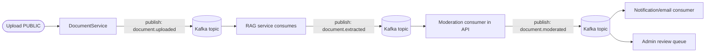
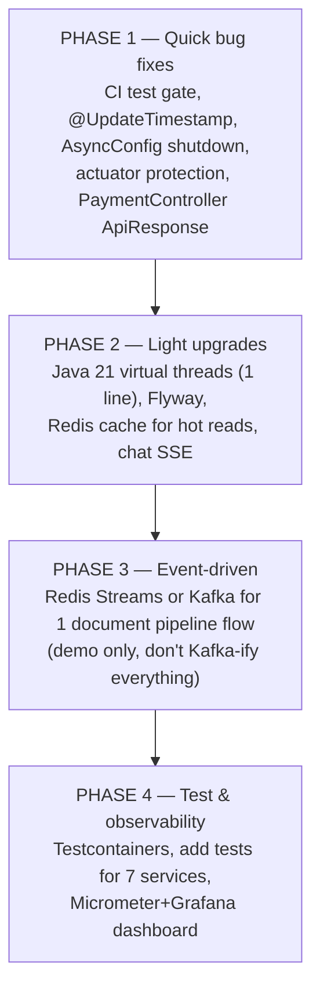

# AI Study Hub API — Improvement Proposals

> Project analysis notes (course project, at the level of a 3rd-year student / intern).
> Date created: 2026-07-07. Content is based on real code I read (AGENTS.md, `pom.xml`, `application.yaml`, `AsyncConfig.java`, `DocumentServiceImpl.java`).
> Ordered from **easy → hard**. You can pick and choose items; you don't need to do them all.

---

## Table of contents

- [0. Overall assessment](#0-overall-assessment)
- [1. Technology upgrades (worth doing, manageable)](#1-technology-upgrades-worth-doing-manageable)
- [2. Where to use Kafka (a specific question)](#2-where-to-use-kafka-a-specific-question)
- [3. Improve the workflow / architecture (easy to do first)](#3-improve-the-workflow--architecture-easy-to-do-first)
- [4. Features to add (pick 1–2 for high marks)](#4-features-to-add-pick-1-2-for-high-marks)
- [5. Testing / DevOps — the biggest gap](#5-testing--devops—the-biggest-gap)
- [6. Observability (bonus, if you have time)](#6-observability-bonus-if-you-have-time)
- [7. Priority roadmap (proposed)](#7-priority-roadmap-proposed)

---

## 0. Overall assessment

This project is quite impressive for a student project — it already has things that many junior devs have never done: microservices (Java + FastAPI), real RAG with pgvector, async orchestration, automatic moderation, presigned S3, JWT + Redis blacklist. The architecture is abstracted through interfaces (`ChatbotClient`, `UploadProvider`) in a proper way.

But there are a few clear "code smells" in the code:

| Issue | Evidence | Severity |
|---|---|---|
| **God class** | `DocumentServiceImpl.java` = **1177 lines** (1 class handles upload + state machine + async + RAG orchestration) | Heavy |
| **Secret fallback in YAML** | `application.yaml:86` has a real default JWT secret, `:90` has `default-secret-key-change-me` | Security |
| **Actuator exposes `'*'` without protection** | `application.yaml:58` exposes everything (including `/env`, `/beans`) without auth | Security |
| **`ddl-auto: update` in prod** | AGENTS.md confirms both profiles use `update` | DB risk |
| **No CI test gate** | Dockerfile builds with `-DskipTests`, CI only deploys | DevOps |
| **WebClient block inside `@Async`** | `ChatbotClientImpl` calls `.block()` on a thread pool of only 5–20 threads | Performance |

> The security issues in an academic project are usually "acceptable", but if you show them in a report/CV, you should fix them so they aren't flagged during defense.

---

## 1. Technology upgrades (worth doing, manageable)

### ✅ Java 17 → Java 21 (LTS) — priority #1, highest ROI

Java 21 brings 2 things that fit this project really well:

- **Virtual threads (`Thread.ofVirtual`)**: the project currently blocks WebClient inside `@Async("taskExecutor")` with a pool of 5/20/100. Virtual threads were made exactly for this kind of "lots of I/O blocking" — each chat request / each callback no longer consumes a whole OS thread. In Spring Boot 4, just set `spring.threads.virtual.enabled: true` and the task executor + Tomcat use virtual threads automatically. **Change 1 line of config, no code changes.** Great to show in a report ("optimize RAG chat throughput with virtual threads").
- **Records** for immutable DTOs (replacing some `@Data @Builder`), **pattern matching** for `switch` in the routing part.

> The safest upgrade (same LTS family, Spring Boot 4 fully supports it) and the easiest to "sell" in a presentation.

### ✅ Flyway (replace `ddl-auto: update`)

`initdb.sql` is already nice — Flyway just version-controls it. Split it into `V1__init.sql`, `V2__add_xxx.sql`. The lesson on **database migration** is a real production skill that few students know. A great fit for a project.

### ✅ MapStruct (optional, lightweight)

AGENTS.md says the manual mapping is intentional — OK for learning, but the 1177-line `DocumentServiceImpl` contains a lot of hand-written mapping. MapStruct generates code at compile time, cutting ~30% of the boilerplate. **Only use it if the manual mapping is painful**; it's not mandatory.

### ✅ Resilience4j (if RAG goes down often)

Currently the `WebClient` call to FastAPI has no retry/circuit breaker. RAG down → the request hangs for 30s (`chat-timeout-seconds`). Resilience4j adds **retry + circuit breaker + bulkhead** easily. Level-appropriate and very "production mindset".

### ⚠️ Should NOT upgrade

- **Spring Boot 4.0.6 → higher**: it's too new right now, leave it as is.
- **WebMVC → WebFlux full reactive**: rewriting everything = too much for a project, and WebMVC + virtual threads is already good enough.
- **PostgreSQL 16 / Redis 7**: current versions, no need to touch.
- **LangChain 0.3 → 1.x** (RAG side): AGENTS.md already warns against this, absolutely not.

---

## 2. Where to use Kafka (a specific question)

The **nicest and most classic** flow to put Kafka in is the **document processing pipeline** — because it's already an async state machine, currently stitched together with `@Async` + HTTP callback + shared secret. This is a textbook use case for event-driven design.

### How Kafka replaces the current flow

| Step | Currently | Switch to Kafka | Benefit |
|---|---|---|---|
| API → RAG ingest | `@Async` WebClient POST `/extract` | Publish `document.uploaded` | RAG consumes on its own, no need to block |
| RAG → API (extract done) | HTTP callback `/internal/documents/callback` + `X-Internal-Secret` | Publish `document.extracted` | **Drop the internal endpoint + secret entirely**, no more 403 worries |
| Moderation result | Call `approve/reject` directly in the same context | Publish `document.moderated` | Split notification out into a separate consumer |
| Admin/email notification | Synchronous inside the flow | Separate consumer on the same topic | Doesn't slow down the main flow |

**Benefits for the report:** "replace tight coupling with event-driven, eliminate the HTTP callback + shared secret, get natural replay/retry, and separate concerns (moderation ≠ notification)".

### ⚠️ But honest advice — a better path for a project

**Kafka is a bit "too much" for a 3rd-year student**: you have to run a broker (KRaft/Zookeeper), manage consumer groups, offsets, partitions, dead-letter… If the goal is to **learn + show on a CV**, there are 2 much lighter options that still earn points:

| Option | Infra already there? | What you learn | Difficulty |
|---|---|---|---|
| **Spring `ApplicationEventPublisher`** (in-process) | ✅ nothing extra needed | event-driven, `@TransactionalEventListener`, decouple notification from business | ⭐ Very easy |
| **Redis Streams / Pub-Sub** | ✅ Redis already there | consumer group, persistence, ack — a "real message broker" without installing Kafka | ⭐⭐ Medium |
| **Kafka** | ❌ need to add 1 service in compose | full event-driven, partition, replay | ⭐⭐⭐ Heavy |

> **Recommendation:** if the instructor/grader cares about Kafka, do Kafka (just set up 1 document pipeline flow to demo). If you choose yourself → **Redis Streams** gives 90% of the learning value for 10% of the effort, because Redis is already in the compose file. Don't try to Kafka-ify every flow — 1 good demo flow beats 3 half-baked ones.

**Only Kafka-ify exactly 1 flow**: `document.uploaded → document.extracted → document.moderated`. Don't touch the chat flow (chat needs low-latency; Kafka adds lag, which hurts).

---

## 3. Improve the workflow / architecture (easy to do first)

1. **Split `DocumentServiceImpl` (1177 lines)** into: `DocumentUploadService`, `DocumentProcessingOrchestrator`, `DocumentModerationService`. This is the refactor with the highest learning value for SRP.
2. **Fix `PaymentController`** to return `ApiResponse` instead of a bare `ResponseEntity` (AGENTS.md already flagged this as an anomaly).
3. **Add method-level security**: currently authz is only by URL prefix. Add `@PreAuthorize("hasRole('ADMIN')")` or `@PreAuthorize("#ownerId == authentication.principal.userId")` to the edit/delete endpoints — a good lesson in defense-in-depth.
4. **Make the WebClient consistent**: OAuth uses `RestClient` while FastAPI uses `WebClient` (inconsistent). Pick 1.
5. **`updated_at` doesn't work** (AGENTS.md: no `@UpdateTimestamp`). Add `@UpdateTimestamp` so audits are correct — a small but real bug.
6. **`AsyncConfig` is missing**: `setWaitForTasksToCompleteOnShutdown(true)` + `setRejectedExecutionHandler` — currently a shutdown can lose running tasks, and a full queue throws the default exception.

---

## 4. Features to add (pick 1–2 for high marks)

| Feature | Why do it | Difficulty | CV points |
|---|---|---|---|
| **Chat streaming (SSE)** — return LLM tokens piece by piece | Clear UX win + learn Server-Sent Events. Currently chat blocks for 30s, which is bad | ⭐⭐ | ⭐⭐⭐ |
| **Redis cache for hot reads** (document metadata, trending, search) | Redis is already there, just add `@Cacheable`. Measurable perf boost | ⭐ | ⭐⭐ |
| **Real-time WebSocket notification** (admin gets an alert for new documents) | `NotificationEntity` already exists | ⭐⭐ | ⭐⭐ |
| **Spring Scheduler** to clean up orphan chunks / expired tokens | Trivial, and handles the RAG store "memory leak" | ⭐ | ⭐ |
| **Thymeleaf email templates** | Replace the current plain-text emails | ⭐ | ⭐ |

> **Suggested picks:** **Chat SSE** + **Redis cache**. Both use existing infra, can be demoed visibly, and fix 2 real weaknesses of the app (slow chat + repeated reads).

---

## 5. Testing / DevOps — the biggest gap

AGENTS.md is clear: **7/17 services are untested, the filter chain is untested, there's no CI gate**. This is the easiest place to score points when defending a "production mindset":

1. **Add a CI test gate**: edit `.github/workflows/workflow.yml` to run `mvn test` before deploying; remove `-DskipTests` from the Dockerfile (or split into 2 stages). Currently, pushing broken code to `main` still deploys — a real risk.
2. **Testcontainers** for integration tests (real Postgres + Redis in Docker, spun up per test). AGENTS.md says everything is currently mocked — Testcontainers lets you test real JPA queries + pgvector, with very high learning value and very impressive. This is **the test upgrade most worth the effort**.
3. **Add tests** for the 7 untested services (`Payment`, `Review`, `TrendingDocument`, `RedisToken`, `ChatbotClient`, `UserSanction`, `GoogleOAuth2`) following the existing Mockito style.

---

## 6. Observability (bonus, if you have time)

Actuator is already there but isn't being used:

- **Micrometer + Prometheus + Grafana**: add `micrometer-registry-prometheus`, expose `/actuator/prometheus`, run grafana in compose → get a dashboard for "request count, chat latency, RAG errors". A report with charts = confidence.
- **Structured logging + correlation ID (MDC)**: trace 1 request across Java → FastAPI. Perfect for microservices.
- **OpenTelemetry tracing** span Java↔Python: a fairly high level, but if you can do it, it's a "wow".

---

## 7. Priority roadmap (proposed)

If you can only manage part of it, ranked by **value / effort**:

### Core choices summary

- **Kafka**: only 1 single flow — the document pipeline (`uploaded → extracted → moderated`). Don't touch chat. If it feels too heavy → use **Redis Streams** instead.
- **Best tech upgrade**: **Java 21 virtual threads** (change 1 line, demo the throughput).
- **Real bugs to fix**: `@UpdateTimestamp`, CI gate, actuator exposure, god class `DocumentServiceImpl`.
