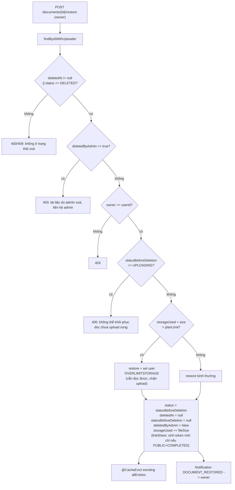

# Khôi phục tài liệu (Document Restore) — Phân tích & Kế hoạch triển khai

> Bối cảnh: hiện tại soft-delete tài liệu **đồng thời xoá luôn** dữ liệu RAG
> (`document_chunks` trong DB + `parent_docs_store/` trên filesystem RAG + rebuild BM25).
> Bài toán: muốn thêm tính năng **khôi phục** tài liệu đã xoá mềm thì triển khai thế nào?
>
> Tài liệu này phân tích trạng thái hiện tại, nêu các phương án kèm đánh đổi, khuyến nghị
> một phương án, và đưa ra kế hoạch triển khai chi tiết (step-by-step). **Chưa viết code.**

---

## 1. Trạng thái hiện tại: soft-delete đang phá gì?

Có **hai đường** soft-delete, chạy cùng một trạng thái `DELETED` nhưng hành vi RAG khác nhau:

### 1.1. Đường owner — `DocumentServiceImpl.deleteDocument` (`DocumentServiceImpl.java:459-502`)

```java
document.setDeletedAt(now());
document.setStatus(DELETED);
// ... trừ storageUsed, có thể OVERLIMITSTORAGE -> ACTIVE ...
document.setLinkShare(null);          // (a) token share bị huỷ vĩnh viễn
documentRepository.save(document);
deleteFastApiVectorsAsync(documentId); // (b) xoá sạch index RAG
```

`deleteFastApiVectorsAsync` (`:504-512`) gọi `DocumentRagClient.deleteVectors` →
`DELETE {fastapi.base-url}/documents/{id}`. Bên RAG (`ingestion.py:229-243`) hàm
`delete_document` làm **3 việc không thể hoàn tác**:

| Tài nguyên | Vị trí | Bị xoá? | Khôi phục được không? |
|---|---|---|---|
| `document_chunks` (text + `embedding vector(1536)` + metadata) | PostgreSQL (`aistudyhub`) | ✅ `DELETE FROM document_chunks WHERE document_id=%s` | Chỉ bằng cách re-chunk + **re-embed (tốn Gemini)** |
| Parent docs (text gốc 1000/200) | filesystem RAG container: `parent_docs_store/` (mounted volume) | ✅ `store.mdelete(parent_ids)` | Chỉ bằng cách tải lại S3 + re-chunk |
| BM25 retriever (in-memory + nguồn từ `parent_docs_store`) | RAM RAG | ✅ rebuild `update_bm25()` | Tự heal khi re-index |
| `link_share` token | cột `documents.link_share` | ✅ set `NULL` | Mất giá trị cũ → phải **sinh token mới** |
| `documents` row (title, summary, fileUrl, tags, status…) | PostgreSQL | ❌ chỉ đổi status thành `DELETED` | Giữ nguyên — khôi phục được |
| File gốc S3 (`fileUrl` + preview) | AWS S3 | ❌ chỉ xoá ở **hard-delete** (sau `retention-days` = 30 ngày) | Giữ nguyên |
| `document_tags`, `reviews`, `reports`, `saved_documents` | PostgreSQL | ❌ (một số cascade ở hard-delete) | Giữ nguyên đến hard-delete |
| `summary` | cột `documents.summary` | ❌ | Giữ nguyên |

### 1.2. Đường admin (qua report) — `ReportServiceImpl.resolveReport` (`ReportServiceImpl.java:123-135`)

```java
document.setDeletedAt(now());
document.setStatus(DELETED);
document.setLinkShare(null);
// ... trừ storageUsed ...
documentRepository.save(document);
//  KHÔNG gọi deleteFastApiVectorsAsync  ← khác biệt với đường owner!
```

**Đây là một sự không nhất quán** đáng chú ý: admin xoá mềm thì **index RAG còn nguyên**
(cho đến khi `DocumentPurgeScheduler` hard-delete sau 30 ngày). Nghĩa là RAG đang
"nắm giữ" chunks zombie của doc admin-xoá trong suốt retention window — vẫn an toàn vì
chat chỉ truyền `COMPLETED` doc_id (xem §2).

> Hệ quả: **khi muốn khôi phục, đường owner bị thiếu dữ liệu RAG, còn đường admin thì còn.**
> Hai đường đang có ngữ nghĩa khác nhau trên cùng một trạng thái `DELETED`.

### 1.3. Hard-delete — `DocumentServiceImpl.hardDeleteDocument` (`:515-542`)

Chạy bởi `DocumentPurgeScheduler` (cron 03:00 mỗi ngày) cho các doc `deletedAt < now() - retentionDays`:
xoá file S3 (`fileUrl` + preview path), xoá `reviews`/`reports`/`session_documents`
(những FK không có `ON DELETE CASCADE`), rồi `documentRepository.delete(doc)`.
**`document_chunks` cascade ở DB** (`initdb.sql:200`: `ON DELETE CASCADE`).
Hard-delete **không** gọi RAG `deleteVectors` — phần parent docs trên filesystem + BM25
**không được dọn** (chỉ sạch nhờ DB cascade). Đây là một gap nhỏ hiện tại.

---

## 2. Tại sao "restore" hiện tại đắt / khó?

Nếu **giữ nguyên** eager-purge ở soft-delete và muốn restore:

1. Index RAG (chunks + embeddings + parent docs) **đã bị xoá** → phải **re-ingest**:
   gọi lại `/process` (PRIVATE) hoặc `/extract` + `/index` (PUBLIC) → **re-chunk + 1 lượt
   `embed_documents` Gemini 1536-dim** (tốn tiền + ~vài giây → phải `@Async`).
2. Phải chạy lại **state machine** (PROCESSING/PENDING/COMPLETED) + (với PUBLIC) re-moderation.
3. Có thể **fail** giữa chừng → cần retry/state-machine như luồng upload hiện tại.
4. `summary` có thể regenerate hoặc dùng lại từ DB (đang còn trong row).

→ Restore chậm, tốn tiền, nhiều failure mode. **Không nên.**

**Nhưng** leak-prevention hiện tại đã **an toàn cho việc giữ lại** chunks khi soft-delete:

- Lớp (1): RAG `similarity_search_by_vector` lọc `embedding IS NOT NULL`.
- Lớp (2): API chỉ truyền `COMPLETED` doc_id cho chat (`ChatServiceImpl:246` chặn
  `deletedAt != null || DELETED` → 404; chat không bao giờ truyền doc `DELETED`).
- Search/trending/recommend đều lọc `d.deletedAt IS NULL`
  (`DocumentRepository`, `TrendingDocumentRepository:22`, `findRecommendedDocumentIds`).

→ Một doc `DELETED` dù còn nguyên chunks/embeddings trong store thì **cũng không bao giờ
được surface**. Giống hệt model an toàn đang dùng cho doc `PENDING`/`REJECTED` (chunks
NULL-embedding). **Đây là chìa khoá cho phương án khuyến nghị.**

---

## 3. Các phương án

### Phương án A — Lazy purge (dời xoá RAG về hard-delete) ✅ KHUYẾN NGHỊ

**Ý tưởng**: soft-delete **không** xoá index RAG nữa — chỉ flip trạng thái DB + trừ storage.
Index RAG chỉ bị xoá khi **hard-delete** (30 ngày sau). Restore lúc đó **trivial**: flip lại
trạng thái + cộng lại storage + sinh share link mới. RAG không cần đụng tới.

```
            soft-delete (owner/admin)              hard-delete (sau 30 ngày)
   ┌─────────────────────────────────────┐         ┌─────────────────────────────────┐
   │ status DELETED, deletedAt = now()   │         │ RAG deleteVectors (chunks +     │
   │ storageUsed -= fileSize             │   ...   │   parent docs + BM25)  ← DỜI LÊN │
   │ linkShare = null                    │ ──────► │ S3 delete (file + preview)      │
   │ KHÔNG đụng RAG  ← thay đổi          │         │ DB row delete (cascade chunks)  │
   └─────────────────────────────────────┘         └─────────────────────────────────┘
```

| | |
|---|---|
| ✅ Restore **tức thì, miễn phí** (không re-embed, không Gemini spend) | |
| ✅ Thống nhất ngữ nghĩa: "soft = có thể undo, hard = vĩnh viễn" | |
| ✅ Khử sự không nhất quán owner-vs-admin (cả hai đều lazy) | |
| ✅ Leak-prevention giữ nguyên (status-gate ở Java; xem §2) | |
| ✅ S3 + DB row vẫn xoá đúng hạn 30 ngày | |
| ⚠️ pgvector + `parent_docs_store/` mang theo **zombie chunks** trong retention window (≤30 ngày) | |
| ⚠️ Phải **chú ý thứ tự** khi hard-delete: gọi RAG `deleteVectors` **trước** khi xoá row `documents` (RAG cần đọc `metadata->>'doc_id'` từ `document_chunks` để tìm `parent_ids`; nếu DB cascade xoá chunks trước, RAG không tìm được parent để dọn filesystem) | |

> Về chi phí "zombie": bị chặn bởi `app.document.retention-days` (mặc định 30). Re-embed
> khi restore **còn đắt hơn** (Gemini API + latency). Mức trade-off này hợp lý cho một
> nền tảng tài liệu học tập (khối lượng delete vừa). Nếu sau này delete quá nhiều, có thể
> **giảm `retention-days`** hoặc chạy một job purge RAG-riêng sớm hơn (xem §8).

### Phương án B — Giữ eager purge + re-index khi restore

Soft-delete giữ nguyên (xoá RAG ngay). Restore thì re-ingest qua `/process` hoặc
`/extract`+`/index` (+ re-moderation nếu PUBLIC).

- ✅ pgvector luôn gọn (không zombie).
- ❌ Restore **chậm + tốn tiền** (Gemini re-embed) và **có thể fail** → cần state-machine
  giống upload. Trải nghiệm user kém (restore "đang xử lý…").
- ❌ Summary regenerate hoặc giữ DB (lạc nhịp).

**Không chọn** — đổi công/đ latency + chi phí + độ phức tạp chỉ để tiết kiệm không gian
vector trong 30 ngày.

### Phương án C — Tombstone trên chunks (đánh dấu ẩn)

Giữ chunks, thêm cờ `hidden` vào metadata chunk, loại khỏi BM25/dense retrieval. Restore
= bỏ cờ.

- ❌ Cần sửa `PostgresVectorStore` retrieval + BM25 + maintenance — **couples chặt** Java
  với internals của RAG, vi phạm giới hạn "RAG own `document_chunks`".
- ❌ Quá phức tạp cho bài toán. **Loại.**

---

## 4. Thiết kế chi tiết (Phương án A)

### 4.1. Thay đổi DB schema

Thêm **hai cột nullable** vào `documents` (dùng `ddl-auto: update` → Hibernate tự thêm cột,
không cần migration script; vẫn nên cập nhật `initdb.sql` để đồng bộ):

```sql
ALTER TABLE "documents" ADD COLUMN "status_before_deletion" document_status;
ALTER TABLE "documents" ADD COLUMN "deleted_by_admin" boolean DEFAULT false;
```

- `status_before_deletion`: lưu trạng thái **trước khi xoá** (`COMPLETED` / `PENDING` /
  `PROCESSING`…). Khi restore, set `status` về lại đúng giá trị này (chứ không phải đoán).
  Trạng thái `UPLOADING` thì không restore (chưa có file hợp lệ — coi như không tồn tại).
- `deleted_by_admin`: phân biệt **owner xoá** vs **admin xoá vì vi phạm**. Mặc định chỉ
  **owner được restore doc do owner xoá**; doc do admin xoá **không cho owner tự restore**
  (tránh vô hiệu hoá quyết định admin) — nếu cần thì thêm endpoint admin-restore (xem §6.4).

Entity (`DocumentEntity`):

```java
@Enumerated(EnumType.STRING)
@ColumnTransformer(read="UPPER(status_before_deletion::text)",
                   write="cast(LOWER(?) as document_status)")
@Column(name="status_before_deletion", columnDefinition="document_status")
private DocumentStatus statusBeforeDeletion;

@Column(name="deleted_by_admin")
@Builder.Default
private Boolean deletedByAdmin = false;
```

> Tuân thủ convention enum hiện có (`@ColumnTransformer` UPPER/lower + native PG enum literal).

### 4.2. Soft-delete mới (cả hai đường)

```java
// DocumentServiceImpl.deleteDocument — bỏ deleteFastApiVectorsAsync(documentId)
DocumentStatus originalStatus = document.getStatus();
document.setStatusBeforeDeletion(originalStatus);   // ← lưu lại
document.setDeletedByAdmin(false);                    // đường owner
document.setDeletedAt(now());
document.setStatus(DELETED);
document.setLinkShare(null);
// ... trừ storage (như cũ) ...
documentRepository.save(document);
// KHÔNG gọi deleteFastApiVectorsAsync  ← lazy purge
```

```java
// ReportServiceImpl.resolveReport — thêm 2 dòng set field (đã không gọi RAG từ trước)
document.setStatusBeforeDeletion(originalStatus);
document.setDeletedByAdmin(true);                     // đường admin
// (phần còn lại giữ nguyên)
```

> Hai đường nay **thống nhất**: đều chỉ flip DB, không đụng RAG.

### 4.3. Hard-delete mới — dời RAG purge lên đây + đúng thứ tự

```java
// DocumentServiceImpl.hardDeleteDocument
DocumentEntity document = ...;

// (1) RAG TRƯỚC: cần document_chunks còn để đọc metadata.doc_id → tìm parent_ids
try {
    ragClient.deleteVectors(documentId);   // xoá chunks + parent_docs_store + BM25
} catch (Exception e) {
    log.warn("RAG purge best-effort failed for {} (DB cascade sẽ dọn chunks): {}",
             documentId, e.getMessage());
}
// Lưu ý: parent_docs_store (filesystem) + BM25 KHÔNG do DB cascade dọn → cần bước này.

// (2) S3
uploadProvider.delete(fileUrl);
uploadProvider.delete(previewPath);

// (3) DB dependents + row (document_chunks cascade theo document_id)
reviewRepository.deleteByDocumentId(documentId);
reportRepository.deleteByDocumentId(documentId);
documentRepository.deleteSessionDocumentsByDocumentId(documentId);
documentRepository.delete(document);
```

> Best-effort như cũ: nếu RAG lỗi, DB cascade vẫn xoá chunks; parent docs zombie trên
> filesystem là rò rỉ nhỏ (có thể dọn bằng job quét `parent_docs_store` rời — §8).

### 4.4. Restore flow — `POST /api/v1/documents/{documentId}/restore` (owner)



Logic khoá:

```java
// DocumentServiceImpl.restoreDocument (MỚI)
@Transactional
@CacheEvict(cacheNames = CacheConfig.CACHE_TRENDING_DOCUMENTS, allEntries = true)
public void restoreDocument(UUID documentId, UUID userId) {
    DocumentEntity doc = documentRepository.findByIdWithUploader(documentId)
            .orElseThrow(() -> new AppException(NOT_FOUND, "Document not found"));

    if (doc.getDeletedAt() == null || !DELETED.equals(doc.getStatus()))
        throw new AppException(BAD_REQUEST, "Document is not deleted");

    if (Boolean.TRUE.equals(doc.getDeletedByAdmin()))
        throw new AppException(FORBIDDEN,
            "This document was removed by an administrator and cannot be restored");

    if (!doc.getUploader().getId().equals(userId))
        throw new AppException(FORBIDDEN, "You are not the owner of this document");

    DocumentStatus pre = doc.getStatusBeforeDeletion();
    if (pre == null || UPLOADING.equals(pre))
        throw new AppException(BAD_REQUEST, "Document cannot be restored");

    // --- khôi phục trạng thái ---
    doc.setStatus(pre);
    doc.setDeletedAt(null);
    doc.setStatusBeforeDeletion(null);
    doc.setDeletedByAdmin(false);

    // --- khôi phục storage (đối xứng phần trừ ở delete) ---
    UserEntity u = doc.getUploader();
    long used = u.getStorageUsed() + doc.getFileSizeBytes();
    u.setStorageUsed(used);
    // nếu vượt plan -> OVERLIMITSTORAGE (mirror chiều ngược của delete)
    long limit = storagePlanRepository.findById(u.getPlanId() != null ? u.getPlanId() : 1)
            .map(StoragePlanEntity::getStorageLimit).orElse(0L);
    if (used > limit && ACTIVE.equals(u.getStatus())) {
        u.setStatus(OVERLIMITSTORAGE);   // vẫn đọc được, chỉ chặn upload
    }
    userRepository.save(u);

    // --- share link: sinh token mới (token cũ đã bị null) ---
    if (pre == COMPLETED && doc.getVisibility() == PUBLIC) {
        doc.setLinkShare("doc-" + UUID.randomUUID());   // dùng lại format hiện tại
    }
    documentRepository.save(doc);

    // --- thông báo ---
    notificationRepository.save(NotificationEntity.builder()
        .user(u).title("Document Restored")
        .content("Your document '" + doc.getTitle() + "' has been restored.")
        .type("DOCUMENT_RESTORED").targetId(doc.getId().toString()).isRead(false).build());

    // RAG: KHÔNG cần đụng — index còn nguyên (lazy purge). Đó là toàn bộ điểm của Phương án A.
}
```

**Tại sao không cần gọi RAG khi restore**: vì soft-delete (mới) không xoá index, nên
`document_chunks` + embeddings + parent docs + BM25 còn nguyên → doc về lại `COMPLETED` là
chat/search/trending thấy lại ngay (cache trending bị evict để hiện ranking mới). Giống
y hệt trạng thái trước khi xoá.

### 4.5. API & controller

```java
// DocumentController — chỉ thêm 1 endpoint, bám convention ApiResponse
@PostMapping("/{documentId}/restore")
@Operation(summary = "Restore a soft-deleted document")
public ApiResponse<Void> restoreDocument(@PathVariable UUID documentId) {
    UUID userId = ((CustomUserDetails) SecurityContextHolder.getContext()
            .getAuthentication().getPrincipal()).getUserId();
    documentService.restoreDocument(documentId, userId);
    return ApiResponse.success("Document restored successfully");
}
```

- Route: `/api/v1/documents/{documentId}/restore` → authenticated (path-based authz hiện có).
- Không thêm method-level security (bám convention repo — authz thuần path).
- `GET /api/v1/documents/trash` đã có sẵn (`getTrashDocuments`) — frontend list trash rồi
  nút "Restore" gọi endpoint trên.

### 4.6. Ma trận trạng thái restore theo `statusBeforeDeletion`

| `statusBeforeDeletion` | Restore hành vi | RAG? |
|---|---|---|
| `COMPLETED` (PRIVATE) | về `COMPLETED`, chat hoạt động lại ngay | còn nguyên — OK |
| `COMPLETED` (PUBLIC) | về `COMPLETED`, sinh share link mới, lên lại trending | còn nguyên — OK |
| `PENDING` (PUBLIC, chưa duyệt) | về `PENDING` (chờ admin duyệt). Có thể **tuỳ chọn** re-enqueue moderation | chunks NULL-embedding còn nguyên |
| `PROCESSING` (đang xử lý khi bị xoá) | về `PROCESSING` rồi để callback RAG đẩy tiếp. **Edge case hiếm** — nên cân nhắc **chặn restore** (báo "tài liệu đang xử lý, thử lại sau") để tránh race | tuỳ |
| `UPLOADING` / `FAILED` / `null` | **chặn** (400) — không nên/không thể khôi phục | — |

> Với `PENDING` (PUBLIC) sau restore: chunks còn NULL-embedding (giống lúc trước xoá). Nếu
> muốn doc được duyệt lại tự động, có thể `ModerationStreamProducer.enqueue(documentId)`
> (consumer đã idempotent: `process()` là no-op khi `status != PENDING`, mà doc đang
> `PENDING` nên chạy thật). **Khuyến nghị bản đầu KHÔNG auto-retrigger** — để admin duyệt
> thủ công, tránh user xoá-khôi phục để "tẩy" kết quả moderation.

---

## 5. Leak-prevention kiểm chứng (an toàn khi giữ chunks)

Khi soft-delete mới (không xoá RAG), doc `DELETED` vẫn có chunks/embeddings trong store.
Kiểm chứng không rò rỉ:

1. **Chat**: `ChatServiceImpl:246` chặn `deletedAt != null || DELETED` → 404 trước khi
   gọi RAG. Doc `DELETED` không bao giờ vào `document_id` của `/chat`. ✅
2. **Search công khai**: `searchPublicDocuments` lọc `d.deletedAt IS NULL` + `COMPLETED`. ✅
3. **Trending**: `findTrendingDocuments` lọc `d.deletedAt IS NULL`. ✅
4. **Recommend**: `findRecommendedDocumentIds` lọc `d.deleted_at IS NULL`. ✅
5. **Preview/shared**: `getSharedDocument`/`getPreviewAccess` chặn `DELETED`/`deletedAt`. ✅
6. **Personal/trash**: tách bạch (`findActiveDocumentsByUploaderId` vs
   `findSoftDeletedDocumentsByUploaderId`). ✅

→ Kết luận: giữ chunks khi soft-delete **không tạo lỗ hổng** so với hiện tại (cùng cơ chế
status-gate đang dùng cho `PENDING`/`REJECTED`).

---

## 6. Edge cases & quyết định

1. **Storage vượt quota khi restore**: không chặn — restore + set user `OVERLIMITSTORAGE`
   (mirror chiều ngược của delete). User vẫn đọc/restore được, chỉ chặn upload mới (giống
   convention `OVERLIMITSTORAGE` hiện có: chặn `initiateUpload`, cho phép list/read).
2. **`linkShare` cũ đã mất**: không cố khôi phục token cũ (đã null). Sinh token mới **chỉ khi
   PUBLIC + COMPLETED**; PRIVATE hoặc PENDING thì để null (user tự bật share sau).
3. **Race restore vs hard-delete**: `DocumentPurgeScheduler` chạy 03:00; restore là request
   người dùng. Cả hai đều `@Transactional` trên cùng `documents` row → PostgreSQL row-lock
   serialize. Trường hợp xấu nhất: doc vừa bị purge thì restore ném `NOT_FOUND` (chấp nhận được).
4. **Doc do admin xoá (vi phạm)**: `deletedByAdmin=true` → owner **không** tự restore.
   Nếu muốn admin có thể undo: thêm `POST /api/v1/admin/documents/{id}/restore` (path
   `/admin/**` → `ROLE_ADMIN` tự động). **Bản đầu bỏ qua** — admin xoá là quyết định cuối.
5. **Thứ tự xoá ở hard-delete**: RAG `deleteVectors` **phải chạy trước** `documentRepository.delete`
   (RAG cần `document_chunks` còn để đọc `metadata.doc_id`). Xem §4.3.
6. **`deleteFastApiVectorsAsync` có còn cần không?**: phần logic gọi RAG xoá được **dời** vào
   `hardDeleteDocument` (đồng bộ, trong transaction). Có thể giữ method `deleteFastApiVectorsAsync`
   (`@Async`) nếu muốn hard-delete không block — **khuyến nghị gọi đồng bộ trong hard-delete**
   (job nền, không phải request người dùng; việc gọi @Async từ method `@Transactional` cùng
   bean còn dễ gây self-invocation trap). Đơn giản hoá: xoá method async, gọi `ragClient.deleteVectors`
   trực tiếp + try/catch best-effort.
7. **Public doc `PENDING` restore**: không auto-retrigger moderation (xem §4.6) — tránh lạm dụng.

---

## 7. Kế hoạch triển khai (step-by-step)

| Bước | File | Việc |
|---|---|---|
| 1 | `model/DocumentEntity.java` | Thêm `statusBeforeDeletion` (enum + `@ColumnTransformer`) + `deletedByAdmin` (`Boolean`, default false). |
| 2 | `initdb.sql` | Thêm 2 cột `status_before_deletion document_status` + `deleted_by_admin boolean DEFAULT false` (đồng bộ với `ddl-auto: update`). |
| 3 | `service/impl/DocumentServiceImpl.java` — `deleteDocument` | Lưu `statusBeforeDeletion`/`deletedByAdmin=false`; **xoá** `deleteFastApiVectorsAsync(documentId)` ở cuối. |
| 4 | `service/impl/DocumentServiceImpl.java` — `hardDeleteDocument` | Thêm `ragClient.deleteVectors` **đầu tiên** (best-effort try/catch) — trước các bước xoá S3/DB. |
| 5 | `service/impl/DocumentServiceImpl.java` | **Mới** `restoreDocument(UUID, UUID)` (logic §4.4): validate → flip trạng thái → cộng storage + quota-check → sinh share link (nếu PUBLIC+COMPLETED) → evict cache → notification. |
| 6 | `service/impl/ReportServiceImpl.java` — `resolveReport` | Set `statusBeforeDeletion` + `deletedByAdmin=true` (RAG giữ nguyên — vốn đã lazy). |
| 7 | `service/DocumentService.java` | Thêm `void restoreDocument(UUID documentId, UUID userId)` vào interface. |
| 8 | `controller/DocumentController.java` | **Mới** `POST /{documentId}/restore` (§4.5). |
| 9 | `service/impl/DocumentServiceImpl.java` | (Tuỳ chọn) dọn `deleteFastApiVectorsAsync` nếu không còn ai gọi — hoặc giữ nếu hard-delete muốn `@Async`. |
| 10 | Test | Xem §8. |

> Không thêm config mới (`application.yaml`). Không thêm dependency/infra.

---

## 8. Testing

Bám phong cách pure-Mockito hiện có (`@ExtendWith(MockitoExtension.class)`, mock repo/RAG/`storagePlanRepository`/`notificationRepository`, `ReflectionTestUtils` cho `@Value`):

- `DocumentServiceImplTest`:
  - **delete**: verify **không** còn `verify(ragClient).deleteVectors(...)`; verify
    `setStatusBeforeDeletion(originalStatus)` + `setDeletedByAdmin(false)`; verify trừ storage
    + (nếu OVERLIMITSTORAGE) restore ACTIVE (như test hiện có).
  - **restore happy path** (`COMPLETED` PUBLIC): status về `COMPLETED`, `deletedAt=null`,
    `linkShare` được set token mới (`"doc-" + ...`), `storageUsed += size`, **không** gọi RAG,
    evict trending, save notification `DOCUMENT_RESTORED`.
  - **restore PRIVATE**: `linkShare` **không** được set (chỉ sinh khi PUBLIC+COMPLETED).
  - **restore vượt quota**: `storageUsed + size > limit` → `OVERLIMITSTORAGE` (không ném).
  - **restore doc không ở trạng thái xoá** → `BAD_REQUEST`.
  - **restore doc admin-xoá** (`deletedByAdmin=true`) → `FORBIDDEN`.
  - **restore không phải owner** → `FORBIDDEN`.
  - **restore `UPLOADING`/`null` pre-status** → `BAD_REQUEST`.
  - **hard-delete**: verify `ragClient.deleteVectors` được gọi **trước** `documentRepository.delete`;
    verify xoá S3 (file + preview) + dependents (reviews/reports/session_documents).
- `ReportServiceImplTest`: verify set `statusBeforeDeletion` + `deletedByAdmin=true`;
  verify **không** gọi RAG (giữ nguyên).
- `DocumentControllerTest` (nếu có controller test): verify `POST /restore` gọi service đúng
  `documentId`/`userId`.

> `@CacheEvict` proxy-based → **inert** trong pure-Mockito (kiểm chứng cấu trúc, giống
> `@Cacheable` hiện có). RAG/Stream không cần Redis thật trong unit test.

**Smoke test (tuỳ chọn, khi có infra)**: `docker compose up -d`, upload 1 doc → chat (verify
citation) → soft-delete → verify `SELECT count(*) FROM document_chunks WHERE document_id=…`
**vẫn > 0** (lazy) → restore → chat lại (verify vẫn citations, không re-embed) → đợi/force
hard-delete → verify chunks = 0 + `parent_docs_store` sạch.

---

## 9. Rủi ro & đánh giá

| Rủi ro | Mức | Giảm thiểu |
|---|---|---|
| Zombie chunks chiếm pgvector/filesystem trong 30 ngày | Thấp | Bị chặn bởi `retention-days`; có thể giảm hoặc thêm job purge RAG sớm (gọi `deleteVectors` cho doc `DELETED` quá N ngày nhưng chưa tới hard-delete — tách khỏi xoá file S3). |
| Race restore vs purge scheduler | Thấp | Cùng row + `@Transactional` → PG row-lock serialize; xấu nhất là `NOT_FOUND`. |
| Restore doc `PENDING` (PUBLIC) để "tẩy" moderation | Trung bình | Không auto-retrigger moderation; admin duyệt thủ công. |
| Quên gọi RAG trước DB cascade ở hard-delete → parent_docs zombie | Trung bình | Đặt `ragClient.deleteVectors` **đầu tiên** trong `hardDeleteDocument` + unit test assert thứ tự. |
| Migration dữ liệu cũ: doc `DELETED` hiện tại (đã eager-purge) không có `statusBeforeDeletion` | Thấp | `statusBeforeDeletion` nullable → restore sẽ chặn (`pre == null` → 400). Doc cũ đã mất RAG thì không restore được (đúng — hoặc fallback re-ingest Phương án B cho riêng các doc này nếu cần). |

---

## 10. Tóm tắt quyết định

- **Chọn Phương án A (lazy purge)**: dời `deleteVectors` từ soft-delete → hard-delete.
- **2 cột mới** `status_before_deletion` + `deleted_by_admin`.
- **1 endpoint mới** `POST /api/v1/documents/{id}/restore` (owner, không cho doc admin-xoá).
- Restore **không đụng RAG** — index còn nguyên → tức thì, miễn phí.
- Leak-prevention **không đổi** (vẫn status-gate ở Java).
- Khử sự không nhất quán owner-vs-admin soft-delete (cả hai đều lazy).
