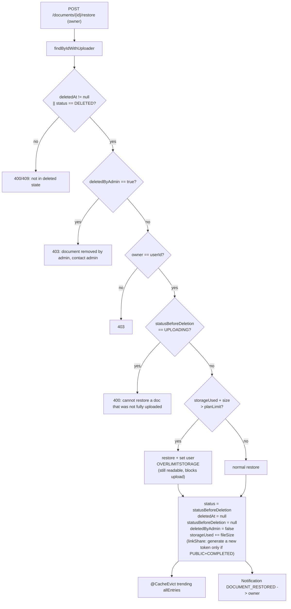

# Document Restore — Analysis & Implementation Plan

> Context: currently, soft-deleting a document **also deletes** the RAG data
> (`document_chunks` in the DB + `parent_docs_store/` on the RAG filesystem + rebuild BM25).
> Problem: how do we add a **restore** feature for soft-deleted documents?
>
> This document analyzes the current state, presents options with trade-offs, recommends
> one option, and gives a detailed step-by-step implementation plan. **No code is written yet.**

---

## 1. Current state: what is soft-delete breaking?

There are **two paths** for soft-delete, both setting the same `DELETED` status but with different RAG behavior:

### 1.1. Owner path — `DocumentServiceImpl.deleteDocument` (`DocumentServiceImpl.java:459-502`)

```java
document.setDeletedAt(now());
document.setStatus(DELETED);
// ... subtract storageUsed, may go OVERLIMITSTORAGE -> ACTIVE ...
document.setLinkShare(null);          // (a) share token destroyed permanently
documentRepository.save(document);
deleteFastApiVectorsAsync(documentId); // (b) wipe the RAG index
```

`deleteFastApiVectorsAsync` (`:504-512`) calls `DocumentRagClient.deleteVectors` →
`DELETE {fastapi.base-url}/documents/{id}`. On the RAG side (`ingestion.py:229-243`) the
`delete_document` function does **3 irreversible things**:

| Resource | Location | Deleted? | Restorable? |
|---|---|---|---|
| `document_chunks` (text + `embedding vector(1536)` + metadata) | PostgreSQL (`aistudyhub`) | ✅ `DELETE FROM document_chunks WHERE document_id=%s` | Only by re-chunk + **re-embed (costs Gemini)** |
| Parent docs (original text 1000/200) | RAG container filesystem: `parent_docs_store/` (mounted volume) | ✅ `store.mdelete(parent_ids)` | Only by re-downloading S3 + re-chunk |
| BM25 retriever (in-memory + source from `parent_docs_store`) | RAG RAM | ✅ rebuild `update_bm25()` | Self-heals on re-index |
| `link_share` token | `documents.link_share` column | ✅ set to `NULL` | Old value is gone → must **generate a new token** |
| `documents` row (title, summary, fileUrl, tags, status…) | PostgreSQL | ❌ only status changes to `DELETED` | Kept as-is — restorable |
| Original S3 file (`fileUrl` + preview) | AWS S3 | ❌ only deleted on **hard-delete** (after `retention-days` = 30 days) | Kept |
| `document_tags`, `reviews`, `reports`, `saved_documents` | PostgreSQL | ❌ (some cascaded on hard-delete) | Kept until hard-delete |
| `summary` | `documents.summary` column | ❌ | Kept |

### 1.2. Admin path (via report) — `ReportServiceImpl.resolveReport` (`ReportServiceImpl.java:123-135`)

```java
document.setDeletedAt(now());
document.setStatus(DELETED);
document.setLinkShare(null);
// ... subtract storageUsed ...
documentRepository.save(document);
//  Does NOT call deleteFastApiVectorsAsync  ← differs from the owner path!
```

**This is a notable inconsistency**: when an admin soft-deletes, the **RAG index stays intact**
(until `DocumentPurgeScheduler` hard-deletes it after 30 days). That means RAG keeps
"holding" zombie chunks for admin-deleted docs throughout the retention window — still safe
because chat only passes `COMPLETED` doc_id (see §2).

> Consequence: **when restoring, the owner path lacks RAG data while the admin path still has it.**
> The two paths have different semantics on the same `DELETED` status.

### 1.3. Hard-delete — `DocumentServiceImpl.hardDeleteDocument` (`:515-542`)

Run by `DocumentPurgeScheduler` (cron 03:00 every day) for docs with `deletedAt < now() - retentionDays`:
deletes the S3 file (`fileUrl` + preview path), deletes `reviews`/`reports`/`session_documents`
(those FKs without `ON DELETE CASCADE`), then `documentRepository.delete(doc)`.
**`document_chunks` cascades in the DB** (`initdb.sql:200`: `ON DELETE CASCADE`).
Hard-delete **does not** call the RAG `deleteVectors` — the parent docs on the filesystem + BM25
**are not cleaned** (only the DB cascade cleans up). This is a small gap today.

---

## 2. Why is "restore" currently expensive / hard?

If we **keep** eager-purge on soft-delete and want to restore:

1. The RAG index (chunks + embeddings + parent docs) **is already deleted** → must **re-ingest**:
   call `/process` (PRIVATE) or `/extract` + `/index` (PUBLIC) again → **re-chunk + 1 round of
   `embed_documents` Gemini 1536-dim** (costs money + ~a few seconds → must be `@Async`).
2. Must re-run the **state machine** (PROCESSING/PENDING/COMPLETED) + (for PUBLIC) re-moderation.
3. May **fail** midway → needs retry/state-machine like the current upload flow.
4. `summary` may be regenerated or reused from DB (still in the row).

→ Restore is slow, costs money, and has many failure modes. **Not recommended.**

**But** the current leak-prevention is **already safe for keeping** chunks on soft-delete:

- Layer (1): RAG `similarity_search_by_vector` filters `embedding IS NOT NULL`.
- Layer (2): The API only passes `COMPLETED` doc_id to chat (`ChatServiceImpl:246` blocks
  `deletedAt != null || DELETED` → 404; chat never passes a `DELETED` doc).
- Search/trending/recommend all filter `d.deletedAt IS NULL`
  (`DocumentRepository`, `TrendingDocumentRepository:22`, `findRecommendedDocumentIds`).

→ A `DELETED` doc, even with its full chunks/embeddings still in the store, is **never
surfaced**. Exactly like the safe model currently used for `PENDING`/`REJECTED` docs
(NULL-embedding chunks). **This is the key to the recommended option.**

---

## 3. Options

### Option A — Lazy purge (move RAG deletion to hard-delete) ✅ RECOMMENDED

**Idea**: soft-delete **no longer** deletes the RAG index — it only flips the DB status and subtracts storage.
The RAG index is only deleted on **hard-delete** (30 days later). Restore then becomes **trivial**:
flip the status back, add storage back, generate a new share link. RAG does not need to be touched.

```
            soft-delete (owner/admin)              hard-delete (after 30 days)
   ┌─────────────────────────────────────┐         ┌─────────────────────────────────┐
   │ status DELETED, deletedAt = now()   │         │ RAG deleteVectors (chunks +     │
   │ storageUsed -= fileSize             │   ...   │   parent docs + BM25)  ← MOVED  │
   │ linkShare = null                    │ ──────► │ S3 delete (file + preview)      │
   │ DO NOT touch RAG  ← change          │         │ DB row delete (cascade chunks)  │
   └─────────────────────────────────────┘         └─────────────────────────────────┘
```

| | |
|---|---|
| ✅ Restore is **instant and free** (no re-embed, no Gemini spend) | |
| ✅ Unified semantics: "soft = undoable, hard = permanent" | |
| ✅ Removes the owner-vs-admin inconsistency (both are lazy) | |
| ✅ Leak-prevention unchanged (status-gate in Java; see §2) | |
| ✅ S3 + DB row still deleted on the 30-day schedule | |
| ⚠️ pgvector + `parent_docs_store/` carry **zombie chunks** during the retention window (≤30 days) | |
| ⚠️ Must **mind the order** on hard-delete: call RAG `deleteVectors` **before** deleting the `documents` row (RAG needs to read `metadata->>'doc_id'` from `document_chunks` to find `parent_ids`; if the DB cascade deletes chunks first, RAG cannot find the parents to clean the filesystem) | |

> On the "zombie" cost: it is bounded by `app.document.retention-days` (default 30). Re-embedding
> on restore **is even more expensive** (Gemini API + latency). This trade-off is reasonable for
> a document-learning platform (moderate delete volume). If deletes grow too large later, you can
> **lower `retention-days`** or run a separate early RAG purge job (see §8).

### Option B — Keep eager purge + re-index on restore

Soft-delete stays the same (delete RAG immediately). On restore, re-ingest via `/process` or
`/extract`+`/index` (+ re-moderation if PUBLIC).

- ✅ pgvector always stays compact (no zombies).
- ❌ Restore is **slow + costly** (Gemini re-embed) and **may fail** → needs a state-machine
  like upload. Poor user experience (restore "processing…").
- ❌ Summary regeneration or DB reuse (out of sync).

**Not chosen** — trading latency + cost + complexity only to save vector space for 30 days.

### Option C — Tombstone on chunks (mark as hidden)

Keep the chunks, add a `hidden` flag to chunk metadata, exclude them from BM25/dense retrieval.
Restore = clear the flag.

- ❌ Requires modifying `PostgresVectorStore` retrieval + BM25 + maintenance — **tightly couples** Java
  with RAG internals, violating the "RAG owns `document_chunks`" boundary.
- ❌ Overkill for this problem. **Rejected.**

---

## 4. Detailed design (Option A)

### 4.1. DB schema changes

Add **two nullable columns** to `documents` (using `ddl-auto: update` → Hibernate adds the columns
automatically, no migration script needed; still update `initdb.sql` to keep them in sync):

```sql
ALTER TABLE "documents" ADD COLUMN "status_before_deletion" document_status;
ALTER TABLE "documents" ADD COLUMN "deleted_by_admin" boolean DEFAULT false;
```

- `status_before_deletion`: stores the status **before deletion** (`COMPLETED` / `PENDING` /
  `PROCESSING`…). On restore, set `status` back to exactly this value (rather than guessing).
  A status of `UPLOADING` is not restorable (no valid file yet — treat as non-existent).
- `deleted_by_admin`: distinguishes **owner-deleted** vs **admin-deleted for violation**. By default only
  **the owner can restore an owner-deleted doc**; an admin-deleted doc **cannot be restored by the owner**
  (to avoid overriding the admin decision) — if needed, add an admin-restore endpoint (see §6.4).

Entity (`DocumentEntity`):

```java
@Enumerated(EnumType.STRING)
@ColumnTransformer(read="UPPER(status_before_deletion::text)",
                   write="cast(LOWER(?) as document_status)")
@Column(name="status_before_deletion", columnDefinition="document_status")
private DocumentStatus statusBeforeDeletion;

@Column(name="deleted_by_admin")
@Builder.Default
private Boolean deletedByAdmin = false;
```

> Follows the existing enum convention (`@ColumnTransformer` UPPER/lower + native PG enum literal).

### 4.2. New soft-delete (both paths)

```java
// DocumentServiceImpl.deleteDocument — remove deleteFastApiVectorsAsync(documentId)
DocumentStatus originalStatus = document.getStatus();
document.setStatusBeforeDeletion(originalStatus);   // ← save it
document.setDeletedByAdmin(false);                    // owner path
document.setDeletedAt(now());
document.setStatus(DELETED);
document.setLinkShare(null);
// ... subtract storage (as before) ...
documentRepository.save(document);
// Do NOT call deleteFastApiVectorsAsync  ← lazy purge
```

```java
// ReportServiceImpl.resolveReport — add 2 lines to set the fields (already did not call RAG)
document.setStatusBeforeDeletion(originalStatus);
document.setDeletedByAdmin(true);                     // admin path
// (rest unchanged)
```

> The two paths are now **unified**: both only flip the DB, neither touches RAG.

### 4.3. New hard-delete — move RAG purge here + correct order

```java
// DocumentServiceImpl.hardDeleteDocument
DocumentEntity document = ...;

// (1) RAG FIRST: needs document_chunks to still exist to read metadata.doc_id -> find parent_ids
try {
    ragClient.deleteVectors(documentId);   // delete chunks + parent_docs_store + BM25
} catch (Exception e) {
    log.warn("RAG purge best-effort failed for {} (DB cascade will clean chunks): {}",
             documentId, e.getMessage());
}
// Note: parent_docs_store (filesystem) + BM25 are NOT cleaned by the DB cascade -> this step is needed.

// (2) S3
uploadProvider.delete(fileUrl);
uploadProvider.delete(previewPath);

// (3) DB dependents + row (document_chunks cascade by document_id)
reviewRepository.deleteByDocumentId(documentId);
reportRepository.deleteByDocumentId(documentId);
documentRepository.deleteSessionDocumentsByDocumentId(documentId);
documentRepository.delete(document);
```

> Best-effort as before: if RAG fails, the DB cascade still deletes chunks; zombie parent docs on
> the filesystem are a small leak (can be cleaned by a separate `parent_docs_store` sweep job — §8).

### 4.4. Restore flow — `POST /api/v1/documents/{documentId}/restore` (owner)



Key logic:

```java
// DocumentServiceImpl.restoreDocument (NEW)
@Transactional
@CacheEvict(cacheNames = CacheConfig.CACHE_TRENDING_DOCUMENTS, allEntries = true)
public void restoreDocument(UUID documentId, UUID userId) {
    DocumentEntity doc = documentRepository.findByIdWithUploader(documentId)
            .orElseThrow(() -> new AppException(NOT_FOUND, "Document not found"));

    if (doc.getDeletedAt() == null || !DELETED.equals(doc.getStatus()))
        throw new AppException(BAD_REQUEST, "Document is not deleted");

    if (Boolean.TRUE.equals(doc.getDeletedByAdmin()))
        throw new AppException(FORBIDDEN,
            "This document was removed by an administrator and cannot be restored");

    if (!doc.getUploader().getId().equals(userId))
        throw new AppException(FORBIDDEN, "You are not the owner of this document");

    DocumentStatus pre = doc.getStatusBeforeDeletion();
    if (pre == null || UPLOADING.equals(pre))
        throw new AppException(BAD_REQUEST, "Document cannot be restored");

    // --- restore status ---
    doc.setStatus(pre);
    doc.setDeletedAt(null);
    doc.setStatusBeforeDeletion(null);
    doc.setDeletedByAdmin(false);

    // --- restore storage (symmetric with the subtraction on delete) ---
    UserEntity u = doc.getUploader();
    long used = u.getStorageUsed() + doc.getFileSizeBytes();
    u.setStorageUsed(used);
    // if over plan -> OVERLIMITSTORAGE (mirror the reverse side of delete)
    long limit = storagePlanRepository.findById(u.getPlanId() != null ? u.getPlanId() : 1)
            .map(StoragePlanEntity::getStorageLimit).orElse(0L);
    if (used > limit && ACTIVE.equals(u.getStatus())) {
        u.setStatus(OVERLIMITSTORAGE);   // still readable, only blocks upload
    }
    userRepository.save(u);

    // --- share link: generate a new token (old token was nulled) ---
    if (pre == COMPLETED && doc.getVisibility() == PUBLIC) {
        doc.setLinkShare("doc-" + UUID.randomUUID());   // reuse the current format
    }
    documentRepository.save(doc);

    // --- notification ---
    notificationRepository.save(NotificationEntity.builder()
        .user(u).title("Document Restored")
        .content("Your document '" + doc.getTitle() + "' has been restored.")
        .type("DOCUMENT_RESTORED").targetId(doc.getId().toString()).isRead(false).build());

    // RAG: NO need to touch — the index is intact (lazy purge). That is the whole point of Option A.
}
```

**Why no RAG call on restore**: because the new soft-delete does not delete the index, so
`document_chunks` + embeddings + parent docs + BM25 are still intact → the doc returns to `COMPLETED`
and chat/search/trending see it again immediately (the trending cache is evicted to show the new ranking).
Exactly the same state as before deletion.

### 4.5. API & controller

```java
// DocumentController — just add 1 endpoint, follow the ApiResponse convention
@PostMapping("/{documentId}/restore")
@Operation(summary = "Restore a soft-deleted document")
public ApiResponse<Void> restoreDocument(@PathVariable UUID documentId) {
    UUID userId = ((CustomUserDetails) SecurityContextHolder.getContext()
            .getAuthentication().getPrincipal()).getUserId();
    documentService.restoreDocument(documentId, userId);
    return ApiResponse.success("Document restored successfully");
}
```

- Route: `/api/v1/documents/{documentId}/restore` → authenticated (existing path-based authz).
- No method-level security added (follows the repo convention — pure path authz).
- `GET /api/v1/documents/trash` already exists (`getTrashDocuments`) — the frontend lists trash then
  the "Restore" button calls the endpoint above.

### 4.6. Restore behavior matrix by `statusBeforeDeletion`

| `statusBeforeDeletion` | Restore behavior | RAG? |
|---|---|---|
| `COMPLETED` (PRIVATE) | back to `COMPLETED`, chat works again immediately | intact — OK |
| `COMPLETED` (PUBLIC) | back to `COMPLETED`, new share link generated, returns to trending | intact — OK |
| `PENDING` (PUBLIC, not yet approved) | back to `PENDING` (waiting for admin approval). May **optionally** re-enqueue moderation | NULL-embedding chunks intact |
| `PROCESSING` (processing when deleted) | back to `PROCESSING` then let the RAG callback continue. **Rare edge case** — consider **blocking restore** (return "document is processing, try again later") to avoid a race | optional |
| `UPLOADING` / `FAILED` / `null` | **block** (400) — should not / cannot be restored | — |

> For `PENDING` (PUBLIC) after restore: chunks still have NULL-embedding (same as before deletion). If
> you want the doc re-approved automatically, you can `ModerationStreamProducer.enqueue(documentId)`
> (the consumer is already idempotent: `process()` is a no-op when `status != PENDING`, and the doc is
> `PENDING` so it runs for real). **Recommend NOT auto-retriggering in the first version** — let the admin
> approve manually, to prevent users from delete-restoring to "reset" the moderation result.

---

## 5. Leak-prevention verification (safe when keeping chunks)

With the new soft-delete (no RAG deletion), a `DELETED` doc still has chunks/embeddings in the store.
Verify there is no leak:

1. **Chat**: `ChatServiceImpl:246` blocks `deletedAt != null || DELETED` → 404 before
   calling RAG. A `DELETED` doc never reaches the `document_id` of `/chat`. ✅
2. **Public search**: `searchPublicDocuments` filters `d.deletedAt IS NULL` + `COMPLETED`. ✅
3. **Trending**: `findTrendingDocuments` filters `d.deletedAt IS NULL`. ✅
4. **Recommend**: `findRecommendedDocumentIds` filters `d.deleted_at IS NULL`. ✅
5. **Preview/shared**: `getSharedDocument`/`getPreviewAccess` block `DELETED`/`deletedAt`. ✅
6. **Personal/trash**: kept separate (`findActiveDocumentsByUploaderId` vs
   `findSoftDeletedDocumentsByUploaderId`). ✅

→ Conclusion: keeping chunks on soft-delete **creates no hole** compared to today (same status-gate
mechanism used for `PENDING`/`REJECTED`).

---

## 6. Edge cases & decisions

1. **Storage over quota on restore**: do not block — restore + set the user to `OVERLIMITSTORAGE`
   (mirror the reverse side of delete). The user can still read/restore; only new uploads are blocked (same
   as the existing `OVERLIMITSTORAGE` convention: blocks `initiateUpload`, allows list/read).
2. **Old `linkShare` is gone**: do not try to recover the old token (already null). Generate a new token
   **only when PUBLIC + COMPLETED**; for PRIVATE or PENDING leave it null (the user enables sharing later).
3. **Race restore vs hard-delete**: `DocumentPurgeScheduler` runs at 03:00; restore is a user request.
   Both are `@Transactional` on the same `documents` row → PostgreSQL row-lock serializes them. Worst
   case: a doc is purged right when restore throws `NOT_FOUND` (acceptable).
4. **Admin-deleted doc (violation)**: `deletedByAdmin=true` → the owner **cannot** self-restore.
   If you want admins to be able to undo: add `POST /api/v1/admin/documents/{id}/restore` (path
   `/admin/**` → `ROLE_ADMIN` automatically). **Skip in the first version** — admin deletion is final.
5. **Delete order on hard-delete**: RAG `deleteVectors` **must run before** `documentRepository.delete`
   (RAG needs `document_chunks` to still exist to read `metadata.doc_id`). See §4.3.
6. **Is `deleteFastApiVectorsAsync` still needed?**: the RAG deletion logic is **moved** into
   `hardDeleteDocument` (synchronous, inside the transaction). You may keep the `deleteFastApiVectorsAsync`
   method (`@Async`) if you want hard-delete to not block — **recommend calling it synchronously in hard-delete**
   (background job, not a user request; calling `@Async` from a `@Transactional` method of the same
   bean is also prone to the self-invocation trap). Simplification: delete the async method, call `ragClient.deleteVectors`
   directly + try/catch best-effort.
7. **PUBLIC `PENDING` doc restore**: do not auto-retrigger moderation (see §4.6) — to prevent abuse.

---

## 7. Implementation plan (step-by-step)

| Step | File | Work |
|---|---|---|
| 1 | `model/DocumentEntity.java` | Add `statusBeforeDeletion` (enum + `@ColumnTransformer`) + `deletedByAdmin` (`Boolean`, default false). |
| 2 | `initdb.sql` | Add 2 columns `status_before_deletion document_status` + `deleted_by_admin boolean DEFAULT false` (keep in sync with `ddl-auto: update`). |
| 3 | `service/impl/DocumentServiceImpl.java` — `deleteDocument` | Save `statusBeforeDeletion`/`deletedByAdmin=false`; **remove** `deleteFastApiVectorsAsync(documentId)` at the end. |
| 4 | `service/impl/DocumentServiceImpl.java` — `hardDeleteDocument` | Add `ragClient.deleteVectors` **first** (best-effort try/catch) — before the S3/DB deletion steps. |
| 5 | `service/impl/DocumentServiceImpl.java` | **New** `restoreDocument(UUID, UUID)` (logic §4.4): validate → flip status → add storage + quota-check → generate share link (if PUBLIC+COMPLETED) → evict cache → notification. |
| 6 | `service/impl/ReportServiceImpl.java` — `resolveReport` | Set `statusBeforeDeletion` + `deletedByAdmin=true` (RAG unchanged — already lazy). |
| 7 | `service/DocumentService.java` | Add `void restoreDocument(UUID documentId, UUID userId)` to the interface. |
| 8 | `controller/DocumentController.java` | **New** `POST /{documentId}/restore` (§4.5). |
| 9 | `service/impl/DocumentServiceImpl.java` | (Optional) remove `deleteFastApiVectorsAsync` if no one calls it anymore — or keep it if hard-delete wants `@Async`. |
| 10 | Test | See §8. |

> No new config added (`application.yaml`). No new dependency/infra.

---

## 8. Testing

Follow the existing pure-Mockito style (`@ExtendWith(MockitoExtension.class)`, mock repo/RAG/`storagePlanRepository`/`notificationRepository`, `ReflectionTestUtils` for `@Value`):

- `DocumentServiceImplTest`:
  - **delete**: verify there is **no longer** `verify(ragClient).deleteVectors(...)`; verify
    `setStatusBeforeDeletion(originalStatus)` + `setDeletedByAdmin(false)`; verify storage subtraction
    + (if OVERLIMITSTORAGE) restore to ACTIVE (like the existing test).
  - **restore happy path** (`COMPLETED` PUBLIC): status back to `COMPLETED`, `deletedAt=null`,
    `linkShare` set to a new token (`"doc-" + ...`), `storageUsed += size`, **does not** call RAG,
    evict trending, save notification `DOCUMENT_RESTORED`.
  - **restore PRIVATE**: `linkShare` **not** set (only generated when PUBLIC+COMPLETED).
  - **restore over quota**: `storageUsed + size > limit` → `OVERLIMITSTORAGE` (no throw).
  - **restore a doc not in deleted state** → `BAD_REQUEST`.
  - **restore an admin-deleted doc** (`deletedByAdmin=true`) → `FORBIDDEN`.
  - **restore not the owner** → `FORBIDDEN`.
  - **restore `UPLOADING`/`null` pre-status** → `BAD_REQUEST`.
  - **hard-delete**: verify `ragClient.deleteVectors` is called **before** `documentRepository.delete`;
    verify S3 deletion (file + preview) + dependents (reviews/reports/session_documents).
- `ReportServiceImplTest`: verify setting `statusBeforeDeletion` + `deletedByAdmin=true`;
  verify **no** RAG call (unchanged).
- `DocumentControllerTest` (if a controller test exists): verify `POST /restore` calls the service with
  the correct `documentId`/`userId`.

> `@CacheEvict` is proxy-based → **inert** in pure-Mockito (verify the structure, like
> the existing `@Cacheable`). RAG/Stream do not need a real Redis in unit tests.

**Smoke test (optional, when infra is available)**: `docker compose up -d`, upload 1 doc → chat (verify
citation) → soft-delete → verify `SELECT count(*) FROM document_chunks WHERE document_id=…`
**is still > 0** (lazy) → restore → chat again (verify citations still present, no re-embed) → wait/force
hard-delete → verify chunks = 0 + `parent_docs_store` clean.

---

## 9. Risks & assessment

| Risk | Level | Mitigation |
|---|---|---|
| Zombie chunks occupy pgvector/filesystem for 30 days | Low | Bounded by `retention-days`; can be lowered or add an early RAG purge job (call `deleteVectors` for `DELETED` docs older than N days but not yet hard-deleted — separate from S3 file deletion). |
| Race restore vs purge scheduler | Low | Same row + `@Transactional` → PG row-lock serialize; worst case is `NOT_FOUND`. |
| Restoring a `PENDING` (PUBLIC) doc to "reset" moderation | Medium | Do not auto-retrigger moderation; admin approves manually. |
| Forgetting to call RAG before the DB cascade on hard-delete → zombie parent_docs | Medium | Put `ragClient.deleteVectors` **first** in `hardDeleteDocument` + unit test asserting the order. |
| Old data migration: existing `DELETED` docs (already eager-purged) have no `statusBeforeDeletion` | Low | `statusBeforeDeletion` is nullable → restore will block (`pre == null` → 400). Old docs that already lost RAG cannot be restored (correct — or fallback to Option B re-ingest for just these docs if needed). |

---

## 10. Summary of decisions

- **Choose Option A (lazy purge)**: move `deleteVectors` from soft-delete → hard-delete.
- **2 new columns** `status_before_deletion` + `deleted_by_admin`.
- **1 new endpoint** `POST /api/v1/documents/{id}/restore` (owner, not allowed for admin-deleted docs).
- Restore **does not touch RAG** — the index stays intact → instant and free.
- Leak-prevention **unchanged** (still status-gate in Java).
- Removes the owner-vs-admin soft-delete inconsistency (both are lazy).
