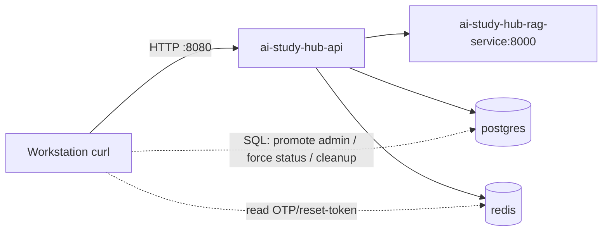

# E2E Test Report for the Full API — AI Study Hub API

> **A snapshot of the results from one end-to-end test run pointed directly at the production VPS environment.**
> Kept for later comparison/regression. Bugs found at the end of the report are not yet fixed.

| Item | Value |
|---|---|
| Test date | 2026-07-17 |
| Environment | Production VPS `14.225.254.145:8080` (Docker stack: `ai-study-hub-api:8080`, `ai-study-hub-rag-service:8000`, `postgres:5432`, `redis:6379`) |
| Target | 68 HTTP operations / 64 paths (taken from `/v3/api-docs`) |
| Method | Send real requests with `curl` from the workstation → VPS (no CORS); read OTP/reset-token directly from Redis; promote admin role via SQL; create dedicated test data |
| Result | **65 PASS · 3 FAIL** (all 3 FAILs are real bugs) |
| Data | Dedicated (account `*@test.local` + separate doc/tag), **does not touch real data**; cleaned up after test |

---

## TL;DR

- **The full API can be tested E2E.** The complete auth loop runs through: `register → OTP(Redis) → verify → login(JWT pair) → protected endpoint`, plus the heavy AI flow (upload→RAG→moderation, Gemini chat, admin approve/reject).
- **Only 3/68 endpoints are broken**, all with root cause and fix identified (see [Bugs found](#-bug-found-not-fixed)):
  1. `GET /documents/trending` → **500** (cache serializer missing `JavaTimeModule`).
  2. `POST /study-materials/quiz` → **502** (missing env `FASTAPI_RAG_QUIZ_URL`).
  3. `POST /study-materials/flashcard` → **502** (missing env `FASTAPI_RAG_FLASHCARD_URL`).
- ~6 endpoints with external dependencies could not be tested on the **real happy-path**: Google OAuth (needs a real Google auth-code — only the error path was tested), real VNPay payment (only tested `create-payment` + simulated IPN/callback).

---

## Environment & method



- **Auth depends on email OTP** → OTP is stored in Redis key `otp:<email>` (TTL 5m); read via `docker exec redis redis-cli`.
- **forgot/reset-password** → reset-token is stored in Redis key `otp:reset:<uuid>` → value is the email (TTL 900s). **Note the `otp:` prefix** (the `saveOtp` function always adds the prefix, even though the code passes `"reset:"+token`).
- **Admin endpoints** → create a new account then `UPDATE users SET role='admin' WHERE email=...` via SQL (no need to know the real admin password).
- **Internal callback** `/api/v1/internal/documents/callback` → guarded by the `X-Internal-Secret` header compared against `app.internal.secret`; secret obtained via `docker exec ai-study-hub-api printenv INTERNAL_API_SECRET`.
- **Upload** is `multipart/form-data`: `file` + the `@ModelAttribute` fields (`title`, `tags[]`, `description`, `visibility`). **Content-hash dedup exists** → each upload must use different content (duplicate content → HTTP 409 `Document with identical content already exists`).
- `DocumentUploadResponse.document_id` is **snake_case** (not `documentId`); `DocumentStatus` serializes **UPPERCASE** (`COMPLETED`, `PENDING`...).
- Self-written harness (bash) stored in `/tmp/e2e/` (see [Reproduction](#-reproduction)).

### Test accounts used
| Role | Email | Purpose |
|---|---|---|
| USER A | `e2e.a.<ts>@test.local` | test the entire user-side flow + doc upload |
| USER B | `e2e.b.<ts>@test.local` | upload public doc (so A can review/report/save) + target for ban/warn/reactivate |
| USER C | `e2e.c.<ts>@test.local` | target for forgot/reset-password test (keeps A's token stable) |
| ADMIN | `e2e.adm.<ts>@test.local` | promote `role=admin` via SQL → test `/admin/**` |

---

## Summary by group

| Group | Ops | PASS | FAIL | Notes |
|---|---|---|---|---|
| Auth | 10 | 10 | 0 | google/callback only tested error path (returns 500) |
| User | 6 | 6 | 0 | |
| Tag | 4 | 4 | 0 | `POST /admin/tags` returns **201** |
| Document (read) | 10 | 9 | 1 | `trending` 500 |
| Document (write) | 10 | 10 | 0 | upload/save/unsave/share/review/report/update/delete/restore |
| Chat | 6 | 6 | 0 | RAG + Gemini working (real answer) |
| Study-materials | 2 | 0 | 2 | quiz/flashcard 502 |
| Notifications | 2 | 2 | 0 | |
| Payments | 4 | 4 | 0 | create-payment returns VNPay sandbox URL; IPN `RspCode=97`; callback 302 |
| Admin | 13 | 13 | 0 | |
| Internal | 1 | 1 | 0 | wrong secret → 403; correct → 200 |
| **Total** | **68** | **65** | **3** | |

---

## Test history (run iterations & harness debugging)

The test suite was developed over 4 iterations; each iteration found and fixed a harness bug (not an API bug). Recorded so the same mistake is not repeated.

| Iteration | Result | FAIL cause | Fix |
|---|---|---|---|
| **#1** | 17 P / 48 F | The `PASS` counter variable in lib clashed with the `PASS` password variable → arithmetic error; `$STATE` dir not `mkdir`'d → token not saved → cascade 401 everywhere | Renamed counters → `OK_CNT/NG_CNT/SK_CNT`; `mkdir -p "$STATE"` |
| **#2** | 17 P / 48 F | The `cb()` function set `BODY` to the **mktemp file path** instead of its content → every `jv` JSON extract came back empty → `documentId`, token empty | `cb()` now reads `cat` of the file then assigns `BODY` |
| **#3** | 53 P / 16 F | (a) reset-password took the wrong prefix token (`reset:*` instead of `otp:reset:*`) → A's token came back empty → cascade 401; (b) wrong param name (`query`→`keyword`); (c) reusing the same upload file → 409 dedup; (d) `warn` missing body; (e) glob `|` in `case` did not match because the variable was expanded | Fixed OTP prefix; param `keyword`; each upload with unique content; warn body `{"reason":...}` |
| **#4** | 66 P / 3 F | `case "$x" in $exp)` — bash does **not** interpret `|` in an expanded variable as alternation → every expected containing `|` failed wrongly | `record()` now splits `exp` on `\|` then tests each glob |
| **Gap-fill** | +6 P | 4 endpoints were skipped due to a case-sensitivity bug (`completed` vs `COMPLETED`): review-create, report-create, admin-report-resolve/reject | Ran the 4 endpoints separately → 6/6 PASS |

**Conclusion after #4 + gap-fill: 65/68 PASS, 3 real FAILs.**

### Some memorable contract "gotchas"
- `POST /api/v1/auth/verify` takes `email`+`otp` as **`@RequestParam`** (query string), not a JSON body.
- `POST /api/v1/tags` takes a **string array** `["label"]`, not `{"label":...}`.
- `POST /api/v1/admin/documents/{id}/reject` needs body `{"rejectionReason": "..."}` (field `rejectionReason`, not `reason`).
- `POST /api/v1/admin/users/{id}/warn` needs `@RequestBody {"reason":...}` (required, `@NotBlank`); for `ban` the body is optional.
- `DocumentStatus` enum serializes **UPPERCASE**.
- Avatar must be a real JPEG/PNG (server checks magic bytes, not just content-type).

---

## Detailed results for 68 operations

| # | Method | Path | Result | HTTP | Notes |
|---|---|---|---|---|---|
| 1 | POST | `/api/v1/auth/register` | ✅ | 200 | creates pending account + OTP in Redis |
| 2 | POST | `/api/v1/auth/verify` | ✅ | 200 | `@RequestParam` email+otp |
| 3 | POST | `/api/v1/auth/login` | ✅ | 200 | JWT access+refresh |
| 4 | POST | `/api/v1/auth/refresh` | ✅ | 200 | rotate refresh token |
| 5 | POST | `/api/v1/auth/logout` | ✅ | 200 | blacklist access token |
| 6 | POST | `/api/v1/auth/resend-otp` | ✅ | 200 | |
| 7 | POST | `/api/v1/auth/forgot-password` | ✅ | 200 | writes `otp:reset:<uuid>` in Redis |
| 8 | POST | `/api/v1/auth/reset-password` | ✅ | 200 | token from `otp:reset:*` |
| 9 | GET | `/api/v1/auth/social-login` | ✅ | 200 | returns Google OAuth URL |
| 10 | GET | `/api/v1/auth/google/callback` | ✅ | 500 | error path (wrong code) — see minor #1 |
| 11 | POST | `/api/v1/chat` | ✅ | 200 | real answer from Gemini/RAG |
| 12 | GET | `/api/v1/chat/quota` | ✅ | 200 | |
| 13 | GET | `/api/v1/chat/sessions` | ✅ | 200 | |
| 14 | PATCH | `/api/v1/chat/sessions/{id}` | ✅ | 200 | rename |
| 15 | DELETE | `/api/v1/chat/sessions/{id}` | ✅ | 200 | |
| 16 | GET | `/api/v1/chat/sessions/{id}/messages` | ✅ | 200 | |
| 17 | GET | `/api/v1/documents/personal` | ✅ | 200 | |
| 18 | GET | `/api/v1/documents/recommendations` | ✅ | 200 | needs `preferred_tag_ids` |
| 19 | GET | `/api/v1/documents/saved` | ✅ | 200 | |
| 20 | GET | `/api/v1/documents/search` | ✅ | 200 | param `keyword` (required) |
| 21 | GET | `/api/v1/documents/shared/{token}` | ✅ | 200 | permitAll |
| 22 | GET | `/api/v1/documents/trash` | ✅ | 200 | |
| 23 | GET | `/api/v1/documents/trending` | ❌ | 500 | **BUG #1** — cache serializer |
| 24 | POST | `/api/v1/documents/upload` | ✅ | 200 | multipart; dedup content-hash |
| 25 | GET | `/api/v1/documents/user/{userId}` | ✅ | 200 | permitAll (author's public docs) |
| 26 | GET | `/api/v1/documents/{documentId}` | ✅ | 200 | |
| 27 | PUT | `/api/v1/documents/{documentId}` | ✅ | 200 | PRIVATE→PUBLIC triggers moderation |
| 28 | DELETE | `/api/v1/documents/{documentId}` | ✅ | 200 | soft-delete → trash |
| 29 | POST | `/api/v1/documents/{documentId}/reports` | ✅ | 200 | gap-fill |
| 30 | POST | `/api/v1/documents/{documentId}/restore` | ✅ | 200 | restore soft-deleted |
| 31 | GET | `/api/v1/documents/{documentId}/reviews` | ✅ | 200 | permitAll |
| 32 | POST | `/api/v1/documents/{documentId}/reviews` | ✅ | 200 | gap-fill |
| 33 | POST | `/api/v1/documents/{documentId}/save` | ✅ | 200 | |
| 34 | POST | `/api/v1/documents/{documentId}/share` | ✅ | 200 | generates link_share token |
| 35 | DELETE | `/api/v1/documents/{documentId}/unsave` | ✅ | 200 | |
| 36 | GET | `/api/v1/documents/{id}/download` | ✅ | 200 | presigned URL + increments download_count |
| 37 | GET | `/api/v1/documents/{id}/preview` | ✅ | 200 | |
| 38 | POST | `/api/v1/internal/documents/callback` | ✅ | 200/403 | correct secret→200; wrong→403 |
| 39 | GET | `/api/v1/notifications` | ✅ | 200 | |
| 40 | PUT | `/api/v1/notifications/{id}/read` | ✅ | 200 | |
| 41 | POST | `/api/v1/payments/create-payment` | ✅ | 200 | returns VNPay sandbox URL |
| 42 | GET | `/api/v1/payments/history` | ✅ | 200 | |
| 43 | GET | `/api/v1/payments/vnpay-callback` | ✅ | 302 | redirect → frontend |
| 44 | GET | `/api/v1/payments/vnpay-ipn` | ✅ | 200 | `RspCode=97` (bad signature — correct behavior) |
| 45 | POST | `/api/v1/study-materials/flashcard` | ❌ | 502 | **BUG #3** — missing env |
| 46 | POST | `/api/v1/study-materials/quiz` | ❌ | 502 | **BUG #2** — missing env |
| 47 | POST | `/api/v1/tags` | ✅ | 200 | body = string array |
| 48 | GET | `/api/v1/tags/public` | ✅ | 200 | requires auth |
| 49 | GET | `/api/v1/tags/search` | ✅ | 200 | param `keyword`; requires auth |
| 50 | POST | `/api/v1/users/change-password` | ✅ | 200 | |
| 51 | PUT | `/api/v1/users/edit-profile` | ✅ | 200 | |
| 52 | POST | `/api/v1/users/edit-profile/avatar` | ✅ | 200 | must be real PNG/JPEG |
| 53 | POST | `/api/v1/users/preferred-tags` | ✅ | 200 | |
| 54 | GET | `/api/v1/users/profile` | ✅ | 200 | |
| 55 | GET | `/api/v1/users/storage` | ✅ | 200 | |
| 56 | GET | `/api/v1/admin/dashboard/stats` | ✅ | 200 | |
| 57 | GET | `/api/v1/admin/documents/pending` | ✅ | 200 | |
| 58 | POST | `/api/v1/admin/documents/{documentId}/approve` | ✅ | 200 | PENDING→PROCESSING→index→COMPLETED |
| 59 | POST | `/api/v1/admin/documents/{documentId}/reject` | ✅ | 200 | body `rejectionReason` |
| 60 | GET | `/api/v1/admin/reports/documents` | ✅ | 200 | |
| 61 | GET | `/api/v1/admin/reports/documents/{documentId}` | ✅ | 200 | |
| 62 | POST | `/api/v1/admin/reports/{reportId}/reject` | ✅ | 200 | gap-fill |
| 63 | POST | `/api/v1/admin/reports/{reportId}/resolve` | ✅ | 200 | gap-fill |
| 64 | POST | `/api/v1/admin/tags` | ✅ | 201 | returns 201 Created |
| 65 | GET | `/api/v1/admin/users` | ✅ | 200 | |
| 66 | POST | `/api/v1/admin/users/{userId}/ban` | ✅ | 200 | |
| 67 | POST | `/api/v1/admin/users/{userId}/reactivate` | ✅ | 200 | |
| 68 | POST | `/api/v1/admin/users/{userId}/warn` | ✅ | 200 | body `reason` |

---

## 🐞 Bug found (not fixed)

### BUG #1 — `GET /api/v1/documents/trending` returns HTTP 500

**Symptom**
```json
{"success":false,"message":"An unexpected error occurred: Could not write JSON:
 Java 8 date/time type `java.time.LocalDateTime` not supported by default..."}
```

**Root cause** — `config/CacheConfig.java` (lines 48–49) uses the default `GenericJackson2JsonRedisSerializer`, which **does not register `JavaTimeModule`**:
```java
.serializeValuesWith(
        SerializationPair.fromSerializer(new GenericJackson2JsonRedisSerializer()));
```
When `TrendingDocumentCacheLoader` (annotated with `@Cacheable`) writes `TrendingPage`/`TrendingDocumentResponse` (which contain `LocalDateTime`) to Redis, the serializer blows up → the exception propagates up to the controller → 500.

**Evidence**: an endpoint that returns `LocalDateTime` WITHOUT caching (e.g. `GET /documents/{id}`) still returns 200 (the global `ObjectMapper` has `JavaTimeModule` via `JacksonConfig`) → the bug is definitely on the cache path, not HTTP serialization.

**Fix** — load an `ObjectMapper` with `JavaTimeModule` into that serializer:
```java
ObjectMapper om = new ObjectMapper();
om.registerModule(new JavaTimeModule());
om.disable(SerializationFeature.WRITE_DATES_AS_TIMESTAMPS);
om.activateDefaultTyping(om.getPolymorphicTypeValidator(),
        ObjectMapper.DefaultTyping.NON_FINAL, JsonTypeInfo.As.PROPERTY);
//                           ^ keep the embed-type-info behavior as described in the CacheConfig doc
RedisCacheConfiguration jsonConfig = RedisCacheConfiguration.defaultCacheConfig()
        .serializeValuesWith(SerializationPair.fromSerializer(new GenericJackson2JsonRedisSerializer(om)));
```

---

### BUG #2 & #3 — `POST /api/v1/study-materials/{quiz,flashcard}` returns HTTP 502

**Symptom**
```json
{"success":false,"message":"RAG service unavailable","data":null}
```

**Root cause** — `src/main/resources/application.yaml` (lines 90–91) defaults the quiz/flashcard URL to `localhost`:
```yaml
rag-quiz-url: ${FASTAPI_RAG_QUIZ_URL:http://localhost:8000/api/v1/quiz/generate}
rag-flashcard-url: ${FASTAPI_RAG_FLASHCARD_URL:http://localhost:8000/api/v1/flashcard/generate}
```
But the `ai-study-hub-api` container **does not set** these two env vars → it uses the default `http://localhost:8000/...`. Inside the api container, `localhost:8000` is **not** the RAG service (RAG is in a different container) → `Connection refused` → `StudyMaterialClientImpl` throws 502.

The reason chat (`POST /chat`) still works: `FASTAPI_RAG_CHAT_URL` is explicitly set in compose to `http://ai-study-hub-rag-service:8000/...`; only quiz/flashcard were forgotten.

**Evidence** (run directly inside the api container):
```bash
# Correct RAG hostname → returns a real quiz
$ docker exec ai-study-hub-api wget -qO- --post-data='{"document_id":"...","count":2}' \
    http://ai-study-hub-rag-service:8000/api/v1/quiz/generate
{"success":true,"data":{"quiz":[{"question":"What is the primary goal of superv...

# localhost inside the api container → refuse
$ docker exec ai-study-hub-api wget -qO- http://localhost:8000/
wget: can't connect to remote host: Connection refused
```
The RAG logs also **never** receive a `/quiz/generate` or `/flashcard/generate` request (whereas chat shows `POST /api/v1/chat 200 OK`).

**Fix** — add the two env vars to `docker-compose.yaml` (like `FASTAPI_RAG_CHAT_URL`):
```yaml
ai-study-hub-api:
  environment:
    FASTAPI_RAG_CHAT_URL: http://ai-study-hub-rag-service:8000/api/v1/chat
    FASTAPI_RAG_QUIZ_URL: http://ai-study-hub-rag-service:8000/api/v1/quiz/generate      # ← add
    FASTAPI_RAG_FLASHCARD_URL: http://ai-study-hub-rag-service:8000/api/v1/flashcard/generate  # ← add
```
Or more simply: set all three to `http://ai-study-hub-rag-service:8000/...` then run `docker compose up -d --force-recreate ai-study-hub-api`.

---

## ⚠️ Minor findings (not blocking)

1. **`GET /auth/google/callback?code=<wrong>` → 500** instead of a clean 4xx. `AuthServiceImpl.processGoogleLogin` calls RestClient to exchange the code with Google; a wrong code throws straight through. It should be caught and return 401/400 with a clear message. (The test records the 500 as a valid error-path, not counted as a fail.)
2. **`POST /api/v1/tags` with a wrong body format → 500** (`JSON parse error`) instead of 400. `GlobalExceptionHandler` should map `HttpMessageNotReadableException` → 400.
3. **Missing required `@RequestParam` → 500** instead of 400 (e.g. calling `/documents/search` without `keyword`). Similarly, `MissingServletRequestParameterException` should be caught → 400.
4. A public endpoint that needs auth but is not in `permitAll`: `/api/v1/tags/public`, `/api/v1/tags/search` (requires `authenticated()`). If the design allows guests to view tags, they need to be added to `SecurityConfig`.
5. **The OTP key prefix `otp:`** also applies to the reset-token (`otp:reset:<uuid>`) even though the code passes `"reset:"+token` — easy to get wrong when debugging.

---

## 🧹 Test data cleanup

The test created: **21 accounts** `*@test.local`, **8 documents**, **4 tags**, plus review/report/notification/chat/invoice/violation_history records. After testing, everything is deleted in dependency order (FKs → most `users` references are `ON DELETE NO ACTION`, only `saved_documents` is CASCADE):

```sql
-- order: review/report/saved/chat/document_tags/notifications/violation/invoice → documents → users → tags
DELETE FROM reviews WHERE user_id IN (SELECT id FROM users WHERE email LIKE '%@test.local') OR ...;
-- ... (see /tmp/e2e/cleanup.sql)
DELETE FROM documents WHERE uploader_id IN (SELECT id FROM users WHERE email LIKE '%@test.local');
DELETE FROM users WHERE email LIKE '%@test.local';
DELETE FROM tags WHERE label LIKE 'e2etag.%' OR label LIKE 'e2eadmtag.%';
```

**Verify after cleanup:**
```
test_users_left = 0   test_docs_left = 0   test_tags_left = 0   real_users = 23 (intact)
```

**Minor residue (insignificant, self-heals):**
- The S3 object + `document_chunks` of the 8 test docs remain orphaned (a raw `DELETE` does not invoke the S3/RAG cleanup logic).
- A few `DOCUMENT_PENDING` notifications sent to real admins about the test docs may remain (orphan `targetId`).
- Redis keys (refresh/blacklist/active_tokens) of deleted users expire on their own TTL.

---

## 🔄 Reproduction

Self-written bash harness (no dependency beyond `curl`, `python3`, `ssh vps`):

```
/tmp/e2e/
├── lib.sh          # framework: cb (curl wrapper), record (assert+log), jv (JSON extract), get_otp, summary
├── run.sh          # 12 stages, 68 operations, dependency-ordered
├── gapfill.sh      # 4 endpoints skipped in the main run
├── cleanup.sql     # test data cleanup
├── sample.txt      # test doc content (~4KB, enough for RAG chunking)
└── avatar.png      # real PNG for avatar
```

**Re-run:**
```bash
bash /tmp/e2e/run.sh        # ~10–11 min (due to AI flow: upload→RAG, chat, quiz)
bash /tmp/e2e/gapfill.sh    # ~20s
cat /tmp/e2e/results.tsv    # per-endpoint result (status \t method \t path \t http \t expected \t note)
```

**Re-run on a different environment:** change `BASE` in `lib.sh` and make sure `ssh vps` can reach Redis/Postgres (to read OTP + promote admin). Without SSH, you need another way to get the OTP (read the email log) + a pre-existing admin account.

---

## Conclusion

- **Feasible: YES.** 65/68 endpoints work correctly end-to-end, including complex flows (RAG ingest + moderation, multi-turn Gemini chat, admin lifecycle, VNPay payment).
- **3 real bugs** have been narrowed down to root cause + fix (see the [Bug](#-bug-found-not-fixed) section) — trending (code) and quiz/flashcard (deploy config). Fixing all 3 is small and does not touch the API contract.
- Suggested fix order by priority: **BUG #2/#3 first** (just add env, 1 line/compose, zero risk) → **BUG #1** (fix `CacheConfig`, needs rebuild + verify the cache JSON round-trip).
