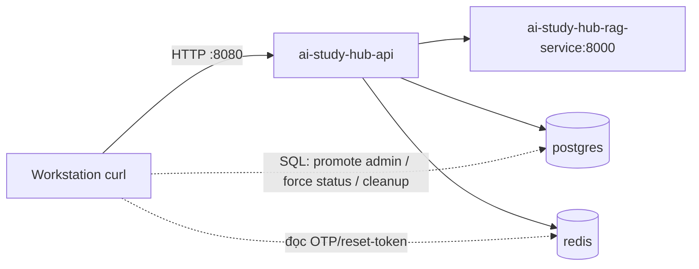

# Báo cáo E2E Test toàn bộ API — AI Study Hub API

> **Bản snapshot kết quả một lượt test end-to-end chạy trực tiếp vào môi trường production VPS.**
> Lưu lại để đối chiếu/regression sau này. Bug tìm được ở cuối báo cáo chưa được fix.

| Mục | Giá trị |
|---|---|
| Ngày test | 2026-07-17 |
| Môi trường | Production VPS `14.225.254.145:8080` (stack Docker: `ai-study-hub-api:8080`, `ai-study-hub-rag-service:8000`, `postgres:5432`, `redis:6379`) |
| Đối tượng | 68 HTTP operations / 64 paths (lấy từ `/v3/api-docs`) |
| Phương pháp | Gửi request thật bằng `curl` từ máy trạm → VPS (không qua CORS); đọc OTP/reset-token trực tiếp từ Redis; promote role admin qua SQL; tạo data test riêng |
| Kết quả | **65 PASS · 3 FAIL** (3 FAIL đều là bug thật) |
| Data | Tạo riêng (account `*@test.local` + doc/tag riêng), **không đụng data thật**; đã dọn sạch sau test |

---

## TL;DR

- **Có thể test E2E toàn bộ API.** Vòng lặp auth đầy đủ chạy thông: `register → OTP(Redis) → verify → login(JWT đôi) → endpoint bảo vệ`, và cả flow AI nặng (upload→RAG→moderation, chat Gemini, admin approve/reject).
- **Chỉ 3/68 endpoint hỏng**, đều đã xác định gốc rễ và cách fix (xem mục [Bug tìm được](#-bug-tìm-được-chưa-fix)):
  1. `GET /documents/trending` → **500** (cache serializer thiếu `JavaTimeModule`).
  2. `POST /study-materials/quiz` → **502** (thiếu env `FASTAPI_RAG_QUIZ_URL`).
  3. `POST /study-materials/flashcard` → **502** (thiếu env `FASTAPI_RAG_FLASHCARD_URL`).
- ~6 endpoint phụ thuộc bên ngoài không test được **happy-path thật**: Google OAuth (cần auth-code Google thật — chỉ test error path), VNPay thanh toán thật (chỉ test `create-payment` + mô phỏng IPN/callback).

---

## Môi trường & phương pháp



- **Auth phụ thuộc email OTP** → OTP lưu Redis key `otp:<email>` (TTL 5m); đọc qua `docker exec redis redis-cli`.
- **forgot/reset-password** → reset-token lưu Redis key `otp:reset:<uuid>` → value là email (TTL 900s). **Lưu ý prefix `otp:`** (hàm `saveOtp` luôn thêm prefix, dù code truyền `"reset:"+token`).
- **Admin endpoints** → tạo account mới rồi `UPDATE users SET role='admin' WHERE email=...` qua SQL (không cần biết mật khẩu admin thật).
- **Internal callback** `/api/v1/internal/documents/callback` → guard bằng header `X-Internal-Secret` so với `app.internal.secret`; secret lấy từ `docker exec ai-study-hub-api printenv INTERNAL_API_SECRET`.
- **Upload** là `multipart/form-data`: `file` + các field `@ModelAttribute` (`title`, `tags[]`, `description`, `visibility`). **Có dedup content-hash** → mỗi upload phải dùng nội dung khác nhau (nội dung trùng → HTTP 409 `Document with identical content already exists`).
- `DocumentUploadResponse.document_id` là **snake_case** (không phải `documentId`); `DocumentStatus` serialize **UPPERCASE** (`COMPLETED`, `PENDING`...).
- Harness tự viết (bash) lưu tại `/tmp/e2e/` (xem [Reproduction](#-reproduction)).

### Tài khoản test dùng
| Vai trò | Email | Mục đích |
|---|---|---|
| USER A | `e2e.a.<ts>@test.local` | test toàn bộ flow user-side + upload doc |
| USER B | `e2e.b.<ts>@test.local` | upload doc public (để A review/report/save) + đích ban/warn/reactivate |
| USER C | `e2e.c.<ts>@test.local` | đích test forgot/reset-password (giữ token A ổn định) |
| ADMIN | `e2e.adm.<ts>@test.local` | promote `role=admin` qua SQL → test `/admin/**` |

---

## Tóm tắt theo nhóm

| Nhóm | Ops | PASS | FAIL | Ghi chú |
|---|---|---|---|---|
| Auth | 10 | 10 | 0 | google/callback chỉ test error path (trả 500) |
| User | 6 | 6 | 0 | |
| Tag | 4 | 4 | 0 | `POST /admin/tags` trả **201** |
| Document (đọc) | 10 | 9 | 1 | `trending` 500 |
| Document (ghi) | 10 | 10 | 0 | upload/save/unsave/share/review/report/update/delete/restore |
| Chat | 6 | 6 | 0 | RAG + Gemini hoạt động (answer thật) |
| Study-materials | 2 | 0 | 2 | quiz/flashcard 502 |
| Notifications | 2 | 2 | 0 | |
| Payments | 4 | 4 | 0 | create-payment ra URL VNPay sandbox; IPN `RspCode=97`; callback 302 |
| Admin | 13 | 13 | 0 | |
| Internal | 1 | 1 | 0 | guard sai secret → 403; đúng → 200 |
| **Tổng** | **68** | **65** | **3** | |

---

## Lịch sử test (các lượt chạy & debug harness)

Bộ test được phát triển lặp lại 4 lượt; mỗi lượt phát hiện và sửa lỗi harness (không phải lỗi API). Ghi lại để lần sau không lặp.

| Lượt | Kết quả | Nguyên nhân FAIL | Sửa |
|---|---|---|---|
| **#1** | 17 P / 48 F | Biến đếm `PASS` trong lib đụng biến password `PASS` → lỗi arithmetic; thư mục `$STATE` chưa `mkdir` → token không lưu → cascade 401 toàn bộ | Đổi tên counter → `OK_CNT/NG_CNT/SK_CNT`; `mkdir -p "$STATE"` |
| **#2** | 17 P / 48 F | Hàm `cb()` gán `BODY` = **đường dẫn file** mktemp chứ không phải nội dung → mọi `jv` extract JSON rỗng → `documentId`, token rỗng | `cb()` đọc `cat` file rồi gán `BODY` |
| **#3** | 53 P / 16 F | (a) reset-password lấy token sai prefix (`reset:*` thay vì `otp:reset:*`) → token A bị rỗng → cascade 401; (b) sai tên param (`query`→`keyword`); (c) tái dùng cùng file upload → 409 dedup; (d) `warn` thiếu body; (e) glob `|` trong `case` không match vì biến mở rộng | Fix prefix OTP; param `keyword`; mỗi upload nội dung duy nhất; warn body `{"reason":...}` |
| **#4** | 66 P / 3 F | `case "$x" in $exp)` — bash **không** diễn giải `|` trong biến mở rộng thành alternation → mọi expected có `|` fail sai | `record()` tách `exp` theo `\|` rồi test từng glob |
| **Gap-fill** | +6 P | 4 endpoint bị skip do bug case-sensitivity (`completed` vs `COMPLETED`): review-create, report-create, admin-report-resolve/reject | Chạy riêng 4 endpoint → 6/6 PASS |

**Kết luận sau #4 + gap-fill: 65/68 PASS, 3 FAIL thật.**

### Một số "bẫy" contract đáng nhớ
- `POST /api/v1/auth/verify` nhận `email`+`otp` là **`@RequestParam`** (query string), không phải JSON body.
- `POST /api/v1/tags` nhận **mảng string** `["label"]`, không phải `{"label":...}`.
- `POST /api/v1/admin/documents/{id}/reject` cần body `{"rejectionReason": "..."}` (field `rejectionReason`, không phải `reason`).
- `POST /api/v1/admin/users/{id}/warn` cần `@RequestBody {"reason":...}` (required, `@NotBlank`); `ban` thì body optional.
- `DocumentStatus` enum serialize **UPPERCASE**.
- Avatar phải là JPEG/PNG thật (server check magic bytes, không chỉ content-type).

---

## Kết quả chi tiết 68 operations

| # | Method | Path | Kết quả | HTTP | Ghi chú |
|---|---|---|---|---|---|
| 1 | POST | `/api/v1/auth/register` | ✅ | 200 | tạo account pending + OTP Redis |
| 2 | POST | `/api/v1/auth/verify` | ✅ | 200 | `@RequestParam` email+otp |
| 3 | POST | `/api/v1/auth/login` | ✅ | 200 | JWT access+refresh |
| 4 | POST | `/api/v1/auth/refresh` | ✅ | 200 | rotate refresh token |
| 5 | POST | `/api/v1/auth/logout` | ✅ | 200 | blacklist access token |
| 6 | POST | `/api/v1/auth/resend-otp` | ✅ | 200 | |
| 7 | POST | `/api/v1/auth/forgot-password` | ✅ | 200 | ghi `otp:reset:<uuid>` Redis |
| 8 | POST | `/api/v1/auth/reset-password` | ✅ | 200 | token từ `otp:reset:*` |
| 9 | GET | `/api/v1/auth/social-login` | ✅ | 200 | trả Google OAuth URL |
| 10 | GET | `/api/v1/auth/google/callback` | ✅ | 500 | error path (code sai) — xem minor #1 |
| 11 | POST | `/api/v1/chat` | ✅ | 200 | answer thật từ Gemini/RAG |
| 12 | GET | `/api/v1/chat/quota` | ✅ | 200 | |
| 13 | GET | `/api/v1/chat/sessions` | ✅ | 200 | |
| 14 | PATCH | `/api/v1/chat/sessions/{id}` | ✅ | 200 | rename |
| 15 | DELETE | `/api/v1/chat/sessions/{id}` | ✅ | 200 | |
| 16 | GET | `/api/v1/chat/sessions/{id}/messages` | ✅ | 200 | |
| 17 | GET | `/api/v1/documents/personal` | ✅ | 200 | |
| 18 | GET | `/api/v1/documents/recommendations` | ✅ | 200 | cần `preferred_tag_ids` |
| 19 | GET | `/api/v1/documents/saved` | ✅ | 200 | |
| 20 | GET | `/api/v1/documents/search` | ✅ | 200 | param `keyword` (bắt buộc) |
| 21 | GET | `/api/v1/documents/shared/{token}` | ✅ | 200 | permitAll |
| 22 | GET | `/api/v1/documents/trash` | ✅ | 200 | |
| 23 | GET | `/api/v1/documents/trending` | ❌ | 500 | **BUG #1** — cache serializer |
| 24 | POST | `/api/v1/documents/upload` | ✅ | 200 | multipart; dedup content-hash |
| 25 | GET | `/api/v1/documents/user/{userId}` | ✅ | 200 | permitAll (public docs của tác giả) |
| 26 | GET | `/api/v1/documents/{documentId}` | ✅ | 200 | |
| 27 | PUT | `/api/v1/documents/{documentId}` | ✅ | 200 | PRIVATE→PUBLIC trigger moderation |
| 28 | DELETE | `/api/v1/documents/{documentId}` | ✅ | 200 | soft-delete → trash |
| 29 | POST | `/api/v1/documents/{documentId}/reports` | ✅ | 200 | gap-fill |
| 30 | POST | `/api/v1/documents/{documentId}/restore` | ✅ | 200 | khôi phục soft-delete |
| 31 | GET | `/api/v1/documents/{documentId}/reviews` | ✅ | 200 | permitAll |
| 32 | POST | `/api/v1/documents/{documentId}/reviews` | ✅ | 200 | gap-fill |
| 33 | POST | `/api/v1/documents/{documentId}/save` | ✅ | 200 | |
| 34 | POST | `/api/v1/documents/{documentId}/share` | ✅ | 200 | sinh link_share token |
| 35 | DELETE | `/api/v1/documents/{documentId}/unsave` | ✅ | 200 | |
| 36 | GET | `/api/v1/documents/{id}/download` | ✅ | 200 | presigned URL + tăng download_count |
| 37 | GET | `/api/v1/documents/{id}/preview` | ✅ | 200 | |
| 38 | POST | `/api/v1/internal/documents/callback` | ✅ | 200/403 | đúng secret→200; sai→403 |
| 39 | GET | `/api/v1/notifications` | ✅ | 200 | |
| 40 | PUT | `/api/v1/notifications/{id}/read` | ✅ | 200 | |
| 41 | POST | `/api/v1/payments/create-payment` | ✅ | 200 | trả URL VNPay sandbox |
| 42 | GET | `/api/v1/payments/history` | ✅ | 200 | |
| 43 | GET | `/api/v1/payments/vnpay-callback` | ✅ | 302 | redirect → frontend |
| 44 | GET | `/api/v1/payments/vnpay-ipn` | ✅ | 200 | `RspCode=97` (sai chữ ký — đúng behavior) |
| 45 | POST | `/api/v1/study-materials/flashcard` | ❌ | 502 | **BUG #3** — thiếu env |
| 46 | POST | `/api/v1/study-materials/quiz` | ❌ | 502 | **BUG #2** — thiếu env |
| 47 | POST | `/api/v1/tags` | ✅ | 200 | body = mảng string |
| 48 | GET | `/api/v1/tags/public` | ✅ | 200 | yêu cầu auth |
| 49 | GET | `/api/v1/tags/search` | ✅ | 200 | param `keyword`; yêu cầu auth |
| 50 | POST | `/api/v1/users/change-password` | ✅ | 200 | |
| 51 | PUT | `/api/v1/users/edit-profile` | ✅ | 200 | |
| 52 | POST | `/api/v1/users/edit-profile/avatar` | ✅ | 200 | phải là PNG/JPEG thật |
| 53 | POST | `/api/v1/users/preferred-tags` | ✅ | 200 | |
| 54 | GET | `/api/v1/users/profile` | ✅ | 200 | |
| 55 | GET | `/api/v1/users/storage` | ✅ | 200 | |
| 56 | GET | `/api/v1/admin/dashboard/stats` | ✅ | 200 | |
| 57 | GET | `/api/v1/admin/documents/pending` | ✅ | 200 | |
| 58 | POST | `/api/v1/admin/documents/{documentId}/approve` | ✅ | 200 | PENDING→PROCESSING→index→COMPLETED |
| 59 | POST | `/api/v1/admin/documents/{documentId}/reject` | ✅ | 200 | body `rejectionReason` |
| 60 | GET | `/api/v1/admin/reports/documents` | ✅ | 200 | |
| 61 | GET | `/api/v1/admin/reports/documents/{documentId}` | ✅ | 200 | |
| 62 | POST | `/api/v1/admin/reports/{reportId}/reject` | ✅ | 200 | gap-fill |
| 63 | POST | `/api/v1/admin/reports/{reportId}/resolve` | ✅ | 200 | gap-fill |
| 64 | POST | `/api/v1/admin/tags` | ✅ | 201 | trả 201 Created |
| 65 | GET | `/api/v1/admin/users` | ✅ | 200 | |
| 66 | POST | `/api/v1/admin/users/{userId}/ban` | ✅ | 200 | |
| 67 | POST | `/api/v1/admin/users/{userId}/reactivate` | ✅ | 200 | |
| 68 | POST | `/api/v1/admin/users/{userId}/warn` | ✅ | 200 | body `reason` |

---

## 🐞 Bug tìm được (chưa fix)

### BUG #1 — `GET /api/v1/documents/trending` trả HTTP 500

**Triệu chứng**
```json
{"success":false,"message":"An unexpected error occurred: Could not write JSON:
 Java 8 date/time type `java.time.LocalDateTime` not supported by default..."}
```

**Gốc rễ** — `config/CacheConfig.java` (dòng 48–49) dùng `GenericJackson2JsonRedisSerializer` mặc định, **không đăng ký `JavaTimeModule`**:
```java
.serializeValuesWith(
        SerializationPair.fromSerializer(new GenericJackson2JsonRedisSerializer()));
```
Khi `TrendingDocumentCacheLoader` (được `@Cacheable`) ghi `TrendingPage`/`TrendingDocumentResponse` (chứa `LocalDateTime`) vào Redis, serializer nổ → exception lan ra controller → 500.

**Bằng chứng**: endpoint KHÔNG cache trả `LocalDateTime` (vd `GET /documents/{id}`) vẫn 200 (global `ObjectMapper` có `JavaTimeModule` qua `JacksonConfig`) → chắc chắn lỗi nằm ở đường cache, không phải serialization HTTP.

**Fix** — nạp `ObjectMapper` có `JavaTimeModule` cho serializer đó:
```java
ObjectMapper om = new ObjectMapper();
om.registerModule(new JavaTimeModule());
om.disable(SerializationFeature.WRITE_DATES_AS_TIMESTAMPS);
om.activateDefaultTyping(om.getPolymorphicTypeValidator(),
        ObjectMapper.DefaultTyping.NON_FINAL, JsonTypeInfo.As.PROPERTY);
//                           ^ giữ behavior embed-type-info như doc CacheConfig mô tả
RedisCacheConfiguration jsonConfig = RedisCacheConfiguration.defaultCacheConfig()
        .serializeValuesWith(SerializationPair.fromSerializer(new GenericJackson2JsonRedisSerializer(om)));
```

---

### BUG #2 & #3 — `POST /api/v1/study-materials/{quiz,flashcard}` trả HTTP 502

**Triệu chứng**
```json
{"success":false,"message":"RAG service unavailable","data":null}
```

**Gốc rễ** — `src/main/resources/application.yaml` (dòng 90–91) mặc định quiz/flashcard URL về `localhost`:
```yaml
rag-quiz-url: ${FASTAPI_RAG_QUIZ_URL:http://localhost:8000/api/v1/quiz/generate}
rag-flashcard-url: ${FASTAPI_RAG_FLASHCARD_URL:http://localhost:8000/api/v1/flashcard/generate}
```
Nhưng container `ai-study-hub-api` **không set** 2 env var này → dùng default `http://localhost:8000/...`. Trong container api, `localhost:8000` **không phải** RAG (RAG ở container khác) → `Connection refused` → `StudyMaterialClientImpl` ném 502.

Lý do chat (`POST /chat`) vẫn hoạt động: `FASTAPI_RAG_CHAT_URL` được set tường minh trong compose về `http://ai-study-hub-rag-service:8000/...`; riêng quiz/flashcard bị quên.

**Bằng chứng** (chạy trực tiếp trong container api):
```bash
# Đúng hostname RAG → trả quiz thật
$ docker exec ai-study-hub-api wget -qO- --post-data='{"document_id":"...","count":2}' \
    http://ai-study-hub-rag-service:8000/api/v1/quiz/generate
{"success":true,"data":{"quiz":[{"question":"What is the primary goal of superv...

# localhost trong container api → refuse
$ docker exec ai-study-hub-api wget -qO- http://localhost:8000/
wget: can't connect to remote host: Connection refused
```
Log RAG cũng **không hề** nhận request `/quiz/generate` hay `/flashcard/generate` (chat thì có `POST /api/v1/chat 200 OK`).

**Fix** — thêm 2 env var vào `docker-compose.yaml` (giống `FASTAPI_RAG_CHAT_URL`):
```yaml
ai-study-hub-api:
  environment:
    FASTAPI_RAG_CHAT_URL: http://ai-study-hub-rag-service:8000/api/v1/chat
    FASTAPI_RAG_QUIZ_URL: http://ai-study-hub-rag-service:8000/api/v1/quiz/generate      # ← thêm
    FASTAPI_RAG_FLASHCARD_URL: http://ai-study-hub-rag-service:8000/api/v1/flashcard/generate  # ← thêm
```
Hoặc làm gọn: đặt cả 3 về `http://ai-study-hub-rag-service:8000/...` rồi `docker compose up -d --force-recreate ai-study-hub-api`.

---

## ⚠️ Phát hiện phụ (minor, không chặn)

1. **`GET /auth/google/callback?code=<sai>` → 500** thay vì 4xx sạch. `AuthServiceImpl.processGoogleLogin` gọi RestClient đổi code với Google, code sai → exception ném thẳng. Nên bắt và trả 401/400 với message rõ. (Test ghi nhận 500 là error-path hợp lệ, không tính fail.)
2. **`POST /api/v1/tags` body sai định dạng → 500** (`JSON parse error`) thay vì 400. `GlobalExceptionHandler` nên map `HttpMessageNotReadableException` → 400.
3. **Missing required `@RequestParam` → 500** thay vì 400 (vd gọi `/documents/search` thiếu `keyword`). Tương tự nên bắt `MissingServletRequestParameterException` → 400.
4. Endpoint công khai cần auth nhưng không nằm trong `permitAll`: `/api/v1/tags/public`, `/api/v1/tags/search` (yêu cầu `authenticated()`). Nếu thiết kế cho phép guest xem tag thì cần thêm vào `SecurityConfig`.
5. **OTP key prefix `otp:`** áp dụng cho cả reset-token (`otp:reset:<uuid>`) dù code truyền `"reset:"+token` — dễ nhầm khi debug.

---

## 🧹 Dọn dẹp data test

Test tạo: **21 account** `*@test.local`, **8 document**, **4 tag**, kèm review/report/notification/chat/invoice/violation_history. Sau khi test xong, xoá sạch theo thứ tự phụ thuộc (FKs → `users` đa số là `ON DELETE NO ACTION`, chỉ `saved_documents` là CASCADE):

```sql
-- thứ tự: review/report/saved/chat/document_tags/notifications/violation/invoice → documents → users → tags
DELETE FROM reviews WHERE user_id IN (SELECT id FROM users WHERE email LIKE '%@test.local') OR ...;
-- ... (xem /tmp/e2e/cleanup.sql)
DELETE FROM documents WHERE uploader_id IN (SELECT id FROM users WHERE email LIKE '%@test.local');
DELETE FROM users WHERE email LIKE '%@test.local';
DELETE FROM tags WHERE label LIKE 'e2etag.%' OR label LIKE 'e2eadmtag.%';
```

**Verify sau khi dọn:**
```
test_users_left = 0   test_docs_left = 0   test_tags_left = 0   real_users = 23 (nguyên vẹn)
```

**Residue nhỏ (không đáng kể, tự self-heal):**
- Object S3 + `document_chunks` của 8 doc test còn mồ côi (raw `DELETE` không gọi logic dọn S3/RAG).
- Vài notification `DOCUMENT_PENDING` gửi cho admin thật về doc test có thể còn (orphan `targetId`).
- Key Redis (refresh/blacklist/active_tokens) của user đã xoá tự hết hạn theo TTL.

---

## 🔄 Reproduction

Harness bash tự viết (không dependency ngoài `curl`, `python3`, `ssh vps`):

```
/tmp/e2e/
├── lib.sh          # framework: cb (curl wrapper), record (assert+log), jv (JSON extract), get_otp, summary
├── run.sh          # 12 stage, 68 operations, dependency-ordered
├── gapfill.sh      # 4 endpoint bị skip ở run chính
├── cleanup.sql     # dọn data test
├── sample.txt      # nội dung doc test (~4KB, đủ cho RAG chunk)
└── avatar.png      # PNG thật cho avatar
```

**Chạy lại:**
```bash
bash /tmp/e2e/run.sh        # ~10–11 phút (do flow AI: upload→RAG, chat, quiz)
bash /tmp/e2e/gapfill.sh    # ~20s
cat /tmp/e2e/results.tsv    # kết quả từng endpoint (status \t method \t path \t http \t expected \t note)
```

**Chạy lại trên môi trường khác:** đổi `BASE` trong `lib.sh` và đảm bảo có `ssh vps` truy cập được Redis/Postgres (để đọc OTP + promote admin). Nếu không có SSH, cần cách khác lấy OTP (đọc log email) + có sẵn account admin.

---

## Kết luận

- **Khả thi: CÓ.** 65/68 endpoint hoạt động đúng end-to-end, bao gồm flow phức tạp (RAG ingest + moderation, chat Gemini đa lượt, admin lifecycle, thanh toán VNPay).
- **3 bug thật** đã được khoanh vùng gốc rễ + cách fix (xem mục [Bug](#-bug-tìm-được-chưa-fix)) — trending (code) và quiz/flashcard (deploy config). Fix cả 3 đều nhỏ, không đụng contract API.
- Đề xuất fix theo thứ tự ưu tiên: **BUG #2/#3 trước** (chỉ thêm env, 1 dòng/compose, zero risk) → **BUG #1** (sửa `CacheConfig`, cần rebuild + verify round-trip cache JSON).
