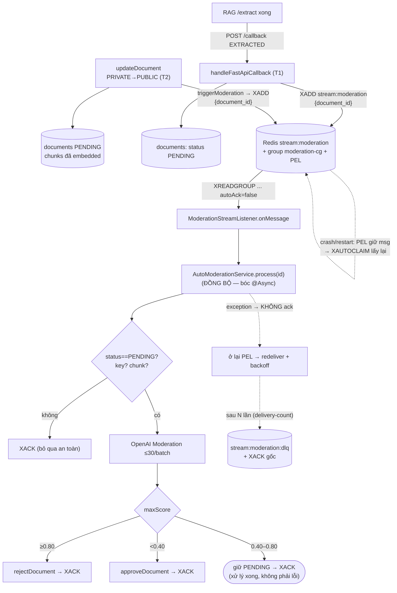

# Auto-Moderation — Thiết kế SAU khi dùng Redis Streams (`stream:moderation`)

> Đối chiếu baseline: [`moderation-streams-before.md`](./moderation-streams-before.md).
> Mục tiêu: biến moderation từ job `@Async` fire-and-forget trên RAM thành **job queue durable, at-least-once,
> có retry/DLQ, scale ngang được** — mà không thêm infra mới (dùng chung Redis đang có).

## 1. Kiến trúc tổng quan

```
                 PRODUCE (Tomcat request thread)                      CONSUME (worker riêng)
        ┌──────────────────────────────────────┐         ┌──────────────────────────────────────┐
 handleFastApiCallback (EXTRACTED)            │         │  StreamMessageListenerContainer       │
   XADD stream:moderation * document_id <id>  │ ──────► │  consumer-group: moderation-cg        │
   return NGAY (không block, không @Async)    │         │  poll BLOCK 2s, batchSize 1          │
        └──────────────────────────────────────┘         │  autoAcknowledge = false             │
                                                          │       │                              │
                              Redis (persistent log)       │       ▼ onMessage(record)           │
                        ┌─────────────────────────────┐    │  ModerationStreamListener           │
                        │  stream:moderation          │◄───┤   → AutoModerationService.process() │
                        │  + PEL (msg chưa ACK)       │    │   → XACK  (thành công)              │
                        │  + stream:moderation:dlq    │    │   → KHÔNG ack (lỗi → redeliver)     │
                        └─────────────────────────────┘    └──────────────────────────────────────┘
```

| Thành phần | Ý nghĩa |
|---|---|
| **Stream** `stream:moderation` | Log append-only, persistent trong Redis. Mỗi message = `{document_id}`. |
| **Consumer group** `moderation-cg` | Đảm bảo 1 message chỉ do **1 consumer** trong nhóm xử lý; Redis tự chia đều cho các instance. |
| **PEL** (Pending Entries List) | Message đã `XREADGROUP` nhưng chưa `XACK` → **sống sót qua crash/restart**. |
| **DLQ** `stream:moderation:dlq` | Message thất bại N lần → dời sang đây + ACK bản gốc, để admin inspect. |
| `XACK` | Báo "đã xử lý xong" → message rời PEL. **Không ACK = xin redeliver.** |

## 2. Sơ đồ luồng mới



## 3. Produce — đổi ở 2 call site

Có **2 nơi** đang gọi `moderateDocumentAsync` (T1 `handleFastApiCallback` EXTRACTED, T2 `updateDocument` PRIVATE→PUBLIC). Cả hai đều đổi thành append vào stream:

```java
// TRƯỚC (cả T1 và T2):
autoModerationService.moderateDocumentAsync(documentId);

// SAU: append vào stream, return gần như tức thì (Redis ~<1ms). Không block request thread.
moderationStreamProducer.enqueue(documentId);
```

> T1 nằm trong callback của RAG (request thread xử lý `/callback`); T2 nằm trong `updateDocument`
> (request thread xử lý `PUT /documents/{id}`). Cả hai đều chỉ cần `enqueue(documentId)` rồi trả về.

`ModerationStreamProducer` (class mới, mỏng):

```java
@Component
@RequiredArgsConstructor
public class ModerationStreamProducer {
    private final StringRedisTemplate redis;

    @Value("${app.moderation.stream-key:stream:moderation}")
    private String streamKey;

    public RecordId enqueue(UUID documentId) {
        return redis.opsForStream().add(streamKey,
                Map.of("document_id", documentId.toString()));   // id tự sinh (XADD *)
    }
}
```

> Lý do gói ra một producer bean: tách biệt Redis khỏi `DocumentServiceImpl`, dễ mock khi test callback
> (giống cách `DocumentRagClient`/`UploadProvider` được abstract ra hiện nay).

## 4. Bóc logic ra method đồng bộ (`process`)

Logic triage trong `AutoModerationServiceImpl.moderateDocumentAsync` **giữ nguyên 100%**, chỉ:

- Thêm method **đồng bộ** `void process(UUID documentId)` chứa đúng phần thân cũ (load doc → chunks → OpenAI → triage).
- Giữ `moderateDocumentAsync` (nếu vẫn cần ad-hoc, ví dụ test) hoặc xoá hẳn. **Listener sẽ gọi `process()`**, KHÔNG qua `@Async` (vì concurrency giờ do consumer group quản).

```java
// AutoModerationServiceImpl
@Override
public void process(UUID documentId) {            // ← đồng bộ, KHÔNG @Async
    log.info("Moderating document {} (stream consumer)", documentId);
    // ... phần thân y hệt moderateDocumentAsync cũ ...
    //   - bỏ qua nếu status != PENDING          (idempotency-guard)
    //   - bỏ qua nếu key rỗng/mock hoặc không chunk
    //   - OpenAI batch ≤30, triage 3 vùng
    //   - catch(Exception): NÉM ra (để listener bắt → KHÔNG ack → redeliver)
    //                       thay vì nuốt như cũ
}
```

> **Thay đổi ngữ nghĩa duy nhất**: `catch(Exception)` cũ **nuốt** lỗi (giữ PENDING lặng thinh).
> Bản mới **ném** để listener KHÔNG ack → message redeliver (có retry/DLQ). Đây chính là điểm sửa gap G2.

## 5. Consume — `StreamMessageListenerContainer`

Spring Data Redis 4.0.5 đã có sẵn (`StreamMessageListenerContainer` implements `SmartLifecycle` → tự `start()`).
**Verify thực tế** trong jar `spring-data-redis-4.0.5.jar`:

- `StreamMessageListenerContainer.create(RedisConnectionFactory, options)`
- options: `.pollTimeout(Duration) / .batchSize(int) / .executor(Executor) / .errorHandler(...)`
- `StreamReadRequest.builder(StreamOffset.create(key, ReadOffset.lastConsumed())).consumer(Consumer.from(group, name)).autoAcknowledge(false).build()`
- `container.register(readRequest, listener)` → `Subscription`

`config/ModerationStreamConfig.java` (mới):

```java
@Configuration
@RequiredArgsConstructor
public class ModerationStreamConfig {

    @Value("${app.moderation.stream-key:stream:moderation}")
    private String streamKey;
    @Value("${app.moderation.group:moderation-cg}")
    private String group;
    @Value("${app.moderation.consumer-name:api-1}")
    private String consumer;

    @Bean
    public StreamMessageListenerContainer<String, MapRecord<String, String, String>> moderationContainer(
            RedisConnectionFactory cf, ModerationStreamListener listener) {

        var options = StreamMessageListenerContainerOptions.builder()
                .pollTimeout(Duration.ofSeconds(2))
                .batchSize(1)
                .build();
        var container = StreamMessageListenerContainer.create(cf, options);

        var req = StreamMessageListenerContainer.StreamReadRequest
                .builder(StreamOffset.create(streamKey, ReadOffset.lastConsumed()))   // ">" = chỉ msg mới
                .consumer(Consumer.from(group, consumer))
                .autoAcknowledge(false)                                               // ACK thủ công
                .build();
        container.register(req, listener);
        return container;   // SmartLifecycle: Spring tự start/stop theo context
    }

    // Tạo group lúc startup (MKSTREAM nếu stream chưa tồn tại). BUSYGROUP = đã có → bỏ qua.
    @Bean
    public ApplicationRunner initModerationGroup(StringRedisTemplate redis) {
        return args -> {
            try {
                redis.opsForStream().createGroup(streamKey, ReadOffset.from("0"), group);
            } catch (RedisSystemException e) {
                log.info("moderation group already exists: {}", e.getMessage());
            }
        };
    }
}
```

> `consumer-name` cần **khác nhau per instance** (vd lấy từ env `HOSTNAME`/`POD_NAME`) để nhiều instance cùng
> tham gia group mà Redis phân biệt được consumer cho PEL reclaim.

Listener (mới):

```java
@Component
@RequiredArgsConstructor
@Slf4j
public class ModerationStreamListener
        implements StreamListener<String, MapRecord<String, String, String>> {

    private final AutoModerationService moderation;     // gọi process()
    private final StringRedisTemplate redis;
    private final ModerationDlqHandler dlqHandler;

    @Value("${app.moderation.stream-key:stream:moderation}") private String streamKey;
    @Value("${app.moderation.group:moderation-cg}")       private String group;
    @Value("${app.moderation.max-attempts:5}")            private int maxAttempts;

    @Override
    public void onMessage(MapRecord<String, String, String> record) {
        UUID documentId = UUID.fromString(record.getValue().get("document_id"));
        try {
            moderation.process(documentId);                          // thành công
            redis.opsForStream().ack(streamKey, group, record.getId());
        } catch (Exception e) {
            log.error("moderation failed for {}, attempts check", documentId, e);
            // delivery-count > maxAttempts → dời DLQ + ACK; ngược lại KHÔNG ack → redeliver
            if (dlqHandler.shouldDeadLetter(streamKey, group, record.getId(), maxAttempts)) {
                dlqHandler.moveToDlq(streamKey, record);
                redis.opsForStream().ack(streamKey, group, record.getId());
            }
            // không ack → message ở lại PEL, container hoặc scheduler sẽ redeliver
        }
    }
}
```

## 6. Crash recovery — PEL + reclaim

- Container dùng `ReadOffset.lastConsumed()` (`>`) chỉ đọc **message mới** của group.
- Message đã đọc nhưng **chưa ACK** nằm trong **PEL** → sống qua restart của Redis (AOF/RDB) và qua restart app.
- Khi app lên lại, các msg treo trong PEL **của consumer đã chết** cần được claim lại. Hai cách (chọn 1):

| Cách | Mô tả |
|---|---|
| **A. Reclaim chủ động (khuyến nghị)** | Một `@Scheduled` định kỳ gọi `XAUTOCLAIM`/`XCLAIM` cho các msg idle quá `minIdleTime` → gán cho consumer đang sống. Spring Data Redis: `opsForStream().pending(...)` (lấy delivery-count) + `opsForStream().claim(key, group, consumer, minIdle, ids)`. |
| **B. Read `0` lần đầu** | Đăng ký thêm 1 subscription với `ReadOffset.from("0")` để consumer mới "tiếp" hết PENDING của chính nó rồi mới đọc `>`. Đơn giản hơn nhưng ít linh hoạt. |

> Đây là phần **cần thiết kế kỹ nhất** (xác định `minIdleTime`, tránh claim trùng đang xử lý). Có thể ở bản
> đầu tiên chỉ làm cách B cho gọn, nâng cấp lên A khi cần multi-instance thật sự.

## 7. Retry / DLQ

- `XPENDING` cho biết **delivery-count** (số lần đã redeliver) của mỗi msg trong PEL.
  Spring Data Redis: `opsForStream().pending(key, group, Range.unbounded(), count)` → `PendingMessage.getTotalDeliveryCount()`.
- Quá `app.moderation.max-attempts` (vd 5) → `XADD stream:moderation:dlq` (kèm `document_id`, lỗi, id gốc) + `XACK` bản gốc.
- Poison message (vd document bị xoá giữa chừng → `process()` ném) sẽ không kẹt vô hạn trong PEL.
- `rejectDocument`/`approveDocument` đã guard `status == PENDING` → redeliver an toàn (xem §8).

## 8. Idempotency (điều kiện tiên quyết — ĐÃ THỎA)

At-least-once ⇒ cùng `document_id` có thể nhận ≥1 lần. Phải an toàn khi chạy lại:

- `process()` **bỏ qua nếu `status != PENDING`** (đã có sẵn) → nếu message redeliver sau khi doc đã `APPROVED`/`REJECTED`/`COMPLETED` → no-op → ACK. ✅
- Triage thuần hàm trên chunks hiện tại → cùng input → cùng kết luận. ✅
- `approveDocument`/`rejectDocument` đều guard trạng thái (`approve`: chỉ `PENDING`→`PROCESSING`; `reject`: chỉ `PENDING`→`REJECTED`) → gọi lại khi đã chuyển trạng thái sẽ ném `AppException` → bắt ở listener → DLQ (đúng hành vi). ✅

> Không cần idempotency key ngoài như `stream:doc-ops` (vì `/process`,`/extract` của RAG mới cần key).
> Moderation idempotent sẵn — lý do đây là luồng "làm thử trước".

## 9. Config thêm (`application.yaml`)

```yaml
app:
  moderation:
    stream-key: stream:moderation
    group: moderation-cg
    consumer-name: ${HOSTNAME:api-1}     # khác nhau per instance
    poll-timeout-seconds: 2
    batch-size: 1
    max-attempts: 5
    dlq-key: stream:moderation:dlq
    reclaim:
      enabled: true
      fixed-delay-ms: 60000
      min-idle-ms: 300000                # msg idle > 5p mới claim
```

Không thêm secret; dùng chung Redis connection hiện có (`spring.data.redis.*`). Không thêm dependency
(Spring Data Redis đã có toàn bộ API Streams).

## 10. Kế hoạch triển khai (step-by-step)

| Bước | File | Việc |
|---|---|---|
| 1 | `service/AutoModerationService.java` | thêm `void process(UUID)`; (tuỳ chọn) giữ/xoá `moderateDocumentAsync`. |
| 2 | `service/impl/AutoModerationServiceImpl.java` | tách thân `moderateDocumentAsync` thành `process()` đồng bộ; **`catch` ném thay vì nuốt**. |
| 3 | `service/impl/ModerationStreamProducer.java` | **mới** — `enqueue(UUID)` gọi `opsForStream().add`. |
| 4 | `service/impl/ModerationStreamListener.java` | **mới** — `StreamListener`, gọi `process()` + `ack`/DLQ. |
| 5 | `service/impl/ModerationDlqHandler.java` | **mới** — đếm delivery-count, move DLQ. |
| 6 | `config/ModerationStreamConfig.java` | **mới** — `StreamMessageListenerContainer` + `createGroup` runner. |
| 7 | `service/impl/DocumentServiceImpl.java` | **2 call site**: nhánh `EXTRACTED` (`handleFastApiCallback`) VÀ nhánh PRIVATE→PUBLIC (`updateDocument`) — cả hai đổi `moderateDocumentAsync(id)` → `moderationStreamProducer.enqueue(id)`. |
| 8 | `application.yaml` | thêm `app.moderation.*`. |
| 9 | Test | xem §11. |

> `@Async` trên moderation **bỏ** (concurrency do consumer group lo). `taskExecutor` **vẫn giữ** cho các
> `@Async` khác (document processing, notifications) — không động tới.

## 11. Testing

Bám phong cách hiện tại (pure Mockito, không Spring context):

- `AutoModerationServiceImplTest` (đã có): cập nhật assert `process()` **ném** exception khi OpenAI lỗi
  (thay vì nuốt) + verify `approveDocument`/`rejectDocument` theo 3 vùng.
- `ModerationStreamListenerTest` (**mới**): mock `AutoModerationService` + `StringRedisTemplate`:
  - `process` thành công → verify `opsForStream().ack(...)` được gọi đúng `(key, group, recordId)`.
  - `process` ném, delivery-count < max → **không** ack, **không** move DLQ.
  - `process` ném, delivery-count ≥ max → verify move DLQ + ack.
- `ModerationStreamProducerTest` (**mới**): verify `opsForStream().add(key, {document_id})`.
- Container/group-creation: **không** unit-test được (cần Redis thật + Spring context) — ghi nhận là
  khoảng trống, cùng kiểu với `@Cacheable` đã có (proxy/infra chỉ verify khi chạy thật).

> Khi muốn smoke-test thật: `docker compose up -d redis`, chạy app, upload 1 doc public, quan sát
> `redis-cli XLEN stream:moderation` = 0 sau khi consumer xử lý + `XACK`, và `XPENDING stream:moderation moderation-cg`.

## 12. Đánh đổi / rủi ro

| Rủi ro | Giải pháp |
|---|---|
| Phức tạp vận hành tăng (PEL, reclaim, DLQ, consumer-name per pod). | Bắt đầu với cách B (read `0`) đơn giản; nâng A khi cần multi-instance. Monitor `XLEN` PEL. |
| `consumer-name` trùng giữa pod → PEL claim lẫn nhau. | Bắt buộc dùng `HOSTNAME`/`POD_NAME`; fail-fast nếu rỗng ở prod. |
| Message redeliver khi đang xử lý (claim quá sớm). | Đặt `min-idle-ms` lớn hơn thời gian moderation tối đa (OpenAI chậm). |
| OpenAI chậm/đứt → PEL phình (msg treo không ack). | Alert trên `XPENDING` count; `max-attempts` + DLQ giới hạn. |
| Order không bảo toàn chặt giữa nhiều consumer. | Không sao — mỗi doc độc lập, không phụ thuộc thứ tự. |

## 13. Khi nào KHÔNG nên làm

- **Single-instance**, tải thấp, OpenAI ổn định → `@Async` đã đủ; Streams là over-engineering.
- Nếu chưa có nhu cầu durability/scale ngang → độ phức tạp vận hành không xứng đáng.
> Đây là bản "làm thử" để nắm Streams; sau khi ổn, áp dụng cùng pattern cho `stream:doc-ops` (pipeline RAG) —
> nơi gap (crash → doc kẹt PROCESSING/PENDING vĩnh viễn) nặng hơn, nhưng cần idempotency key ở phía RAG.
