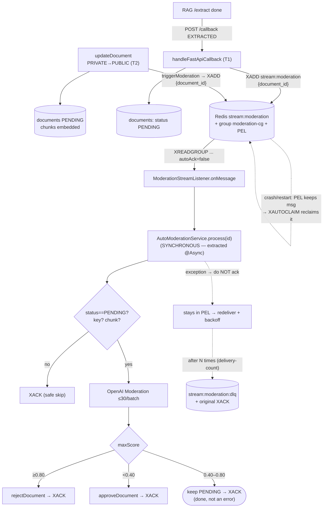

# Auto-Moderation — Design AFTER using Redis Streams (`stream:moderation`)

> Baseline comparison: [`moderation-streams-before.md`](./moderation-streams-before.md).
> Goal: turn moderation from a fire-and-forget `@Async` job in RAM into a **durable, at-least-once job queue,
> with retry/DLQ, horizontally scalable** — without adding new infrastructure (reuse the existing Redis).

## 1. Overall architecture

```
                 PRODUCE (Tomcat request thread)                      CONSUME (dedicated worker)
        ┌──────────────────────────────────────┐         ┌──────────────────────────────────────┐
 handleFastApiCallback (EXTRACTED)            │         │  StreamMessageListenerContainer       │
   XADD stream:moderation * document_id <id>  │ ──────► │  consumer-group: moderation-cg        │
   return IMMEDIATELY (no block, no @Async)   │         │  poll BLOCK 2s, batchSize 1           │
        └──────────────────────────────────────┘         │  autoAcknowledge = false             │
                                                          │       │                              │
                              Redis (persistent log)       │       ▼ onMessage(record)           │
                        ┌─────────────────────────────┐    │  ModerationStreamListener           │
                        │  stream:moderation          │◄───┤   → AutoModerationService.process() │
                        │  + PEL (un-ACKed msgs)      │    │   → XACK  (success)                 │
                        │  + stream:moderation:dlq    │    │   → do NOT ack (error → redeliver)  │
                        └─────────────────────────────┘    └──────────────────────────────────────┘
```

| Component | Meaning |
|---|---|
| **Stream** `stream:moderation` | Append-only, persistent log in Redis. Each message = `{document_id}`. |
| **Consumer group** `moderation-cg` | Ensures 1 message is handled by only **1 consumer** in the group; Redis distributes evenly across instances. |
| **PEL** (Pending Entries List) | Messages already `XREADGROUP` but not yet `XACK` → **survive crash/restart**. |
| **DLQ** `stream:moderation:dlq` | Messages that fail N times → moved here + the original ACKed, for admin inspection. |
| `XACK` | Signals "done processing" → message leaves the PEL. **Not ACKing = requesting a redeliver.** |

## 2. New flow diagram



## 3. Produce — change at 2 call sites

There are **2 places** currently calling `moderateDocumentAsync` (T1 `handleFastApiCallback` EXTRACTED, T2 `updateDocument` PRIVATE→PUBLIC). Both change to append to the stream:

```java
// BEFORE (both T1 and T2):
autoModerationService.moderateDocumentAsync(documentId);

// AFTER: append to the stream, return almost instantly (Redis ~<1ms). Does not block the request thread.
moderationStreamProducer.enqueue(documentId);
```

> T1 is inside the RAG callback (request thread handling `/callback`); T2 is inside `updateDocument`
> (request thread handling `PUT /documents/{id}`). Both only need `enqueue(documentId)` then return.

`ModerationStreamProducer` (new, thin class):

```java
@Component
@RequiredArgsConstructor
public class ModerationStreamProducer {
    private final StringRedisTemplate redis;

    @Value("${app.moderation.stream-key:stream:moderation}")
    private String streamKey;

    public RecordId enqueue(UUID documentId) {
        return redis.opsForStream().add(streamKey,
                Map.of("document_id", documentId.toString()));   // id auto-generated (XADD *)
    }
}
```

> Reason for wrapping it in a producer bean: decouple Redis from `DocumentServiceImpl`, easy to mock when testing
> the callback (same way `DocumentRagClient`/`UploadProvider` are abstracted out today).

## 4. Extract logic into a synchronous method (`process`)

The triage logic in `AutoModerationServiceImpl.moderateDocumentAsync` is **kept 100% unchanged**, only:

- Add a **synchronous** method `void process(UUID documentId)` containing exactly the old body (load doc → chunks → OpenAI → triage).
- Keep `moderateDocumentAsync` (if still needed ad-hoc, e.g. tests) or delete it entirely. **The listener will call `process()`**, NOT via `@Async` (because concurrency is now managed by the consumer group).

```java
// AutoModerationServiceImpl
@Override
public void process(UUID documentId) {            // ← synchronous, NOT @Async
    log.info("Moderating document {} (stream consumer)", documentId);
    // ... body identical to the old moderateDocumentAsync ...
    //   - skip if status != PENDING          (idempotency-guard)
    //   - skip if key is empty/mock or no chunk
    //   - OpenAI batch ≤30, triage 3 zones
    //   - catch(Exception): THROW it (so the listener catches → does NOT ack → redeliver)
    //                       instead of swallowing as before
}
```

> **The only semantic change**: the old `catch(Exception)` **swallowed** the error (kept PENDING silently).
> The new version **throws** so the listener does NOT ack → the message is redelivered (with retry/DLQ). This is exactly the fix for gap G2.

## 5. Consume — `StreamMessageListenerContainer`

Spring Data Redis 4.0.5 already provides it (`StreamMessageListenerContainer` implements `SmartLifecycle` → auto `start()`).
**Verified** in the jar `spring-data-redis-4.0.5.jar`:

- `StreamMessageListenerContainer.create(RedisConnectionFactory, options)`
- options: `.pollTimeout(Duration) / .batchSize(int) / .executor(Executor) / .errorHandler(...)`
- `StreamReadRequest.builder(StreamOffset.create(key, ReadOffset.lastConsumed())).consumer(Consumer.from(group, name)).autoAcknowledge(false).build()`
- `container.register(readRequest, listener)` → `Subscription`

`config/ModerationStreamConfig.java` (new):

```java
@Configuration
@RequiredArgsConstructor
public class ModerationStreamConfig {

    @Value("${app.moderation.stream-key:stream:moderation}")
    private String streamKey;
    @Value("${app.moderation.group:moderation-cg}")
    private String group;
    @Value("${app.moderation.consumer-name:api-1}")
    private String consumer;

    @Bean
    public StreamMessageListenerContainer<String, MapRecord<String, String, String>> moderationContainer(
            RedisConnectionFactory cf, ModerationStreamListener listener) {

        var options = StreamMessageListenerContainerOptions.builder()
                .pollTimeout(Duration.ofSeconds(2))
                .batchSize(1)
                .build();
        var container = StreamMessageListenerContainer.create(cf, options);

        var req = StreamMessageListenerContainer.StreamReadRequest
                .builder(StreamOffset.create(streamKey, ReadOffset.lastConsumed()))   // ">" = new messages only
                .consumer(Consumer.from(group, consumer))
                .autoAcknowledge(false)                                               // manual ACK
                .build();
        container.register(req, listener);
        return container;   // SmartLifecycle: Spring auto start/stop with the context
    }

    // Create the group at startup (MKSTREAM if the stream does not exist yet). BUSYGROUP = already exists → skip.
    @Bean
    public ApplicationRunner initModerationGroup(StringRedisTemplate redis) {
        return args -> {
            try {
                redis.opsForStream().createGroup(streamKey, ReadOffset.from("0"), group);
            } catch (RedisSystemException e) {
                log.info("moderation group already exists: {}", e.getMessage());
            }
        };
    }
}
```

> `consumer-name` must be **unique per instance** (e.g. from env `HOSTNAME`/`POD_NAME`) so multiple instances can
> join the same group and Redis can distinguish consumers for PEL reclaim.

Listener (new):

```java
@Component
@RequiredArgsConstructor
@Slf4j
public class ModerationStreamListener
        implements StreamListener<String, MapRecord<String, String, String>> {

    private final AutoModerationService moderation;     // calls process()
    private final StringRedisTemplate redis;
    private final ModerationDlqHandler dlqHandler;

    @Value("${app.moderation.stream-key:stream:moderation}") private String streamKey;
    @Value("${app.moderation.group:moderation-cg}")       private String group;
    @Value("${app.moderation.max-attempts:5}")            private int maxAttempts;

    @Override
    public void onMessage(MapRecord<String, String, String> record) {
        UUID documentId = UUID.fromString(record.getValue().get("document_id"));
        try {
            moderation.process(documentId);                          // success
            redis.opsForStream().ack(streamKey, group, record.getId());
        } catch (Exception e) {
            log.error("moderation failed for {}, attempts check", documentId, e);
            // delivery-count > maxAttempts → move to DLQ + ACK; otherwise do NOT ack → redeliver
            if (dlqHandler.shouldDeadLetter(streamKey, group, record.getId(), maxAttempts)) {
                dlqHandler.moveToDlq(streamKey, record);
                redis.opsForStream().ack(streamKey, group, record.getId());
            }
            // no ack → message stays in PEL, the container or a scheduler will redeliver
        }
    }
}
```

## 6. Crash recovery — PEL + reclaim

- The container uses `ReadOffset.lastConsumed()` (`>`) to read only **new messages** of the group.
- Messages already read but **not yet ACKed** live in the **PEL** → they survive a Redis restart (AOF/RDB) and an app restart.
- When the app comes back up, messages stuck in the PEL **of a dead consumer** must be reclaimed. Two options (pick one):

| Option | Description |
|---|---|
| **A. Proactive reclaim (recommended)** | A `@Scheduled` task periodically calls `XAUTOCLAIM`/`XCLAIM` for messages idle longer than `minIdleTime` → assigns them to a live consumer. Spring Data Redis: `opsForStream().pending(...)` (get delivery-count) + `opsForStream().claim(key, group, consumer, minIdle, ids)`. |
| **B. Read `0` on first run** | Register an extra subscription with `ReadOffset.from("0")` so a new consumer first "takes over" all of its own PENDING before reading `>`. Simpler but less flexible. |

> This is the part that **needs the most careful design** (determine `minIdleTime`, avoid claiming a message that is currently being processed). In the first
> version you may just do option B for simplicity, and upgrade to A when real multi-instance is needed.

## 7. Retry / DLQ

- `XPENDING` reports the **delivery-count** (number of times redelivered) of each message in the PEL.
  Spring Data Redis: `opsForStream().pending(key, group, Range.unbounded(), count)` → `PendingMessage.getTotalDeliveryCount()`.
- Over `app.moderation.max-attempts` (e.g. 5) → `XADD stream:moderation:dlq` (with `document_id`, the error, the original id) + `XACK` the original.
- Poison messages (e.g. document deleted mid-flight → `process()` throws) will not get stuck forever in the PEL.
- `rejectDocument`/`approveDocument` already guard `status == PENDING` → safe redeliver (see §8).

## 8. Idempotency (prerequisite — ALREADY MET)

At-least-once ⇒ the same `document_id` may be received ≥1 time. Re-runs must be safe:

- `process()` **skips if `status != PENDING`** (already present) → if a message is redelivered after the doc is already `APPROVED`/`REJECTED`/`COMPLETED` → no-op → ACK. ✅
- Triage is a pure function over the current chunks → same input → same conclusion. ✅
- `approveDocument`/`rejectDocument` both guard the state (`approve`: only `PENDING`→`PROCESSING`; `reject`: only `PENDING`→`REJECTED`) → calling again after the state has changed throws `AppException` → caught in the listener → DLQ (correct behavior). ✅

> No external idempotency key is needed like `stream:doc-ops` (because RAG's `/process`,`/extract` newly need a key).
> Moderation is already idempotent — the reason this is the "try it first" flow.

## 9. Additional config (`application.yaml`)

```yaml
app:
  moderation:
    stream-key: stream:moderation
    group: moderation-cg
    consumer-name: ${HOSTNAME:api-1}     # unique per instance
    poll-timeout-seconds: 2
    batch-size: 1
    max-attempts: 5
    dlq-key: stream:moderation:dlq
    reclaim:
      enabled: true
      fixed-delay-ms: 60000
      min-idle-ms: 300000                # claim only if msg idle > 5min
```

No new secrets; reuse the existing Redis connection (`spring.data.redis.*`). No new dependencies
(Spring Data Redis already has the full Streams API).

## 10. Implementation plan (step-by-step)

| Step | File | Task |
|---|---|---|
| 1 | `service/AutoModerationService.java` | add `void process(UUID)`; (optional) keep/delete `moderateDocumentAsync`. |
| 2 | `service/impl/AutoModerationServiceImpl.java` | split the body of `moderateDocumentAsync` into a synchronous `process()`; **`catch` throws instead of swallowing**. |
| 3 | `service/impl/ModerationStreamProducer.java` | **new** — `enqueue(UUID)` calls `opsForStream().add`. |
| 4 | `service/impl/ModerationStreamListener.java` | **new** — `StreamListener`, calls `process()` + `ack`/DLQ. |
| 5 | `service/impl/ModerationDlqHandler.java` | **new** — counts delivery-count, moves to DLQ. |
| 6 | `config/ModerationStreamConfig.java` | **new** — `StreamMessageListenerContainer` + `createGroup` runner. |
| 7 | `service/impl/DocumentServiceImpl.java` | **2 call sites**: the `EXTRACTED` branch (`handleFastApiCallback`) AND the PRIVATE→PUBLIC branch (`updateDocument`) — both change `moderateDocumentAsync(id)` → `moderationStreamProducer.enqueue(id)`. |
| 8 | `application.yaml` | add `app.moderation.*`. |
| 9 | Test | see §11. |

> The `@Async` on moderation is **removed** (concurrency is handled by the consumer group). `taskExecutor` is **kept** for other
> `@Async` methods (document processing, notifications) — left untouched.

## 11. Testing

Follow the current style (pure Mockito, no Spring context):

- `AutoModerationServiceImplTest` (already exists): update to assert `process()` **throws** an exception on OpenAI error
  (instead of swallowing) + verify `approveDocument`/`rejectDocument` across the 3 zones.
- `ModerationStreamListenerTest` (**new**): mock `AutoModerationService` + `StringRedisTemplate`:
  - `process` succeeds → verify `opsForStream().ack(...)` is called with the correct `(key, group, recordId)`.
  - `process` throws, delivery-count < max → **no** ack, **no** move to DLQ.
  - `process` throws, delivery-count ≥ max → verify move to DLQ + ack.
- `ModerationStreamProducerTest` (**new**): verify `opsForStream().add(key, {document_id})`.
- Container/group-creation: **cannot** be unit-tested (needs real Redis + Spring context) — acknowledged as
  a gap, same kind as the existing `@Cacheable` (proxy/infra only verified when running for real).

> When you want a real smoke test: `docker compose up -d redis`, run the app, upload 1 public doc, observe
> `redis-cli XLEN stream:moderation` = 0 after the consumer processes + `XACK`, and `XPENDING stream:moderation moderation-cg`.

## 12. Trade-offs / risks

| Risk | Mitigation |
|---|---|
| Operational complexity increases (PEL, reclaim, DLQ, consumer-name per pod). | Start with option B (read `0`) for simplicity; upgrade to A when multi-instance is needed. Monitor the PEL `XLEN`. |
| Duplicate `consumer-name` across pods → they reclaim each other's PEL. | Must use `HOSTNAME`/`POD_NAME`; fail-fast if empty in prod. |
| Message redelivered while still being processed (claimed too early). | Set `min-idle-ms` larger than the max moderation time (OpenAI is slow). |
| OpenAI slow/down → PEL grows (messages stuck without ack). | Alert on `XPENDING` count; `max-attempts` + DLQ bound it. |
| Order not strictly preserved across multiple consumers. | Fine — each doc is independent, order does not matter. |

## 13. When NOT to do this

- **Single-instance**, low load, OpenAI stable → `@Async` is enough; Streams is over-engineering.
- If there is no need for durability/horizontal scaling yet → the operational complexity is not worth it.

> This is a "trial" version to get familiar with Streams; once stable, apply the same pattern to `stream:doc-ops` (RAG pipeline) —
> where the gap (crash → doc stuck in PROCESSING/PENDING forever) is worse, but an idempotency key is needed on the RAG side.
