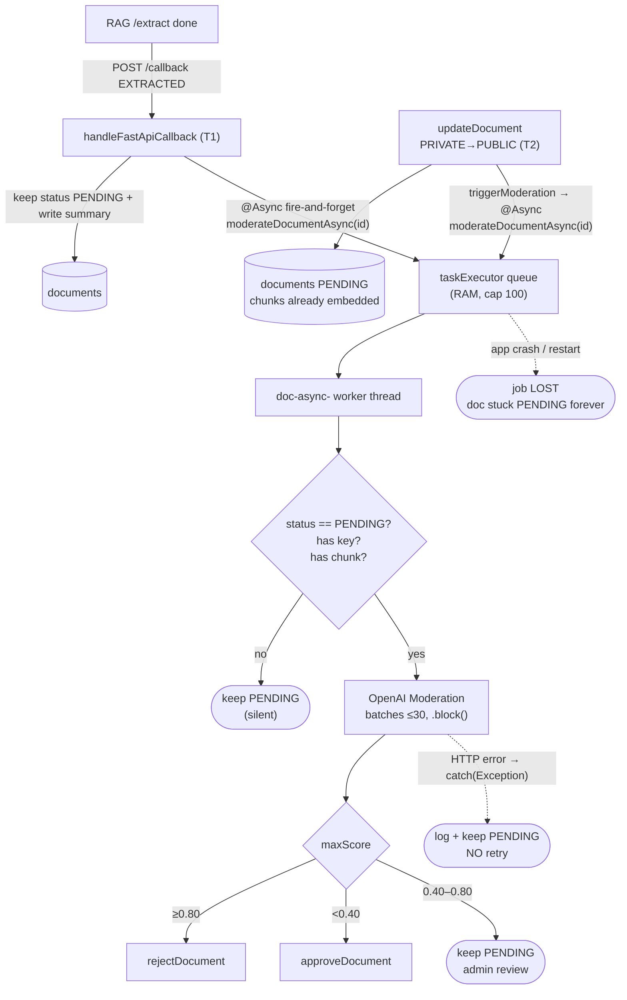

# Auto-Moderation — CURRENT state (before Redis Streams)

> Purpose: accurately describe the moderation flow currently running in the code, to provide a baseline for comparison when moving to
> `stream:moderation`. All class/method/line references follow the current source tree.

## 1. High-level flow

Moderation is triggered at **2 points** (both call the same `moderateDocumentAsync` → same triage logic):

| # | Trigger | Context | Why chunks are available right away |
|---|---|---|---|
| **T1** | `EXTRACTED` callback from RAG (`handleFastApiCallback`) | **PUBLIC** upload: RAG `/extract` done | RAG just created chunks (`embedding=NULL`) |
| **T2** | `updateDocument` PRIVATE→PUBLIC (`triggerModeration=true`) | Private doc already indexed, user switches to public | Chunks **already embedded** (private upload already ran `/process`) — read directly, no `/extract` needed |

```
RAG /extract done                         user switches PRIVATE -> PUBLIC
   │  POST /callback {status:EXTRACTED}      │  PUT /documents/{id} {visibility:public}
   ▼                                         ▼
handleFastApiCallback  (T1)                 updateDocument  (T2)
   └──────────────────┬──────────────────────┘
                      ▼
   autoModerationService.moderateDocumentAsync(documentId)   // @Async("taskExecutor")
```

> Both T1 and T2 **do NOT retry** — errors are only `log + keep PENDING` (see gap G2).

## 2. Trigger points (actual code)

`service/impl/DocumentServiceImpl.java` — **2 call sites**:

**T1 — the `EXTRACTED` branch inside `handleFastApiCallback` (~line 249):**
```java
} else if ("EXTRACTED".equalsIgnoreCase(status)) {
    if (summary != null && !summary.trim().isEmpty()) document.setSummary(summary);
    log.info("RAG EXTRACTED. Document {} chunks ready for moderation; ...", documentId);
    autoModerationService.moderateDocumentAsync(documentId);
}
```

**T2 — the PRIVATE→PUBLIC branch inside `updateDocument` (~lines 398–425):**
```java
if (DocumentVisibility.PUBLIC.equals(newVisibility)) {        // PRIVATE -> PUBLIC
    document.setStatus(DocumentStatus.PENDING);
    createPendingApprovalNotifications(document);
    triggerModeration = true;                                  // ← flip the flag
}
// ... documentRepository.save(document) ...
if (triggerModeration) {
    autoModerationService.moderateDocumentAsync(documentId);   // ← T2
}
// NOTE: does NOT call RAG /extract here — chunks are already embedded (private upload already ran /process),
//       so moderation reads document_chunks directly. RAG visibility only flips to public in approveDocument.
```

Notes:
- T1 (callback) is retried by RAG **3× with backoff**. T2 has no retry mechanism at the caller layer. **The moderation job itself has NO retry** on either path.
- T2 **does not** have an `EXTRACTED` callback (because it does not re-extract) — moderation is called **directly in-process**, not via a RAG callback.

## 3. Execution mechanism: `@Async("taskExecutor")`

`service/impl/AutoModerationServiceImpl.java`:

```java
@Async("taskExecutor")
@Override
public void moderateDocumentAsync(UUID documentId) { ... }
```

- Runs on a `ThreadPoolTaskExecutor` (`config/AsyncConfig`): core 5 / max 20 / **queue 100** (RAM),
  virtual threads enabled, prefix `doc-async-`.
- The queue lives **in process RAM**. It is not persistent, and is not written to disk/Redis.

## 4. Triage logic (already exists, kept unchanged when migrating)

Inside `moderateDocumentAsync`:

1. Load document → **skip if status ≠ `PENDING`** (important idempotency guard).
2. Read chunks read-only via `DocumentChunkRepository.findChunkContentsByDocumentId` (table `document_chunks`,
   owned by RAG — backend only reads).
3. Skip (keep `PENDING`) if: `openai.api-key` is empty/`mock_key`, or there is no chunk, or every chunk is empty.
4. Call the **OpenAI Moderation API** (via the shared `WebClient` bean, `.block()`), batched **≤ 30 chunks per call**.
5. Compute `maxScore` = the highest score across **all chunks × all categories**. Triage into 3 zones:
   - `maxScore ≥ 0.80` → `documentService.rejectDocument(id, reason-in-Vietnamese)` (generate reason).
   - `maxScore < 0.40` → `documentService.approveDocument(id)`.
   - `0.40 ≤ maxScore < 0.80` → **keep `PENDING`** (admin reviews manually).
6. Everything is wrapped in `try/catch (Exception)` → catches errors → **log + keep `PENDING`** (no throw, no retry).

`approveDocument` / `rejectDocument` are called **within the same Spring context** (no HTTP/JWT).

## 5. Current flow diagram



## 6. Gaps — why Redis Streams is needed

| # | Gap | Consequence |
|---|-----|--------|
| G1 | **Not persistent** — the job sits in the `taskExecutor` queue (RAM). A crash/restart mid-run loses the job. | The document is already `PENDING` but moderation **never runs again** → stuck forever, with no record to trace. |
| G2 | **No retry** — `catch(Exception)` only does `log.error` then keeps `PENDING`. Transient OpenAI errors (timeout/429/5xx) are never retried. | One transient error → admin must review manually, or the doc dies at `PENDING`. |
| G3 | **Caller-runs backpressure** — when the queue is full (cap 100), `taskExecutor` runs the job directly on the **callback request thread** (CallerRunsPolicy). | The RAG callback is **blocked** waiting for moderation (slow OpenAI call) → RAG may time out the callback. |
| G4 | **No observability** — cannot tell whether a `PENDING` doc is in the "gray zone waiting for admin" or "moderation crashed/errored before finishing". | Hard to debug, hard to alert. |
| G5 | **No horizontal scaling** — the queue is per-process. With 2 instances, each instance has its own queue, and documents that land on a dead instance are never processed. | Multi-instance deployment fragments the load. |

> G1 + G2 are the root cause: moderation is a **business-critical, idempotent** job (rerunning on the same chunks → same triage result),
> yet it runs fire-and-forget in RAM — exactly the use case that Redis Streams solves.

## 7. Summary of current related files/classes

| File | Role |
|------|---------|
| `service/AutoModerationService.java` | interface, single method `void moderateDocumentAsync(UUID)`. |
| `service/impl/AutoModerationServiceImpl.java` | `@Async` triage (load doc → chunks → OpenAI → approve/reject/PENDING). Nested DTOs `ModerationRequest/Response/Result`. |
| `service/impl/DocumentServiceImpl.java` | **2 triggers**: `handleFastApiCallback` (`EXTRACTED` branch, T1) + `updateDocument` (PRIVATE→PUBLIC, T2). |
| `repository/DocumentChunkRepository.java` | `findChunkContentsByDocumentId` (native, read-only `document_chunks`). |
| `config/AsyncConfig.java` | `taskExecutor` (where the job currently runs). |

---

See next: [`moderation-streams-after.md`](./moderation-streams-after.md) — design + how to implement Redis Streams.
