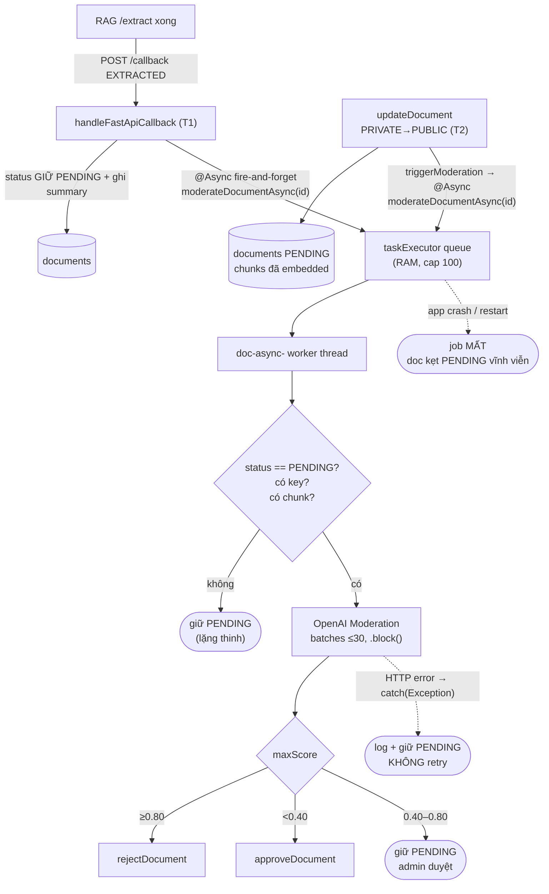

# Auto-Moderation — Trạng thái HIỆN TẠI (trước Redis Streams)

> Mục đích: mô tả chính xác luồng moderation đang chạy trong code để có baseline so sánh khi chuyển sang
> `stream:moderation`. Mọi tham chiếu class/method/dòng đều bám source tree hiện tại.

## 1. Luồng ở mức cao

Moderation được đốt ở **2 điểm** (cả hai đều gọi cùng `moderateDocumentAsync` → cùng logic triage):

| # | Trigger | Ngữ cảnh | Tại sao đọc được chunks ngay |
|---|---|---|---|
| **T1** | callback `EXTRACTED` từ RAG (`handleFastApiCallback`) | Upload **PUBLIC**: RAG `/extract` xong | RAG vừa tạo chunks (`embedding=NULL`) |
| **T2** | `updateDocument` PRIVATE→PUBLIC (`triggerModeration=true`) | Doc private đã index, user đổi sang public | Chunks **đã embedded sẵn** (upload private đã `/process`) — đọc luôn, không cần `/extract` |

```
RAG /extract xong                         user đổi PRIVATE -> PUBLIC
   │  POST /callback {status:EXTRACTED}      │  PUT /documents/{id} {visibility:public}
   ▼                                         ▼
handleFastApiCallback  (T1)                 updateDocument  (T2)
   └──────────────────┬──────────────────────┘
                      ▼
   autoModerationService.moderateDocumentAsync(documentId)   // @Async("taskExecutor")
```

> Cả T1 và T2 **đều không retry** — lỗi chỉ `log + giữ PENDING` (xem gap G2).

## 2. Trigger points (code thật)

`service/impl/DocumentServiceImpl.java` — **2 call site**:

**T1 — nhánh `EXTRACTED` trong `handleFastApiCallback` (~dòng 249):**
```java
} else if ("EXTRACTED".equalsIgnoreCase(status)) {
    if (summary != null && !summary.trim().isEmpty()) document.setSummary(summary);
    log.info("RAG EXTRACTED. Document {} chunks ready for moderation; ...", documentId);
    autoModerationService.moderateDocumentAsync(documentId);
}
```

**T2 — nhánh PRIVATE→PUBLIC trong `updateDocument` (~dòng 398–425):**
```java
if (DocumentVisibility.PUBLIC.equals(newVisibility)) {        // PRIVATE -> PUBLIC
    document.setStatus(DocumentStatus.PENDING);
    createPendingApprovalNotifications(document);
    triggerModeration = true;                                  // ← bật cờ
}
// ... documentRepository.save(document) ...
if (triggerModeration) {
    autoModerationService.moderateDocumentAsync(documentId);   // ← T2
}
// NOTE: KHÔNG gọi RAG /extract ở đây — chunks đã embedded sẵn (upload private đã /process),
//       nên moderation đọc document_chunks ngay. RAG visibility chỉ flip sang public ở approveDocument.
```

Các lưu ý:
- T1 (callback) được RAG **thử lại 3× với backoff**. T2 không có cơ chế retry nào ở tầng gọi. **Bản thân job moderation KHÔNG có retry** ở cả 2 đường.
- T2 **không** có `EXTRACTED` callback (vì không extract lại) — moderation được gọi **trực tiếp trong process**, không qua callback RAG.

## 3. Cơ chế thực thi: `@Async("taskExecutor")`

`service/impl/AutoModerationServiceImpl.java`:

```java
@Async("taskExecutor")
@Override
public void moderateDocumentAsync(UUID documentId) { ... }
```

- Chạy trên `ThreadPoolTaskExecutor` (`config/AsyncConfig`): core 5 / max 20 / **queue 100** (RAM),
  virtual threads bật, prefix `doc-async-`.
- Queue nằm **trong RAM của process**. Không persistent, không ghi đĩa/Redis.

## 4. Logic triage (đã có, giữ nguyên khi migrate)

Bên trong `moderateDocumentAsync`:

1. Load document → **bỏ qua nếu status ≠ `PENDING`** (idempotency-guard quan trọng).
2. Đọc chunks read-only qua `DocumentChunkRepository.findChunkContentsByDocumentId` (bảng `document_chunks`,
   do RAG sở hữu — backend chỉ đọc).
3. Bỏ qua (giữ `PENDING`) nếu: `openai.api-key` rỗng/`mock_key`, hoặc không có chunk, hoặc chunk toàn rỗng.
4. Gọi **OpenAI Moderation API** (qua shared `WebClient` bean, `.block()`), chia batch **≤ 30 chunk/lần**.
5. Tính `maxScore` = điểm cao nhất trên **mọi chunk × mọi category**. Triage 3 vùng:
   - `maxScore ≥ 0.80` → `documentService.rejectDocument(id, lý-do-tiếng-Việt)` (generate reason).
   - `maxScore < 0.40` → `documentService.approveDocument(id)`.
   - `0.40 ≤ maxScore < 0.80` → **giữ `PENDING`** (admin duyệt tay).
6. Toàn bộ bọc `try/catch (Exception)` → bắt lỗi → **log + giữ `PENDING`** (không ném, không retry).

`approveDocument` / `rejectDocument` được gọi **trong cùng Spring context** (không HTTP/JWT).

## 5. Sơ đồ luồng hiện tại



## 6. Các khoảng trống (gap) — lý do cần Redis Streams

| # | Gap | Hệ quả |
|---|-----|--------|
| G1 | **Không persistent** — job nằm trong `taskExecutor` queue (RAM). Crash/restart giữa chừng → job mất. | Document đã `PENDING` nhưng moderation **không bao giờ chạy lại** → kẹt vĩnh viễn, không có bản ghi gì để trace. |
| G2 | **Không retry** — `catch(Exception)` chỉ `log.error` rồi giữ `PENDING`. Lỗi OpenAI (timeout/429/5xx) transient cũng không được thử lại. | Một lỗi nhất thời → admin phải duyệt tay, hoặc doc chết ở `PENDING`. |
| G3 | **Caller-runs backpressure** — khi queue đầy (cap 100), `taskExecutor` chạy job ngay trên **request thread của callback** (CallerRunsPolicy). | RAG gọi callback bị **block** chờ moderation (gọi OpenAI chậm) → RAG có thể timeout callback. |
| G4 | **Không quan sát** — không phân biệt được một doc `PENDING` là do "vùng vàng chờ admin" hay do "moderation crash/error chưa kịp xử lý". | Khó debug, khó alert. |
| G5 | **Không scale ngang** — queue là per-process. 2 instance chạy thì mỗi instance tự queue, document rơi vào instance chết sẽ không được xử lý. | Triển khai multi-instance bị phân mảnh tải. |

> G1 + G2 là gốc rễ: moderation là job **business-critical, idempotent** (chạy lại trên cùng chunks → cùng triage),
> lại đang chạy fire-and-forget trên RAM → đúng kiểu use-case mà Redis Streams giải.

## 7. Tóm tắt file/class hiện tại liên quan

| File | Vai trò |
|------|---------|
| `service/AutoModerationService.java` | interface, method duy nhất `void moderateDocumentAsync(UUID)`. |
| `service/impl/AutoModerationServiceImpl.java` | `@Async` triage (load doc → chunks → OpenAI → approve/reject/PENDING). DTO lồng `ModerationRequest/Response/Result`. |
| `service/impl/DocumentServiceImpl.java` | **2 trigger**: `handleFastApiCallback` (nhánh `EXTRACTED`, T1) + `updateDocument` (PRIVATE→PUBLIC, T2). |
| `repository/DocumentChunkRepository.java` | `findChunkContentsByDocumentId` (native, read-only `document_chunks`). |
| `config/AsyncConfig.java` | `taskExecutor` (nơi job đang chạy). |

---

Xem tiếp: [`moderation-streams-after.md`](./moderation-streams-after.md) — thiết kế + cách triển khai Redis Streams.
