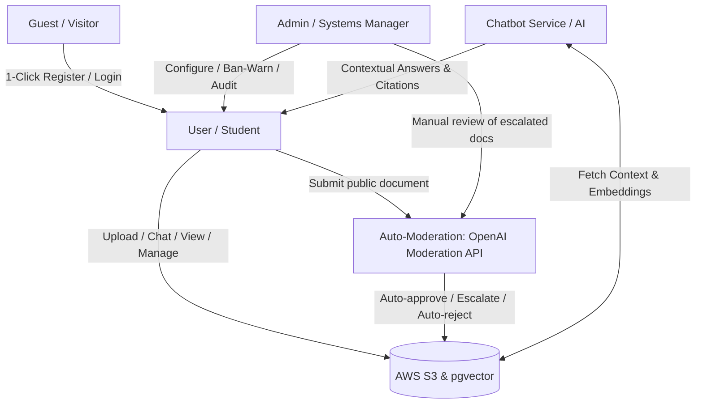

# Project Context Analysis: AI Study Hub

This document establishes the project context, technical architecture, feature scope, and business logic for the **AI-Powered Study Document Management System (AI Study Hub)**, distilled from the business requirements and vision documentation.

---

## 1. Project Overview & Context

University students face massive information overload and highly fragmented study material storage. Documents (slides, past exams, notes) are scattered across Google Drive, email, Zalo, Messenger, and local drives. This results in lost files, zero knowledge sharing between student cohorts, and hours wasted searching or parsing long academic papers.

**AI Study Hub** resolves this by providing a unified cloud-based document repository combined with an **AI RAG (Retrieval-Augmented Generation) Chatbot** that allows students to interact directly with their documents.

### Key References
- Business Requirements: [AI-Study-Hub-BRD.md](./AI-Study-Hub-BRD.md)
- Vision & Scope: [vision-scope-ai-study-hub.md](./vision-scope-ai-study-hub.md)

---

## 2. Business Objectives & Success Metrics

The success of the platform depends on reaching specific business and technical benchmarks:

| Category | Metric / Objective | Target Value |
| :--- | :--- | :--- |
| **Business** | User Migration Rate | Centralize $\ge$ 80% of target students in partner universities within 6 months |
| **Business** | Search Time Reduction | 70% decrease in document search times for active users |
| **Business** | Reading/Summarizing Boost | 50% decrease in paper/slide reading times |
| **Business** | Conversion Rate | $\ge$ 5% conversion from Free to Premium subscription within 6 months |
| **System** | AI Response Latency | $<$ 5 seconds for RAG chat responses |
| **System** | AI Citation Accuracy | $\ge$ 90% accuracy in referencing sources (limiting hallucinations) |
| **System** | Keyword Search Speed | $<$ 1.5 seconds for query execution |
| **System** | Document Preview Render | $<$ 3 seconds to display PDF/Word online |

---

## 3. Actors & Roles

The system interacts with four primary actors, each with defined access scopes:

1. **Guest (Visitor):** Unauthenticated. Can access the landing page, view mockups/features, and register/login (with 1-click Google OAuth2 integration).
2. **User (Student/Learner):** Authenticated. Manages personal private folders/documents, tags files, performs keyword search, initiates AI RAG chats and study-material generation, bookmarks files, shares documents to the public library, and manages payment subscriptions.
3. **Admin (System Administrator):** System auditor. Manages accounts, reviews public library submissions that are escalated by the automated moderation queue (checking copyright infringement), monitors system performance logs, and tracks subscription revenues. Admins can still manually approve or reject any document.
4. **ChatbotService (System Actor):** AI backend (FastAPI microservice). Handles text chunking, document vectorization (into pgvector), hybrid semantic retrieval (BM25 + dense vectors + Jina reranker), and prompts the Gemini LLM to return responses with precise citations.

---

## 4. Feature Breakdown & Scope (MVP vs. Future)

### Phase 1: MVP Scope (Current Focus)

- **Authentication (FEAT-AUTH):**
  - Traditional Email signup + Activation Link or OTP verification.
  - JWT session maintenance.
  - Google OAuth2 1-click login.
  - Profile customization (display name, avatar, password resets).
- **Document Management & Cloud Storage (FEAT-DOC & FEAT-STG):**
  - S3-backed upload for `.pdf`, `.docx`, `.txt`, and `.md` only (max 50 MB per file; multipart ceiling 60 MB so oversized uploads return a clean 400).
  - Content-hash upload deduplication (duplicate content hash → 409 conflict).
  - Manual tagging on upload for categorization.
  - S3 presigned URLs for secure document access and download.
  - Online PDF preview rendering in-browser without downloads.
  - Private/Public visibility (public documents go through moderation before going live).
  - Soft-delete with a Trash view and owner-initiated restore within the retention window.
  - Bookmarks: save/unsave documents for quick access.
- **Search & Discovery (FEAT-FTS):**
  - Public keyword search matching document **title + description** via SQL `ILIKE` (case-insensitive). There is no full-text index over document bodies in this API.
  - Trending documents and tag-based recommendations (driven by the user's preferred tags).
  - Deep semantic search over document content is delivered by the RAG chat feature (FEAT-AI-RAG), not the public search endpoint.
- **Contextual RAG AI Assistant (FEAT-AI-RAG):**
  - Instant document summaries.
  - Multi-document context selection (chatting with a single file or a whole folder).
  - Citations including file names and page numbers.
  - Conversational history tracking (renaming/deleting chat sessions).
- **AI Study-Material Generation (FEAT-AI-MAT):**
  - Generate quizzes and flashcards scoped to a specific document.
  - Counts against the shared daily AI quota; if the model declines, the API returns 200 with an empty list and a reason message.
- **Content Moderation (FEAT-MOD):**
  - Public uploads are auto-triaged by the OpenAI Moderation API (`omni-moderation-latest`) on a durable Redis Streams queue: auto-approve when the max category score is **< 0.40**, escalate to manual review at **0.40–0.80**, and auto-reject at **≥ 0.80** (messages move to a DLQ after 5 failed attempts).
  - Admins can still manually approve or reject any document.
- **Community Sharing (FEAT-SOC):**
  - 1–5 star ratings and text reviews on public documents.
  - Abuse reporting of public documents (resolved or rejected by admins).
- **Subscriptions & Payments (FEAT-MON):**
  - Subscription usage dashboard.
  - VNPay payments signed with HMAC-SHA512: `create-payment` returns a VNPay sandbox URL, `vnpay-ipn` handles the server-to-server IPN, and `vnpay-callback` performs a 302 browser redirect to the frontend.
  - Daily AI quota enforcement via a Redis counter (shared across chat, quiz, and flashcard).
  - Storage enforcement logic for downgraded accounts.
- **In-App Notifications (FEAT-NOT):**
  - Notifications for moderation results, new reviews/reports, account warnings/bans, and subscription events (plan upgrade, plan expiring, etc.).

### Phase 2: Future Scope

- **Social Hub Enhancements (FEAT-SOC):**
  - Comment threads and richer social interaction under public files.
  - "Trending" ranking refined by social-graph interaction signals.
- **Smart AI Upgrades:**
  - AI Auto-tagging based on content analysis.
  - Multimodal RAG (processing charts and images inside PDFs).
  - Automated Mindmap generator from uploads.
- **Advanced Monetization:**
  - Group and classroom shared workspace subscription plans.
  - Gamified Points System (earning tokens/premium days when public documents get highly downloaded/rated).

---

## 5. Subscription & Monetization Logic

The MVP implements a strict subscription and rate-limiting scheme to manage LLM API costs and cloud storage bills.

### Subscription Tiers

| Feature / Limit | Free Plan | Premium Plan |
| :--- | :--- | :--- |
| **Cloud Storage** | 2 GB | 10 GB |
| **Daily AI Requests** | 15 / day | 60 / day |
| **Shared AI Quota** | chat + quiz + flashcard | chat + quiz + flashcard |
| **Max Upload Size** | 50 MB | 50 MB |
| **Accepted Formats** | `.pdf`, `.docx`, `.txt`, `.md` | same |
| **Cost** | 0 VND | Paid (30-day cycle) |

### Key Business Rules
1. **Daily Reset:** Daily AI request quotas reset automatically via a Redis counter with a 24-hour TTL (lazy reset, no scheduled job). The quota is shared across chat, quiz, and flashcard.
2. **Subscription Cycle:** Premium subscription runs on a strict **30-day billing cycle**.
3. **Automatic Downgrade:** If the subscription is not renewed at the end of the 30-day cycle, the user account degrades from **Premium** to **Free**.
4. **Storage Penalty Lock:**
   - When a downgraded account's data size exceeds the **Free limit (2 GB)**, the system sets the user's status to **`overlimitstorage`**, which blocks **upload only**.
   - The user can still list, view, and preview their own documents and continue using AI chat.
   - The user has two ways to clear the lock:
     - **Renew** the Premium subscription.
     - **Delete** excess files until storage is $\le$ 2 GB.

---

## 6. Critical Technical Constraints & Risks

- **Context Window & Cost Control:** There is no hard page or word cap enforced in code. To keep API cost and latency reasonable, RAG retrieval is bounded by the hybrid pipeline (BM25 over parent documents + pgvector top-k → Jina reranker top-5), backed by a 30-second chat timeout (60 seconds for study-material generation). Users are guided to scope each chat to a single file or a curated folder rather than feeding in an entire library.
- **Copyright Violations:** Users might upload copyrighted textbooks or confidential exam questions. Public library uploads are **auto-triaged by the OpenAI Moderation API** (`omni-moderation-latest`) on a durable Redis Streams queue — auto-approve when the max category score is **< 0.40**, auto-reject when **≥ 0.80**, and manual admin review for **0.40–0.80** — in addition to manual admin moderation.
- **Hallucinations:** AI answers must use strict groundings and reference precise pages to reduce incorrect info.
- **Payment Callback Reliability:** Network drops could interrupt browser redirects. VNPay mitigates this with a server-to-server IPN (`vnpay-ipn`) alongside the browser `vnpay-callback`; invoices track a `pending / success / failed` status so payments can be reconciled from the IPN.
